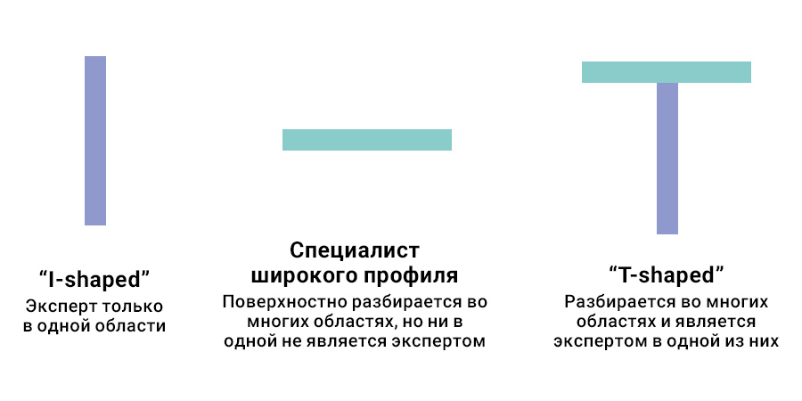

Привет, `%username%`! За 2021 год я прошел примерно 50 собеседований и понял одну страшную для себя вещь – я ничего не знаю, но кое-чему научился.

## Накину контекста

Некоторые из твоих, да и моих тоже, знакомых могут задаться вопросами в духе "Ты без работы сидел долго?" "А если работал, то зачем проходил собеседования?" "Зачем так много проходил собеседований?" ну и далее в том же духе. Для всех таких заходов у меня один простой ответ: большинство (не все, а большинство) больших компаний смотрят на soft-skills – на "не технические" навыки, к коим относится и коммуникативный навык (то, как ты излагаешь свои мысли), а hard-skills могут помочь подтянуть. "Чтобы знания не забывались, ими надо пользоваться" – это относится не только к умениям работать руками, но и к умениям излагать свои мысли.

Когда ко мне приходят с предложением "посмотреть нашу вакансию в ТОП-3 компанию ХХХ", я в большинстве случаев соглашаюсь для того, чтобы не растерять навык прохождения собеседований. Умение рассуждать в слух и озвучивать свои действия с кодом или в консоли – всегда дают большой плюс – интервьюер "видит и слышит твои мысли", а значит может сопоставить ход твоих мыслей и "ход мыслей команды" и определить "хорошо ли ты впишешься в команду" и "какие направления сможешь закрыть".

## Нудное описание проблемы

Пройдя вагон собеседований за прошлый 2021 год, я осознал только одну вещь – я умею хорошо проходить собеседования. Сложно назвать это полноценной проблемой без знания контекста. Помимо умения проходить собеседования, обычно надо уметь еще и работать – почему-то все компании это прям обязательным условием требуют. Под умением работать я подразумеваю следующее: применять своих hard-skills на практике – писать код, чинить сервер, дебажить Java-приложение в проде.

Имея широкий кругозор и большую насмотренность, ты довольно легко будешь отвечать на общие вопросы "рекомендательного характера" – например: "Как бы ты спроектировал инфраструктуру под такое-то приложение, с такими-то запросами по rps/dau/mau/etc". Софта, облаков, оркестраторов и прочих штук ведь довольно много, а способность предложить разные варианты говорит о тебе то, что ты "в теме" и следишь за индустрией.

Широкого кругозора всегда недостаточно! Общие базовые вещи надо знать по всем штукам, с которыми ты работаешь. А помимо этого стоит выделить для себя самые интересные штуки и углубляться в них. Есть термин "T-shaped person" – это человек, который является экспертом как минимум в одной области, но при этом разбирается во многих других и может свободно поддерживать общение с другими специалистами на базовом уровне.

T-shaped специалист противопоставляется I-специалисту (эксперту только в одной области) и дженералисту – человеку, который знает обо всем понемногу, но ни в одну область не углубляется.

У меня же на момент написания этих строк "вертикальная палочка в букве Т" настолько короткая, что ей можно пренебречь. Это значит, что надо углубляться в какую-то область или направление, чтобы стать в ней экспертом высокого уровня.

Проще говоря, я в большей степени дженералист – специалист широкого профиля, нежели эксперт в какой-то области. Это не есть хорошо и надо этот мой косяк срочно исправлять. А понимание сути проблемы – уже половина решения.

## Путь исправления

Чтобы построить путь, по которому я буду закрывать пробелы в знаниях, надо задаться (при чем неоднократно) вопросами "что я не знаю" и "что я хочу узнать". Как тебе известно, я довольно ленивый человек и вместо того, чтобы озадачиваться вопросами, я взял готовый роадмап для специалиста по DevOps-практике с сайта [roadmap.sh](https://roadmap.sh/devops) и выписал себе абсолютно все пункты.

Начать стоит с самого начала, а в самом начале упоминаются языки программирования – Python и Golang. С них я начал и писал про это в одной из прошлых статей – [Программирование и работа](https://jtprog.ru/dev-and-work/). Дальше просто спускаться вниз по карте и разбираться в каждом пункте, чтобы закрыть пробелы в знаниях.

Постепенно будут формироваться более интересные направления и менее интересные направления. Погружаясь в то, что больше нравится можно прокачать себя как T-shaped специалиста – у тебя будет широкий охват по областям знаний и глубина в интересной для тебя области.

## Выводы

Собеседования проходить надо хоть иногда, даже если ты не ищешь работу. Если тебе предлагают посмотреть вакансию, то соглашайся и не совокупляй себе голову. Если ты боишься, что твой текущий работодатель сделает "а-та-та по попе" за поход на собеседования, то видимо стоит задуматься над этим.

Раньше было модно иметь резюме на [hh.ru](https://hh.ru), но уже более четырех лет я не пользуюсь этой площадкой по одной простой причине – тогда работодатели "следили за твоим профилем на hh" и если замечали, что ты свое закрытое резюме обновил – сразу делали строгое "а-та-та по попе". А я ведь просто хочу вписать очередное достижение, а не искать работу. С тех пор я перестал пользоваться сервисами и вытащил свое резюме в [открытый доступ](https://savinmi.ru) – никто не сможет мне запретить держать его в таком виде.

Также на собеседованиях можно встретить различные интересные задачи, которые действительно заставят тебя подумать – например такую [Задачка с собеса 0003](https://jtprog.ru/interview-task-0003/).

Продавать себя на собеседовании и отлично отвечать на заковыристые вопросы как технического характера, так и по soft-skills, это не менее важный навык, чем знать все флаги iptables – я бложик этот веду в качестве шпаргалки и часто им пользуюсь, например вот [Шпаргалка по iptables](https://jtprog.ru/iptables-manual/).

Не забывай учиться и развиваться – я к сожалению это понял слишком поздно. Надо много всего наверстывать, и тем не менее – понять проблему это уже половина решения!

---

Если у тебя есть вопросы, комментарии и/или замечания – заходи в [чат](https://ttttt.me/jtprogru_chat), а так же подписывайся на [канал](https://ttttt.me/jtprogru_channel).

О способах отблагодарить автора можно почитать на странице "[Донаты](https://jtprog.ru/donations/)". 
