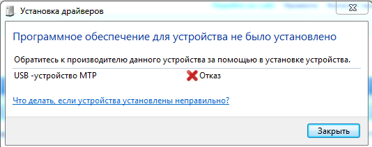

Некоторое время назад столкнулся с проблемой при попытке подключить Андроидофон к рабочему компу (Windpws 7 x64) сотрудника в режиме MTP. Естесственно нихрена не получилось :-) ЭтожВинда! Пораскинув мозгами и поработав с паре с гуглом решение было найдено. Так вот где собака зарыта!

Наверняка кто-то еще кроме меня сталкивался с проблемой, когда подключаешь Android-мобилку свою/друга/коллеги к компу с Windows 7 (или не только с ней?) и видишь вот такое волшебное окошко:



Да полюбому кто-то сталкивался с такой проблемой. И как показала моя практика большинство думает что надо скачать драйвера на свою мобилку на сайте производителя и поставить именно их т.к. они правильные.

Решение гораздо проще! Надо всего лишь удалить один ключик в реестре. Это объясняется тем, что ~~ЭтожВинда!~~ в Windows с этим самым MTP не все так гладко и судя по всему они не особо чешутся по этому поводу. Ну да ладно.

Запускаем Редактор реестра от имени администратора и идем вот по этому пути:
```cmd
HKEY_LOCAL_MACHINE\SYSTEM\CurrentControlSet\Control\Class\{EEC5AD98-8080-425F-922A-DABF3DE3F69A}
```
И там ищем ключик с именем `UpperFilters` и удаляем его к чертям собачьим! Да именно удалаяем. Если его там не оказалось, то его можно поискать по всему реестру через стандартный поиск. После того как вы удалите этот самый ключ компьютер надо перезагрузить. После перезагрузки подключайте вашего Andrюху и радуйтесь.

На этом все! Profit!

> **Ахтунг!** Не забывайте делать бэкап реестра на всякий случай! *ЭтожВинда*!

**UPD:** В некоторых случаях бывает необходимо в указанной ветке удалить все ключи.
