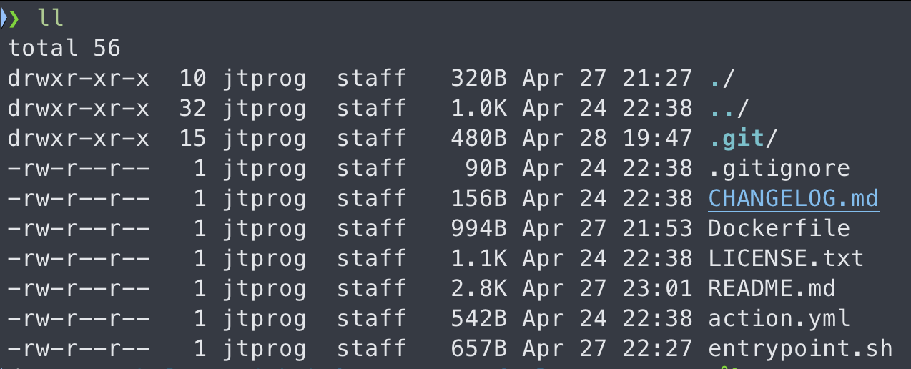

Привет, `%username%`! Я тут недавно у себя на [Medium](https://jtprog.medium.com/как-и-зачем-я-веду-свой-блог-cd0c429f9ffa) расписывал как именно я работаю с контентом на этом сайте.

> Блогер – человек, который ведет свой [блог](https://ru.wikipedia.org/wiki/Блог), а не вот эти ваши с ютубов ~~блэт~~.

Так исторически сложилось, что для себя и своих проектов я чаще использую GitHub, а GitLab я использую исключительно в работе. В крайних случаях используется Bitbucket (но это прям вообще жесть для меня).

Вариантов ведения блога у меня было уже несколько, о чем можно почитать в той же статье на [Medium](https://jtprog.medium.com/как-и-зачем-я-веду-свой-блог-cd0c429f9ffa), [тут](/gohugo/) и [тут](/gitlab-ci/), так что описывать причины я не вижу смысла.

## "Ближе к телу!"

Поехали! Клонируем нужный репозиторий и создаем в нём необходимые директории:

```bash
git clone git@github.com:jtprogru/jtprog.ru.git ~/blog
cd ~/blog
mkdir -p .github/workflow
touch .github/workflow/main.yml
```

Файл можешь назвать, так как тебе будет удобно и понятно. Далее созданный файлик приводим к примерно такому виду:

```yaml
---
name: CI
'on':
  push:
    branches: [ master ]
  pull_request:
    branches: [ master ]
jobs:
  deploy-website:
    runs-on: ubuntu-latest
    steps:
      - name: Do a git checkout including submodules
        uses: actions/checkout@master
        with:
          submodules: true

      - name: Generate and deploy website
        uses: jtprogru/hugo-rsync-deployment@master
        env:
          VPS_DEPLOY_KEY: ${{secrets.DEPLOY_SSH_KEY}}
          VPS_DEPLOY_USER: ${{secrets.DEPLOY_USER}}
          VPS_DEPLOY_HOST: ${{secrets.DEPLOY_HOST}}
          VPS_DEPLOY_DEST: ${{secrets.DEPLOY_TARGET_PATH}}
        with:
          hugo-arguments: '--minify'
          rsync-arguments: '-avz --delete --progress'
```

Согласно инструкциям в данном файлике GitHub выполнит следующее:

- Складирует репозиторий, а так же все сабмодули;
- Запустит код из ветки `master` репозитория [`jtprogru/hugo-rsync-deployment`](https://github.com/jtprogru/hugo-rsync-deployment);

Теперь заглянем в этот репозиторий [hugo-rsync-deployment](https://github.com/jtprogru/hugo-rsync-deployment). В данном репозитории файликов вообще ерунда:



Из важного тут только три файла:

- `action.yml` – служебная информация для GitHub, которая говорит что данный репозиторий может использоваться как GitHub Actions (его даже можно опубликовать в [Marketplace](https://github.com/marketplace?type=actions));
- `Dockerfile` – обычный файл с описанием того, как собирать Docker-образ;
- `entrypoint.sh` – bash-скрипт, который будет запускаться в Docker'е;

По итогу у нас получается финт ушами. Мы создаем docker image на базе легковесного Alpine и устанавливаем в него свежий `hugo`, `rsync` и `openssh`. После чего запускаем наш скрипт `entrypoint.sh`, в котором мы просто запускаем генерацию статики с помощью `hugo` и отправляем данные на хостинг с использованием `rsync`.

У меня используется shared hosting от [fozzy.com](https://accounts.fozzy.com/aff.php?aff=1116) уже много лет (с 2014 года я живу у них). Короче рекомендую прям!

Но ради справедливости хочу заметить, что у Hugo есть встроенные механизмы деплоя сайтов на, например, Amazon S3, GitHub Pages, GitLab Pages. Подробнее почитать про встроенные механизмы деплоя можно в официальной документации Hugo в соответствующем [разделе](https://gohugo.io/hosting-and-deployment/).

## Где почитать и посмотреть

GitHub Actions – это инструмент для построения CI/CD, завязанный целиком и полностью на функционале GitHub (который принадлежит Microsoft). Вот [тут](https://docs.github.com/en/actions) можно почитать официальную документацию.

Для тех, кому "нннада пасматреть глазами", вот вам ссылка на GitHub-репозиторий этого блога [`jtprogru/jtprog.ru`](https://github.com/jtprogru/jtprog.ru) – я таки решился сделать его открытым.

## Итоги

В итоге у меня сейчас для работы с данным блогом используется тот стек инструментов, который мне прям **нраицца**. Теперь осталось озаботиться контентной частью блога...

На этом всё! Profit!

---
Если у тебя есть вопросы, комментарии и/или замечания – заходи в [чат](https://ttttt.me/jtprogru_chat), а так же подписывайся на [канал](https://ttttt.me/jtprogru_channel).
