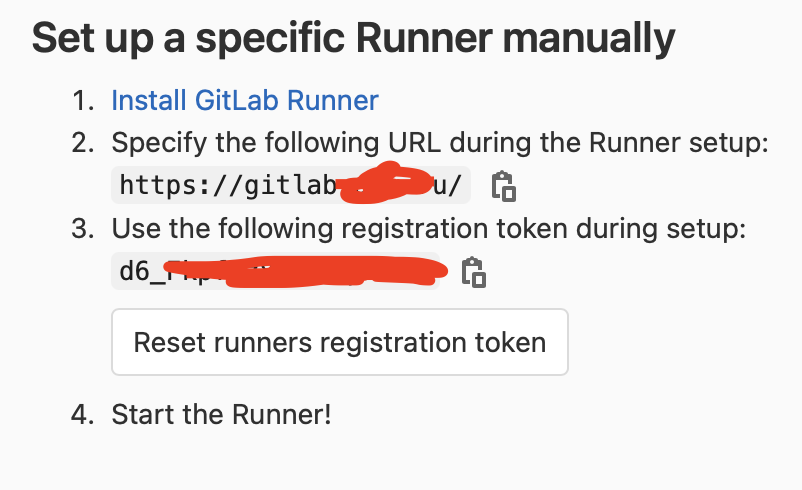

Привет, `%username%`! Простая шпаргалка о том, как быстро и просто установить Gitlab Runner на Ubuntu/Debian.

## Добавляем репозиторий

Имеем в распоряжении сервер на Ubuntu:

```bash
root@mysrv:~# lsb_release -a
No LSB modules are available.
Distributor ID:    Ubuntu
Description:    Ubuntu 18.04.4 LTS
Release:    18.04
Codename:    bionic
root@mysrv:~#
```

Теперь добавляем репу:

```bash
curl -L https://packages.gitlab.com/install/repositories/runner/gitlab-runner/script.deb.sh | sudo bash
```

## Установка

Установка последней версии выполняется просто:

```bash
sudo apt update
export GITLAB_RUNNER_DISABLE_SKEL=true; sudo -E apt-get install gitlab-runner
```

Установка конкретной версии:

```bash
sudo apt update
sudo apt-cache madison gitlab-runner
export GITLAB_RUNNER_DISABLE_SKEL=true; sudo -E apt-get install gitlab-runner=10.0.0
```

## Регистрация

Для регистрации ранера необходимо получить токен в настройках репозитория (или группы репозиториев). Это делается в разделе `Settings` -> `CI/CD` -> `Runners`. А выглядит интересующий нас пункт примерно вот так:



Теперь мы можем выполнить регистрацию ранера вот такой командой:

```bash
sudo gitlab-runner register
Runtime platform                                    arch=amd64 os=linux pid=8846 revision=8fa89735 version=13.6.0
Running in system-mode.
Enter the GitLab instance URL (for example, https://gitlab.com/):
https://gitlab.jtprog.ru/
Enter the registration token:
5oqXxxXXXXxX-UsP6ye_
Enter a description for the runner:
[runner]:
Enter tags for the runner (comma-separated):
jtprog,docker,blog
Registering runner... succeeded                     runner=3xxXxxXX
Enter an executor: docker-ssh, shell, ssh, virtualbox, docker-ssh+machine, kubernetes, custom, parallels, docker+machine, docker:
shell
Runner registered successfully. Feel free to start it, but if it's running already the config should be automatically reloaded!
```

Тут мы зарегистрировали самый простой вариант ранера с обычным шеллом (shell) в качестве исполнителя. Это нам позволит выполнять на ранере такого типа абсолютно все, что я могу выполнить руками в консоли.

## Автоматизация

Для работы с gitlab-runner есть официальный [модуль](https://docs.ansible.com/ansible/latest/collections/community/general/gitlab_runner_module.html) в Ansible, а так же есть вроде бы не плохая [роль](https://github.com/riemers/ansible-gitlab-runner) для установки gitlab-runner.

На это всё! Profit!

---
Если у тебя есть вопросы, комментарии и/или замечания – заходи в [чат](https://ttttt.me/jtprogru_chat), а так же подписывайся на [канал](https://ttttt.me/jtprogru_channel).
