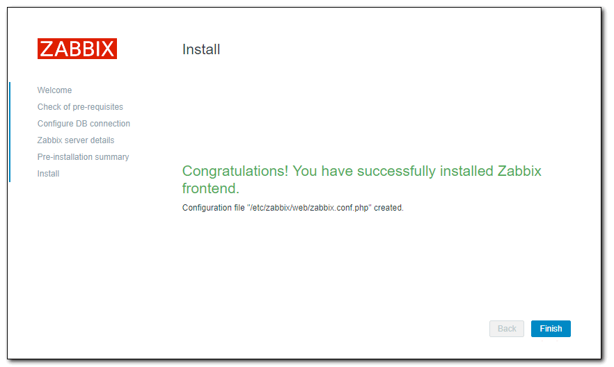

Привет `%username%`! В этом посте я подробно расскажу об установке и начальной настройке Zabbix 3.4 на примере CentOS 7. Выбор ОС был очевидным ввиду того, что только эта ОСь используется у нас в компании, а мониторинг просто необходим. Все подробности под катом.

И так, приступим. Установку CentOS я описывать не буду, т.к. и без меня там все ясно и понятно (~~хотя может расскажу чуть позже~~). Делаем следующее - логинимся по ssh от имени рута на наш чистый сервер. Далее делаем стандартную процедуру обновления:

```bash
yum update && yum upgrade -y
```

После чего я обычно ставлю стандартный для себя набор:

```bash
yum install vim mc git -y
```

После завершения установки своего любимого софта приступаем к основному действию. Для начала отключаем **SElinux**. Я не вижу смысла с ним заморачиваться на сервере мониторинга в локальной сети.

```bash
vim /etc/sysconfig/selinux
```

Редактируем строку:

```bash
SELINUX=disabled
```

и выполняем команду:

```bash
setenforce 0
```

Теперь установим `mariadb`. Её необходимо ставить отдельно, почему-то она не устанавливается как необходимая зависимость при установке самого сервера Zabbix.

```bash
yum install mariadb mariadb-server
```

Запускаем `mariadb` и добавляем ее в автозагрузку:

```bash
systemctl start mariadb  
systemctl enable mariadb.service
```

Отрабатываем скрипт первоначальной настройки `mysql`:

```bash
/usr/bin/mysql_secure_installation
```

На этом подготовка завершена. Приступим к установке самого Zabbix'а и для начала подключим официальный репозиторий 3.4:

```bash
rpm -Uvh http://repo.zabbix.com/zabbix/3.4/rhel/7/x86_64/zabbix-release-3.4-1.el7.centos.noarch.rpm
```

Устанавливаем Zabbix сервер с веб-интерфейсом и с базой данных MySQL:

```bash
yum install zabbix-server-mysql zabbix-web-mysql
```

После окончания загрузки всех зависимостей нужно создать пользователя и базу данных для мониторинга. Делаем все через консоль:

```bash
mysql -uroot -p
```

Тут вас попросят ввести пароль от пользователя `root` для сервера `mysql`, после чего создаем базу данных и пользователя для системы мониторинга:

```sql
create database zabbix character set utf8 collate utf8_bin;  
grant all privileges on zabbix.* to zabbix@localhost identified by 'zabpassword';  
quit;
```

А теперь импортируем схему БД и начальные данные для Zabbix'а:

```bash
zcat /usr/share/doc/zabbix-server-mysql-**3.4.***/create.sql.gz | mysql -uroot -p  zabbix
```

Тут снова вводим пароль от рута `mysql` и ждем немного. После чего редактируем файл конфигурации сервера заббикс. Прописываем данные для подключения к БД.

```bash
vim /etc/zabbix/zabbix_server.conf
```

И меняем следующие строчки:

```text
DBHost=localhost  
DBName=zabbix  
DBUser=zabbix  
DBPassword=zabpassword
```

Этих минимальных настроек достаточно, для работы сервера. В дополнение можно еще увеличить параметр `Timeout`. Он отвечает за время ожидания ответа от агента, `snmp` устройства или внешней проверки. Иногда этого бывает недостаточно. В частности, когда используется какой-то скрипт, который долго выполняется, для получения метрики. Поставьте секунд 10-15.

Запускаем `zabbix` и добавляем в автозагрузку:

```bash
systemctl start zabbix-server  
systemctl enable zabbix-server
```

Проверяем лог файл на наличие ошибок:

```bash
cat /var/log/zabbix/zabbix_server.log
```


Если у вас примерно так же, значит все в порядке. Сервер штатно запустился и готов к работе.

Для продолжения настройки сервера мониторинга, нам нужно зайти в web-интерфейс. Перед этим отредактируем файл конфигурации web сервера. Открываем конфиг и раскомментируем одну строку, изменив ее под свой часовой пояс:

```bash
vim /etc/httpd/conf.d/zabbix.conf

php_value date.timezone Europe/Moscow
```

Сохраняем файл. Теперь запускаем `httpd` и добавляем его в автозагрузку:

```bash
systemctl start httpd  
systemctl enable httpd
```

Можно заходить на веб интерфейс по адресу [http://192.168.0.250/zabbix](http://192.168.0.250/zabbix), где `192.168.0.250` ip адрес сервера или его доменное имя (пример: `zabbix.mycompany.local`), где устанавливаем и настраиваем мониторинг заббикс.

> На этом этапе важно проверить настройки `firewalld`. Если вы его не настраивали и не отключали, то скорее всего по указанному адресу у вас ничего не откроется. В данной статье я не буду отвлекаться на настройку фаервола, это тема отдельного разговора. Подробно вопрос [настройки iptables](https://jtprog.ru/iptables-manual/) я рассмотрел отдельно. Либо настройте `firewalld`, либо просто отключите. В приведенной ссылке рассказано, как это сделать.

Открываем в браузере web-интерфейс `zabbix`. Нас встречает страница приветствия. Если у вас то же самое, вы на верном пути.


Жмем Next step и попадаем на страницу проверок. Если все делали точно по инструкции, то все проверки у вас будут пройдены.


Двигаемся дальше и указываем параметры для подключения к `mysql`. Данные те же, что мы указывали ранее при создании БД и пользователя.


На следующем этапе надо указать адрес сервера и порт, на котором он будет работать. Оставляем значения по-умолчанию.


Еше раз проверяем все настройки. Если все в порядке, двигаемся дальше на заключительный этап установки.


Если поучили это сообщение, то поздравляю, установка сервера мониторинга Zabbix 3.4 закончена.



Нажимаете Finish и попадаете на страницу логина в систему. Данные по умолчанию следующие:

```text
User: Admin
Password: zabbix
```

Нас встречает голая панель управления, так как никаких параметров мы не наблюдаем и не имеем ни одного объекта сбора данных. Далее мы расставляем агенты на все сервера и/или компьютеры которые хотим мониторить (*информации в официальной документации достаточно*) и радуемся жизни.

На этом всё!

---
Если у тебя есть вопросы, комментарии и/или замечания – заходи в [чат](https://ttttt.me/jtprogru_chat), а так же подписывайся на [канал](https://ttttt.me/jtprogru_channel).
