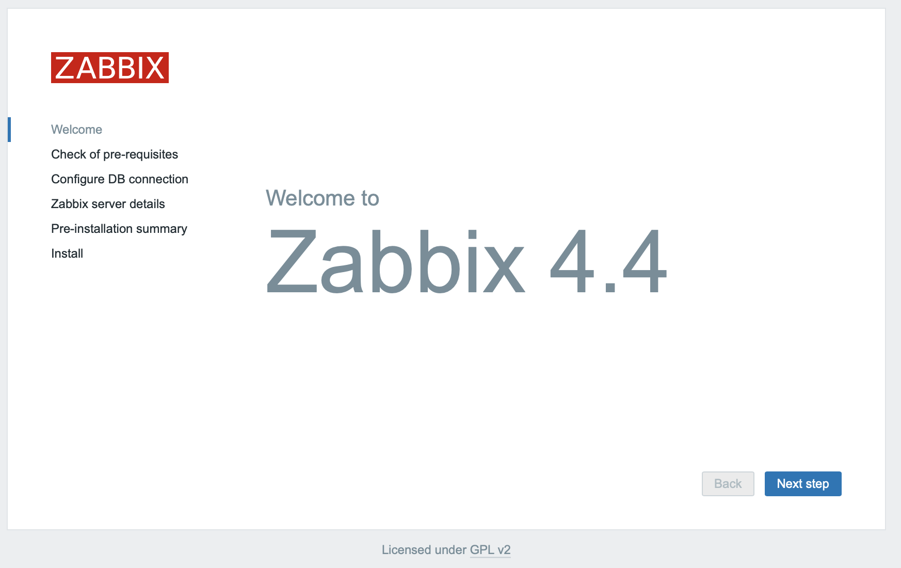
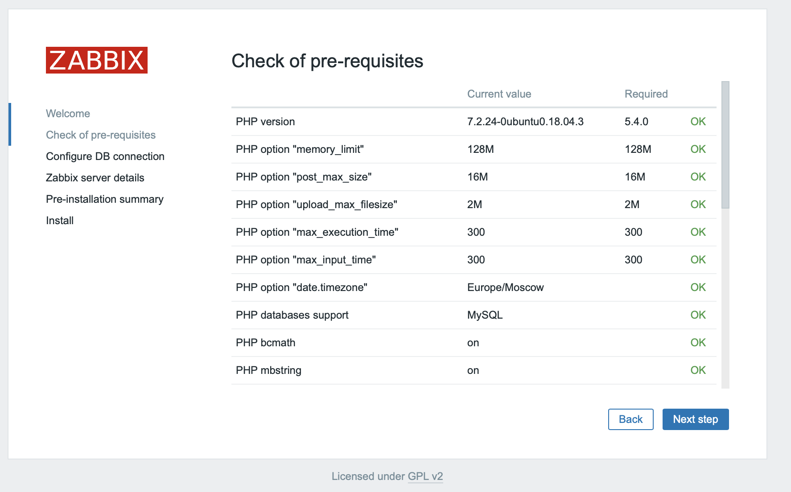
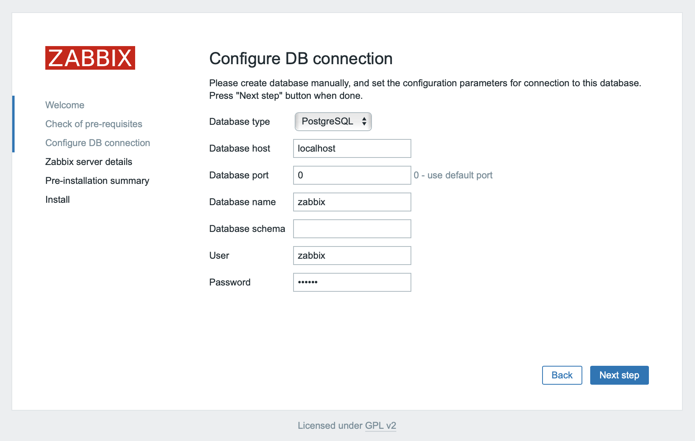
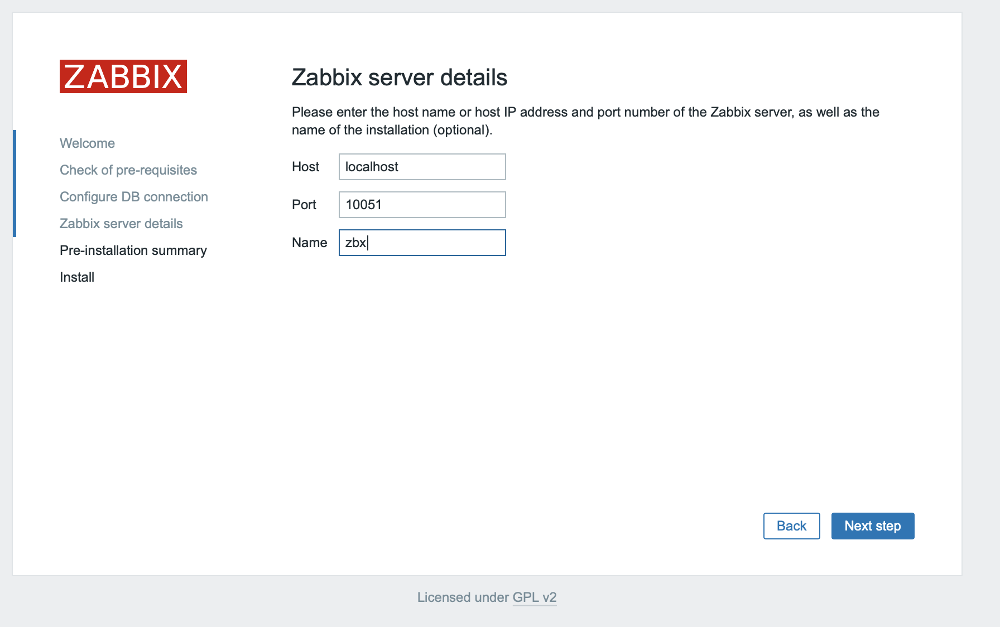
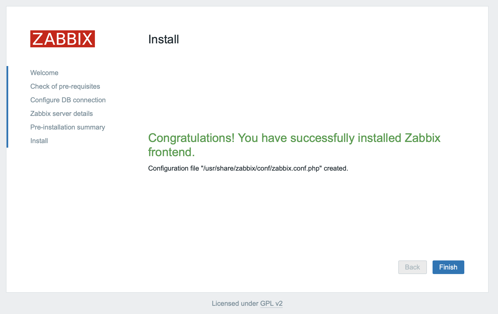

Привет, `%username%`! Данная статья - обычный пересказ официальной документации [Zabbix](https://www.zabbix.com/download?zabbix=4.4&os_distribution=ubuntu&os_version=18.04_bionic&db=postgresql&ws=nginx) и не содержит в себе ничего магического. Да и процесс установки уже мною освещался ранее на [CentOS](https://jtprog.ru/install-zabbix-centos/).

Ставить буду максимально свежую версию (на момент написания статьи) Zabbix на такую же свежую Ubuntu Server 18.04.4.

> **ВАЖНО**! Все дальнейшие действия на сервере выполняются из под учетной записи `root`.

## Добавление Zabbix репозитория

Предполагается, что установка выполняется на чистую систему, поэтому для начала обновим текущие пакеты в системе.

```bash
apt update
apt upgrade -y
```

Добавим репозиторий Zabbix и обновим информацию о доступных пакетах:

```bash
wget https://repo.zabbix.com/zabbix/4.4/ubuntu/pool/main/z/zabbix-release/zabbix-release_4.4-1+bionic_all.deb
dpkg -i zabbix-release_4.4-1+bionic_all.deb
apt update
```

## Установка Zabbix-server

Я буду ставить Zabbix для PostgreSQL, потому что так удобно мне. Так же сразу ставим Nginx и WEB-интерфейс для

```bash
apt install zabbix-server-pgsql zabbix-frontend-php php7.2-pgsql zabbix-nginx-conf zabbix-agent -y
```

## Готовим PostgreSQL

Для начала создадим пользователя:

```bash
sudo -u postgres createuser --pwprompt zabbix
```

Нас попросят дважды ввести пароль для нового пользователя `zabbix` - собственно говоря вводим дважды одно и тоже и всё. Далее создадим базу, которую будет использовать Zabbix:

```bash
sudo -u postgres createdb -O zabbix -E Unicode -T template0 zabbix
```

Выполним подготовку базы для Zabbix - создадим необходимые таблицы/индексы:

```bash
zcat /usr/share/doc/zabbix-server-pgsql/create.sql.gz | sudo -u zabbix psql zabbix
```

## Настройка Zabbix-server

После всех вышеописанных процедур необходимо указать Zabbix-server'у с какой БД он работает и как к ней подключиться. Делается это просто - в файле `/etc/zabbix/zabbix_server.conf` необходимо отредактировать следующие параметры:

```ini
DBHost=localhost
DBName=zabbix
DBUser=zabbix
DBPassword=zabbix
```

> ВАЖНО! В конфигурационном файле пароль для доступа к БД хранится в открытом виде в параметре `DBPassword`

## Запуск

Предварительно проверяем настройки для Nginx в этом файлике `/etc/zabbix/nginx.conf`. Правим там `listen` и `server_name`. А так же не забываем указать часовой пояс в этом файлике `/etc/zabbix/php-fpm.conf`

Следующим этапом запускаем Zabbix-server, Nginx, PHP-FPM (он поставился автоматически).

```bash
systemctl enable zabbix-server.service
systemctl enable nginx.service
systemctl enable php7.2-fpm.service
systemctl restart zabbix-server.service
systemctl restart nginx.service
systemctl restart php7.2-fpm.service
```

Далее идем в любой доступный браузер и все дальше будет настраиваться через WEB-UI

## WEB-UI

Собственно говоря тут все просто - Next->Next->Next =)

Открываем наш сервер по DNS/IP - в зависимости от того, как настроили, в браузере. И видим приветствие:


Тут делаем самое простое - нажимаем `Next step`


На этом этапе проверяются настройки PHP и прочего. Тут могу сказать поправить часовой пояс, в том случае если вы это забыли сделать ранее.
> **ВАЖНО**! Скриншот сделан до того, как установлен пакет `php7.2-pgsql`, поэтому в пункте `PHP databases support` указан только MySQL


Делаем то, о чем просят - указываем параметры подключения к БД - выбираем PostgreSQL и указываем свои данные.


Указываем где именно у нас стоит Zabbix-server, а так же его `hostname`.


Проверяем всё, что мы ввели и подтверждаем.


Собсна **Congratulations**!

Дальше нам доступен стандартный пользователь для входа в web-интерфейс с логином `Admin` и паролем `zabbix`. Собственно входим в web-ui и пользуемся как можем.

## Итог

Оказалось все гораздо проще, чем казалось =)

---
Если у тебя есть вопросы, комментарии и/или замечания – заходи в [чат](https://ttttt.me/jtprogru_chat), а так же подписывайся на [канал](https://ttttt.me/jtprogru_channel).
