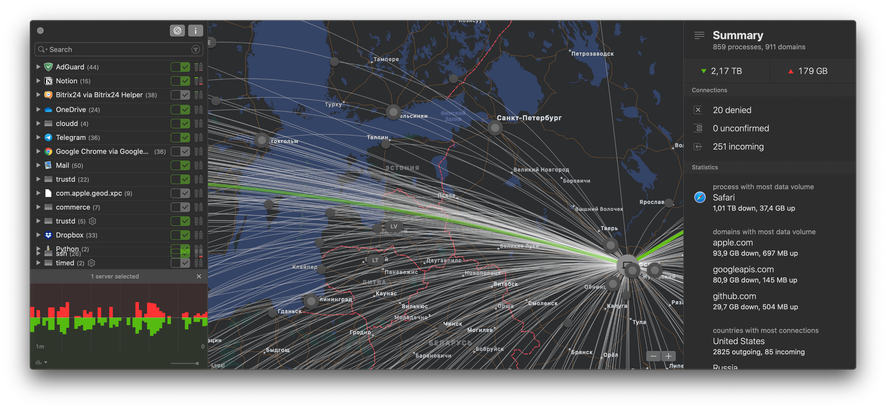

Привет, `%username%`! В народе (даже в наши времена) ходит слух, что macOS самая защищенная ОСь и под нее не бывает вирусов, а еще что там не нужен файрвол. И ведь такое говорят с довольно серьезным видом (те кто в этом нихрена не понимает – продаваны/консультанты).

Собственно говоря Little Snitch я купил довольно почти сразу вместе с покупкой нового MBP примерно два года назад. Установил, включил Alert mode и забыл. 

В Alert mode есть одним минус – он первое время тебя просто атакует вопросами кого и куда пускать. 

Так же в настройках можно указать несколько профилей и настроить автоматическое их переключение при использовании той или иной сети Wi-Fi. Штука довольно прикольная и удобная – из дома я одни программы выпускаю в сеть, из офиса – другие, а если подключаюсь где-нибудь в кафе – то вообще браузер только на несколько сайтов может ходить. Ну и входящие подключения так же блокирует более чем отлично.

Ну и довольно большим бонусом имеется монитор сетевого доступа:

В реальном времени отображает кто, куда, где... Короче пощекотать своего внутреннего параноика будет чем 😉

Ну и в самом мониторе можно прямо на лету блокировать как отдельные программы, так и отдельные сайты – например сайты статистики/рекламы.

Итог: софтина должна быть куплена каждым, кто заботится о своей безопасности. 

---

Если у тебя есть вопросы, комментарии и/или замечания – заходи в [чат](https://ttttt.me/jtprogru_chat), а так же подписывайся на [канал](https://ttttt.me/jtprogru_channel).
