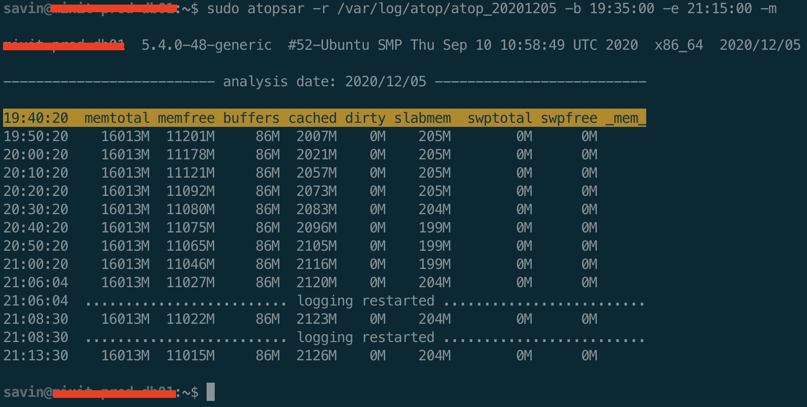
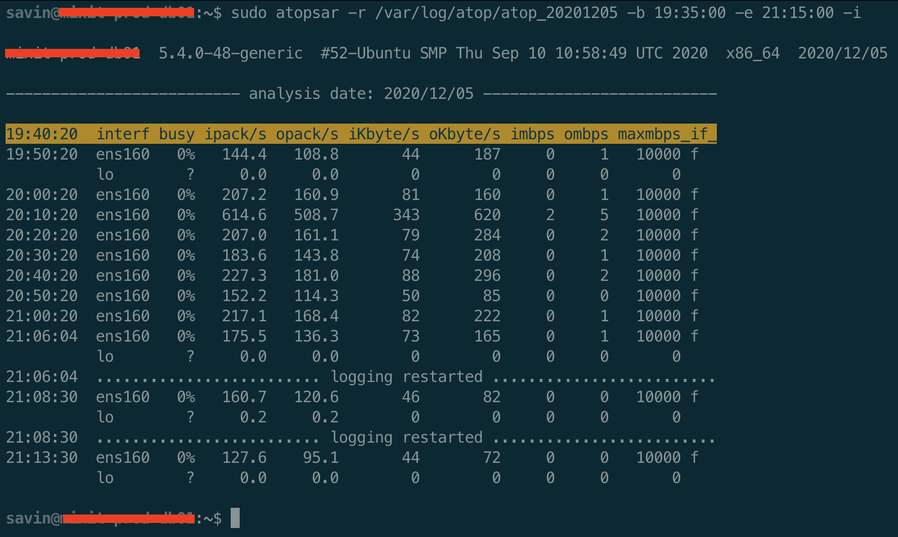
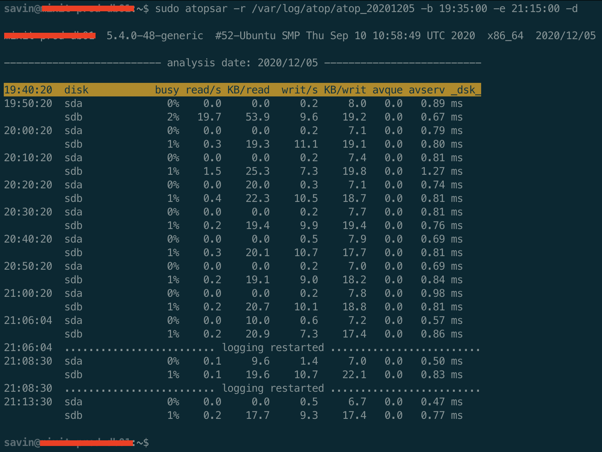

Привет, `%username%`! Мониторинга много не бывает, а значит такие инструменты как Zabbix, Prometheus и другие имеют какие-то недостатки. Одним из основных недостатков может быть то, что для мониторинга нужна инфраструктура. А если у нас один сервер, то нам может быть достаточно такого инструмента как `atop`.

Устанавливается быстро, ресурсов потребляет мало. Единственный минус — работать с ним можно только в CLI.

## Установка и настройка

Установка выполняется стандартным способом:

```bash
# установка
sudo apt install atop
# или
# sudo yum install atop
# проверка
atop -V
Version: 2.4.0 - 2019/01/12 20:37:57     <gerlof.langeveld@atoptool.nl>
# автозапуск
sudo systemctl enable atop.service
# запуск
sudo systemctl start atop.service
```

### Конфигурационный файл

```bash
cat /etc/default/atop
# Интервал через который делается снимок нагрузки сервера, в секундах.
LOGINTERVAL=300
# Путь до логов atop.
LOGPATH="/var/log/atop"
# хранить бэкапы за 10 дней.
LOGGENERATIONS=10
```

Настройка завершена.

## Как пользоваться atop

После установки `atop` появляется команда `atopsar`, которая является встроенным анализатором логов `atop` и  позволяет быстро найти проблему и смотреть лог в нужное вам время.

Основные ключи:

- `-b` — с какого времени надо вывести лог;
- `-e` — до какого времени надо вывести лог;

Общая нагрузка:

- `-d` — нагрузка на каждый диск отдельно;
- `-m` — нагрузка на оперативную память и swap;
- `-с` — нагрузка на процессор, отдельно по каждому ядру;
- `-p` — количество процессов и тредов;
- `-w` — нагрузка на ipv4;
- `-W` — ошибки на ipv4;
- `-i` — нагрузка на интерфейс;

Поиск отдельных процессов:

- `-O`  — TOP-3 процессов по CPU;
- `-G`  — TOP-3 процессов по RAM;
- `-D`  — TOP-3 процессов по диску;
- `-N`  — TOP-3 процессов по сети;

Если вам этого недостаточно, можно посмотреть полный снимок нагрузки на сервер командой:

```bash
sudo atop -r /path/to/file.log
```

А можно сразу указать временные рамки:

```bash
sudo atop -r /var/log/atop/atop_20201205 -b 19:35:00 -e 21:15:00
```

Откроется тот же `atop`, в котором видна вся нагрузка на сервере, где можно выставлять сортировку по процессам, но за только на нужное время. Чтобы открыть следующий снимок нагрузки, нажмите `t`, предыдущий снимок — `T`. Время снимка указано в первой строке посередине экрана. В качестве примера посмотрим на нагрузку на RAM с `19:35:00` до `21:15:00` от 5 декабря 2020 г.

```bash
sudo atopsar -r /var/log/atop/atop_20201205 -b 19:35:00 -e 21:15:00 -m
```



Нагрузка по сетевым интерфейсам:

```bash
sudo atopsar -r /var/log/atop/atop_20201205 -b 19:35:00 -e 21:15:00 -i
```



Нагрузка на диски:

```bash
sudo atopsar -r /var/log/atop/atop_20201205 -b 19:35:00 -e 21:15:00 -d
```



## Итоги

Думаю для базовой диагностики упомянутой в этой статье информации достаточно. На этом всё! Profit!

---
Если у тебя есть вопросы, комментарии и/или замечания – заходи в [чат](https://ttttt.me/jtprogru_chat), а так же подписывайся на [канал](https://ttttt.me/jtprogru_channel).
