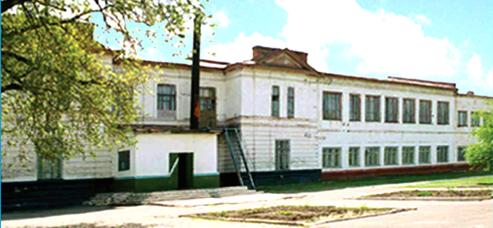
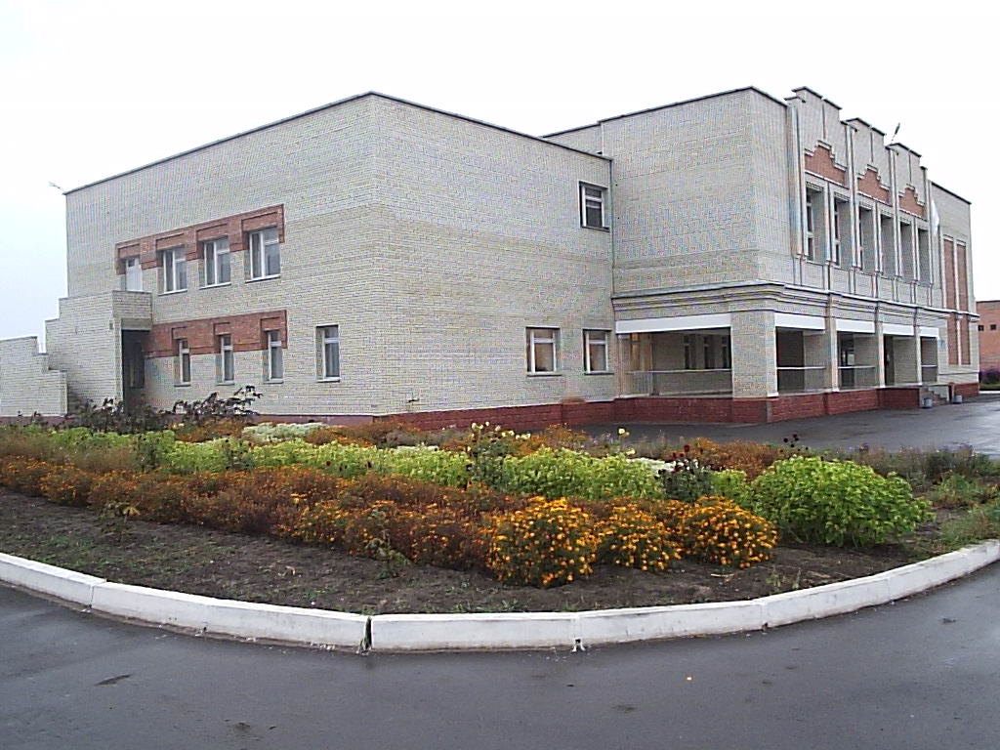
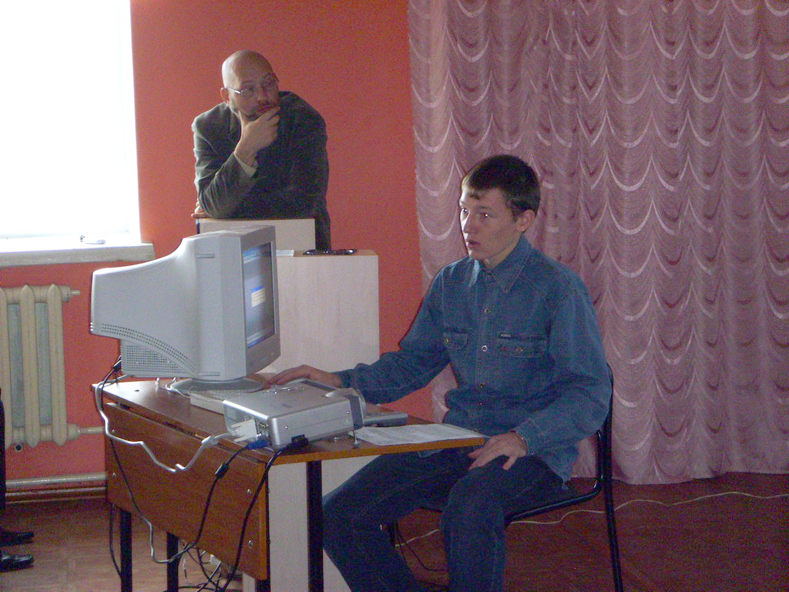

Привет, `%username%`! Ниже по тексту не будет никаких советов, рекомендаций, списков курсов которые тебе могут помочь. Будет только моя личная история о том, как я смог "Войти в АйТи".

## Начало начал

Началось все примерно в 2001-2002 году – я учился в школе одного маленького посёлка городского типа. Школа была (и надеюсь остается) известной почти на всю область. Причиной тому был отличный педагогический состав. Все учителя там работали! Даже по другому скажу: Все УЧИТЕЛЯ там пахали! Именно УЧИТЕЛЯ – с БОЛЬШОЙ буквы!

Не буду врать, у меня как и у многих детей были проблемы по некоторым предметам по самым разным причинам. Но учителя действительно делали многое для детей. За что им огромное спасибо!

Именно в этой [школе](https://wiki.soiro.ru/Школа_р.п.Пинеровка_(Балашовский_район_Саратовская_область)) я впервые увидел компьютер! Это был целый компьютерный класс, в котором было порядка 10-12 [УКНЦ](https://ru.wikipedia.org/wiki/Электроника_МС_0511) для учеников и парочка "крутых и современных пентиумов" на столе учителя информатики.

Не могу сказать, что я "прям прозрел" когда увидел это "чудо инженерной мысли". Первое что я начал делать, как и большинство детей, это играть! Мне очень стыдно, но я совершенно не помню как назывались те игры, которые там были. Но был один поворотный момент. Как-то я дождался своей очереди и начал играть во что-то связанное с вертолётиками (ну сорян – не помню я названия игрушек) и комп взял и завис. Игра начала дико лагать и на экране появлялись артефакты.

Я как и положенно в такой ситуации начал паниковать на тему того, что я "сломал компутер". Это нормально – все через такое проходили кмк. Но мою тихую панику заметил [учитель информатики](https://wiki.soiro.ru/Участник:Виталий_Пичугин) и подошел ко мне. Он не стал ругать, а пытался пояснить что именно произошло (возможно у меня на лице было написано что я идиот – не знаю) и как можно это исправить.    

Я до конца не уверен, но кажется именно тогда я понял что "компутеры – это жуть как интересно". После этого я еще два года ходил в этот кабинет и иногда играл на УКНЦ, а иногда смотрел как "старшеклассники рубились в Героев" на компе учителя.

## Глубока ли кроличья нора?

На момент перехода в восьмой класс в нашем поселке открыли новую школу (которую строили лет 10 наверное и на стройке которой мы иногда играли). Эта школа была огромная и новая по сравнению со старой.    

Плюсом в тот же период школа выиграла грант на 1 000 000 рублей и в школе начала появляться современная техника (на сколько это было возможно тогда). В школе появились ноутбуки в профильных кабинетах, второй кабинет информатики, мультимедийные доски в некоторых кабинетах.

И тут на базе всего этого учителем информатики был открыт "кружок информатики и программирования", куда я поспешил записаться и проводил там довольно много времени.

Помимо основ работы за компьютером, его устройства и прочих базовых вещей, нас учили алгоритмам, системному мышлению, умению декомпозировать задачу, ну и программирование конечно тоже было.

Программировали сначала на [QBasic](https://ru.wikipedia.org/wiki/QBasic), потом на [Pascal](https://ru.wikipedia.org/wiki/Паскаль_(язык_программирования)) и [Turbo Pascal](https://ru.wikipedia.org/wiki/Turbo_Pascal). После появились такие варианты языков как [Delphi](https://ru.wikipedia.org/wiki/Delphi_(язык_программирования)) и [Visual Basic](https://ru.wikipedia.org/wiki/Visual_Basic) и даже [VBA](https://ru.wikipedia.org/wiki/Visual_Basic_for_Applications) и [VBScript](https://ru.wikipedia.org/wiki/VBScript). Так же я участвовал в различных олимпиадах по программированию (как школьных так и районных и областных) и где-то даже занимал призовые места.

Постепенно большая часть задач по администрированию школьной сети и компьютеров перешла на мои плечи и я не редко был тем, кого выдергивали посреди урока учителя с просьбами "помочь распечатать" или "показать как сделать что-то" или "починить принтер" (я иногда заправлял лазерные принтеры порошком).

На фоне этого часто страдала успеваемость и дисциплина. Но так или иначе я смог закончить 11 классов и даже аттестат получил без троек! Учитывая уровень моего раздолбайства это было достижением.

Я даже с учителем химии ругался как-то на тему, того что я ничего не хочу знать и "химия не пригодится мне в жизни, потому что я буду нажимать на кнопки, а знать из чего они сделаны мне не обязательно".

Кроме программирования и внутришкольных активностей я не редко принимал участие в межшкольных мероприятиях для преподавателей разных школ. Помогал с автоматизацией всяких рутинных процессов как умел – Excell + VBS/VBA и всякие мелочи в духе приглашений, бейджиков дежурных, уведомлений для родителей и учителей (они потом печатались) делались довольно быстро мною.

Меня всё это очень интересовало и я всасывал знания как только мог. В попытках узнать что за файлики такие с расширением `.dll` я мог за неделю 5-10 раз переустановить винду на своем домашнем ПК.

## Времена раздолбайства

По окончании школы я получил удостоверение о начальном профессиональном образовании по специальности "Оператор ЭВМ / Программист". Удостоверение было выдано организацией, которой уже нету и оно позволяло мне без проблем поступить в пару колледжей. Но я решил, что хочу идти в Политех – СГТУ им. Гагарина Ю.А.

Свобода от родительского надзора и толпа раздолбаев-единомышленников сделали свое дело. Меня не допустили до летней сессии потому, что я прогулял всю физру (да физру!) за год и мне отказались ставить зачет "любыми способами". После чего меня отчислили (а я поступал на платное) и я посидев недельку дома решил, что лучше я "схожу в армию сейчас, чем ждать буду до осени – годик-то всего служить". Пачка внешних обстоятельств сложились особым образом и я провел в армии не год, как планировал, а три.

После армии, работал то там, то сям – крыл крыши на фермах, строил бассейны для воды, продавал пластиковые окна. Много всякого было разного.

Потом подвернулась возможность поступить в "столичный ВУЗ на бюджет". Образование как понятно из текста выше, я не особо любил. Особенно в том виде, в котором оно предлагалось студентам. Но шанс "покорить Москву" был и меня заинтересовал.

Вторая попытка получить вышку тоже не увенчалась успехом, но прошел я чуть дальше – перевелся на второй курс и бросил это заведение. А перед тем как бросить второй универ, я два месяца активно учил Linux. Меня отправили в командировку на "максимум две недели", но она длилась два месяца. Где-то в Тверской области завод по производству брикетированного торфа, я, ноутбук, запасной HDD, USB-модем от пчелайна и туева хуча свободного времени.

Ради любопытства поставил себе кажется ROSA Linux, потом Ubuntu, потом еще куча всяких дистрибутивов. Методом научного тыка, чтением man-ов и форумов я начал раскуривать Linux и мне понравилось. По завершении командировки я уже имел неплохой скилл уверенно пользователя Linux.

## Поворот ни туда

Дальше была работа, которая сделал очередной поворот в моей жизни. Я спустя какое-то время устроился работать в ночной бар охранником. Работал 6 ночей в неделю и получал довольно не плохо как мне казалось.

Так сложилось, что один из посетителей был "айтишником" и мы случайно разговорились. Он оценив мои знания смело (хоть и пьяненько) заявил, что "с такими знаниями можно смело идти эникеем и просить 60-70k". Спустя примерно месяц после этого разговора так и случилось – я ушел из охраны и очень быстро нашел работу эникейщиком. Настолько быстро, что после собеса я помчался в ЧОП чтобы мне скорее отдали трудовую книжку и я подписал все бумажки.

## Первая работа

В той компании я проработал с весны 2014 до весны 2017 – без малого три года вышло. Начинал обычным эникеем – запись в трудовой "Помощник системного администратора". Как я туда попал? Повезло – по другому не могу сказать. Просто повезло и всё тут.

Собеседование было комбинированным: HR и "технари" были вместе (трое их было всего). Стандартная схема: расскажите о себе, что умеете и т.д. и т.п.

На тот момент я умел пользоваться консолью Linux'a на уровне, достаточном чтоб не применять [патч Бармина](http://cyclowiki.org/wiki/Патч_Бармина) по советам с форумов и разбирался в том, что и где примерно расположено в линупсе. Успел даже "написать" правило для `udev`, чтобы нормально заработал USB-модем от пчелайна и даже что-то понял из разряда "а как это, а нах это?".

Менял картриджи в принтерах, помогал дамочкам в бухгалтерии с `Odin Ass`, отвечал на звонки из других филиалов компании и ползал с витухой в зубах – типичная работа эникейщика.

Параллельно раскуривал Windows Server 2008 и 2012, разбирался в том, как работает и нахрена нужна Active Directory с групповыми политиками, погружался в виртуализацию на базе VMware ESXi 5.x, разворачивал Ubuntu Server 14.04 в качестве почтового сервера компании, раскуривал как правильно устанавливать [Стахановца](https://stakhanovets.ru) чтоб не заподозрил никто из сотрудников.

В таком режиме прошло примерно пол года. А дальше случилась показательная ситуация: начальника отдела "спалили на откатах" с помощью той же DLP системы "Стахановец", которую он сам курировал (а я ее разворачивал на хомячьих компах).

## Времена меняются

Наступила смена власти – начальником назначили старшего админа, а меня повысили до админа-обыкновенного. Дальше бывало много всякого разного и не особо безобразного. В конце 2015 или начале 2016 моего начальника отдела стали часто замечать пьяным (ну в говно бухое тело блюющее под собственный стол было трудно не заметить). По итогу с ним распрощались, а меня сделали временным "и.о." – в компании на тот момент был еще админ в одном из филиалов. Но спустя какое-то время меня назначили начальником отдела, дали добро на набор сотрудников в количестве двух штук (эникейщик и админ).

Отдел собрал, даже как-то им руководил – народ не жаловался, а если и жаловались то не мне (а если за моей спиной – это уж на их совести). Счастье длилось не долго – спустя какое-то время мой бывший начальник замаячил на горизонте – смог вернуться в компанию начальником ИБ – отдел придумали под него. Поскольку у нас с ним был личный конфликт (на фоне его пьяных дебошей) – я не хотел с ним взаимодействовать никак. А спустя какое-то время большую часть времени он занимался тем, что "изобретал" как можно меня "выкинуть" из компании. По итогу я ушел сам не дожидаясь когда свершится чудо и на него снизойдет озарение.

## Дальше – больше

Я какое-то время был без работы, потому что не мог найти по не ясным для меня причинам "нормальную" работу. То одним надо было самому себе генерировать задачи, то другим было непонятно "чойта ты начальник в одмины идешь", а третим было надо "чтобы если что – все наши сервера должны сгореть". Время было такое, что жопа и пипец. Но я таки как-то нашел место – поработал, а потом другое место – поработал. Постепенно пришел к мысли, что я не хочу взаимодействовать с "хомячками" (саппорт – не мое от слова совсем, потому что я не люблю тупых людей). Поработал в галере, потом в вебстудии.

Сейчас я точно знаю одно: за семь с лишним лет реального опыта я знаю ровно нихуя!

А те, кто увидели курсы "Девупс с нуля за месяц и зарплата 100500kkk наносек" и решили что так обязательно и будет – прекращайте верить в сказки (или не прекращайте – тут уж мне плевать).

Идти в IT только ради денег? ИДИТЕ! Я не против! Благодаря вам – я буду получать сильно больше!

---
Если у тебя есть вопросы, комментарии и/или замечания – заходи в [чат](https://ttttt.me/jtprogru_chat), а так же подписывайся на [канал](https://ttttt.me/jtprogru_channel).
