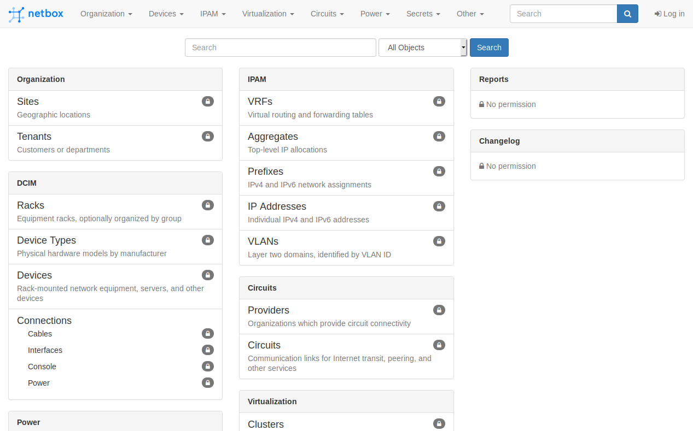
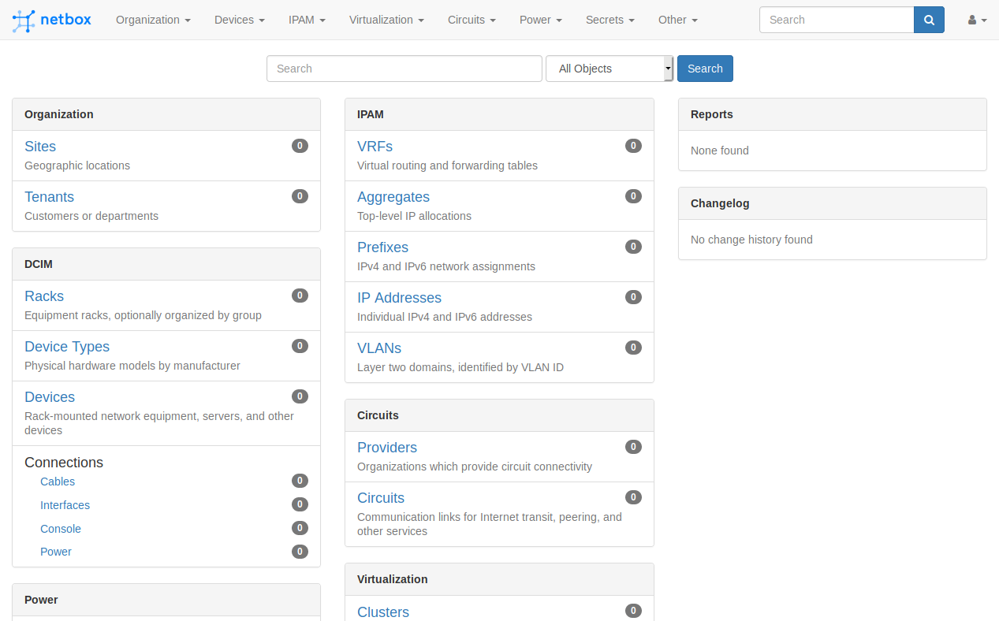

Привет, `%username%`! Поговорим о такой классной штуке как [Netbox](https://netbox.readthedocs.io/en/stable/), а так же установим её на Ubuntu 20.04 и прикрутим авторизацию через MS Active Directory.

## Подготовка

Начнем по порядку с обновления пакетов и установки PostgreSQL:

```bash
sudo apt-get update
sudo apt-get install -y postgresql libpq-dev
```

Подключение к PostgreSQL:

```bash
sudo -u postgres psql
```

Создание БД и пользователя от имени которого Netbox будет подключаться к PostgreSQL:

```sql
postgres=# CREATE DATABASE netbox;
CREATE DATABASE
postgres=# CREATE USER netbox WITH PASSWORD 'FuckingMagicPassw0rd';
CREATE ROLE
postgres=# GRANT ALL PRIVILEGES ON DATABASE netbox TO netbox;
GRANT
postgres=# \q
```

Проверяем доступ в БД:

```bash
psql -U netbox -W -h localhost netbox
```

Устанавливаем Redis:

```bash
sudo apt-get install -y redis-server
```

Проверка доступности Redis:

```bash
redis-cli ping
PONG
```

Установка Python и дополнительных пакетов:

```bash
sudo apt-get install -y python3 python3-pip python3-venv python3-dev build-essential libxml2-dev libxslt1-dev libffi-dev libpq-dev libssl-dev zlib1g-dev
```

## Установка Netbox

Качаем архив с github'a и распаковываем его:

```bash
wget https://github.com/netbox-community/netbox/archive/v2.8.8.tar.gz
tar -xzf v2.8.8.tar.gz -C /opt
cd /opt/
ln -s netbox-2.8.8/ netbox
cd /opt/netbox/
```

Создание пользователя `netbox`:

```bash
groupadd --system netbox
adduser --system --gid <gid_netbox_from_etc_group> netbox
chown --recursive netbox /opt/netbox/netbox/media/
```

Это `<gid_netbox_from_etc_group>` заменить на число, которое можно посмотреть вот так:

```bash
sudo cat /etc/group | grep netbox
```

Создаем виртуальное окружение:

```bash
python3 -m venv /opt/netbox/venv
source venv/bin/activate
pip3 install -r requirements.txt
```

## Настройка Netbox

Копируем пример конфигурации:

```bash
cd netbox/netbox/
cp configuration.example.py configuration.py
```

Файл `configuration.py` приводим к похожему виду:

```python
#########################
#                       #
#   Required settings   #
#                       #
#########################

# This is a list of valid fully-qualified domain names (FQDNs) for the NetBox server. NetBox will not permit write
# access to the server via any other hostnames. The first FQDN in the list will be treated as the preferred name.
#
# Example: ALLOWED_HOSTS = ['netbox.example.com', 'netbox.internal.local']
ALLOWED_HOSTS = [
    'netbox.jtprog.ru',
    'netbox.jtprog.local',
    '127.0.0.1',
    '192.168.0.110'
]

# PostgreSQL database configuration. See the Django documentation for a complete list of available parameters:
#   https://docs.djangoproject.com/en/stable/ref/settings/#databases
DATABASE = {
    'NAME': 'netbox',         # Database name
    'USER': 'netbox',               # PostgreSQL username
    'PASSWORD': 'FuckingMagicPassw0rd',           # PostgreSQL password
    'HOST': 'localhost',      # Database server
    'PORT': '',               # Database port (leave blank for default)
    'CONN_MAX_AGE': 300,      # Max database connection age
}

# Redis database settings. Redis is used for caching and for queuing background tasks such as webhook events. A separate
# configuration exists for each. Full connection details are required in both sections, and it is strongly recommended
# to use two separate database IDs.
REDIS = {
    'tasks': {
        'HOST': 'localhost',
        'PORT': 6379,
        # Comment out `HOST` and `PORT` lines and uncomment the following if using Redis Sentinel
        # 'SENTINELS': [('mysentinel.redis.example.com', 6379)],
        # 'SENTINEL_SERVICE': 'netbox',
        'PASSWORD': '',
        'DATABASE': 0,
        'DEFAULT_TIMEOUT': 300,
        'SSL': False,
    },
    'caching': {
        'HOST': 'localhost',
        'PORT': 6379,
        # Comment out `HOST` and `PORT` lines and uncomment the following if using Redis Sentinel
        # 'SENTINELS': [('mysentinel.redis.example.com', 6379)],
        # 'SENTINEL_SERVICE': 'netbox',
        'PASSWORD': '',
        'DATABASE': 1,
        'DEFAULT_TIMEOUT': 300,
        'SSL': False,
    }
}

# This key is used for secure generation of random numbers and strings. It must never be exposed outside of this file.
# For optimal security, SECRET_KEY should be at least 50 characters in length and contain a mix of letters, numbers, and
# symbols. NetBox will not run without this defined. For more information, see
# https://docs.djangoproject.com/en/stable/ref/settings/#std:setting-SECRET_KEY
SECRET_KEY = 'supersecretkey'


#########################
#                       #
#   Optional settings   #
#                       #
#########################

# Specify one or more name and email address tuples representing NetBox administrators. These people will be notified of
# application errors (assuming correct email settings are provided).
ADMINS = [
    # ['John Doe', 'jdoe@example.com'],
]

# URL schemes that are allowed within links in NetBox
ALLOWED_URL_SCHEMES = (
    'file', 'ftp', 'ftps', 'http', 'https', 'irc', 'mailto', 'sftp', 'ssh', 'tel', 'telnet', 'tftp', 'vnc', 'xmpp',
)

# Optionally display a persistent banner at the top and/or bottom of every page. HTML is allowed. To display the same
# content in both banners, define BANNER_TOP and set BANNER_BOTTOM = BANNER_TOP.
BANNER_TOP = ''
BANNER_BOTTOM = ''

# Text to include on the login page above the login form. HTML is allowed.
BANNER_LOGIN = ''

# Base URL path if accessing NetBox within a directory. For example, if installed at http://example.com/netbox/, set:
# BASE_PATH = 'netbox/'
BASE_PATH = ''

# Cache timeout in seconds. Set to 0 to dissable caching. Defaults to 900 (15 minutes)
CACHE_TIMEOUT = 900

# Maximum number of days to retain logged changes. Set to 0 to retain changes indefinitely. (Default: 90)
CHANGELOG_RETENTION = 90

# API Cross-Origin Resource Sharing (CORS) settings. If CORS_ORIGIN_ALLOW_ALL is set to True, all origins will be
# allowed. Otherwise, define a list of allowed origins using either CORS_ORIGIN_WHITELIST or
# CORS_ORIGIN_REGEX_WHITELIST. For more information, see https://github.com/ottoyiu/django-cors-headers
CORS_ORIGIN_ALLOW_ALL = False
CORS_ORIGIN_WHITELIST = [
    'https://netbox.jtprog.ru',
    'https://netbox.jtprog.local',
    'http://netbox.jtprog.ru',
    'http://netbox.jtprog.local',
]
CORS_ORIGIN_REGEX_WHITELIST = [
    # r'^(https?://)?(\w+\.)?example\.com$',
]

# Set to True to enable server debugging. WARNING: Debugging introduces a substantial performance penalty and may reveal
# sensitive information about your installation. Only enable debugging
# on a production system.
DEBUG = False

# Email settings
EMAIL = {
    'SERVER': 'localhost',
    'PORT': 25,
    'USERNAME': '',
    'PASSWORD': '',
    'USE_SSL': False,
    'USE_TLS': False,
    'TIMEOUT': 10,  # seconds
    'FROM_EMAIL': '',
}

# Enforcement of unique IP space can be toggled on a per-VRF basis. To enforce unique IP space within the global table
# (all prefixes and IP addresses not assigned to a VRF), set ENFORCE_GLOBAL_UNIQUE to True.
ENFORCE_GLOBAL_UNIQUE = False

# Exempt certain models from the enforcement of view permissions. Models listed here will be viewable by all users and
# by anonymous users. List models in the form `<app>.<model>`. Add '*' to this list to exempt all models.
EXEMPT_VIEW_PERMISSIONS = [
    # 'dcim.site',
    # 'dcim.region',
    # 'ipam.prefix',
]

# HTTP proxies NetBox should use when sending outbound HTTP requests (e.g. for webhooks).
# HTTP_PROXIES = {
#     'http': 'http://10.10.1.10:3128',
#     'https': 'http://10.10.1.10:1080',
# }

# IP addresses recognized as internal to the system. The debugging toolbar will be available only to clients accessing
# NetBox from an internal IP.
INTERNAL_IPS = ('127.0.0.1', '::1')

# Enable custom logging. Please see the Django documentation for detailed guidance on configuring custom logs:
#   https://docs.djangoproject.com/en/stable/topics/logging/
LOGGING = {
    'version': 1,
    'disable_existing_loggers': False,
    'handlers': {
         'file': {
             'level': 'INFO',
             'class': 'logging.FileHandler',
             'filename': '/var/log/netbox.log',
         },
     },
     'loggers': {
         'django': {
             'handlers': ['file'],
             'level': 'INFO',
         },
     },
}

# Setting this to True will permit only authenticated users to access any part of NetBox. By default, anonymous users
# are permitted to access most data in NetBox (excluding secrets) but not make any changes.
LOGIN_REQUIRED = True

# The length of time (in seconds) for which a user will remain logged into the web UI before being prompted to
# re-authenticate. (Default: 1209600 [14 days])
LOGIN_TIMEOUT = 3600

# Setting this to True will display a "maintenance mode" banner at the top of every page.
MAINTENANCE_MODE = False

# An API consumer can request an arbitrary number of objects =by appending the "limit" parameter to the URL (e.g.
# "?limit=1000"). This setting defines the maximum limit. Setting it to 0 or None will allow an API consumer to request
# all objects by specifying "?limit=0".
MAX_PAGE_SIZE = 1000

# The file path where uploaded media such as image attachments are stored. A trailing slash is not needed. Note that
# the default value of this setting is derived from the installed location.
MEDIA_ROOT = '/opt/netbox/netbox/media'

# By default uploaded media is stored on the local filesystem. Using Django-storages is also supported. Provide the
# class path of the storage driver in STORAGE_BACKEND and any configuration options in STORAGE_CONFIG. For example:
# STORAGE_BACKEND = 'storages.backends.s3boto3.S3Boto3Storage'
# STORAGE_CONFIG = {
#     'AWS_ACCESS_KEY_ID': 'Key ID',
#     'AWS_SECRET_ACCESS_KEY': 'Secret',
#     'AWS_STORAGE_BUCKET_NAME': 'netbox',
#     'AWS_S3_REGION_NAME': 'eu-west-1',
# }

# Expose Prometheus monitoring metrics at the HTTP endpoint '/metrics'
METRICS_ENABLED = True

# Credentials that NetBox will uses to authenticate to devices when connecting via NAPALM.
NAPALM_USERNAME = ''
NAPALM_PASSWORD = ''

# NAPALM timeout (in seconds). (Default: 30)
NAPALM_TIMEOUT = 30

# NAPALM optional arguments (see http://napalm.readthedocs.io/en/latest/support/#optional-arguments). Arguments must
# be provided as a dictionary.
NAPALM_ARGS = {}

# Determine how many objects to display per page within a list. (Default: 50)
PAGINATE_COUNT = 50

# Enable installed plugins. Add the name of each plugin to the list.
PLUGINS = []

# Plugins configuration settings. These settings are used by various plugins that the user may have installed.
# Each key in the dictionary is the name of an installed plugin and its value is a dictionary of settings.
# PLUGINS_CONFIG = {
#     'my_plugin': {
#         'foo': 'bar',
#         'buzz': 'bazz'
#     }
# }

# When determining the primary IP address for a device, IPv6 is preferred over IPv4 by default. Set this to True to
# prefer IPv4 instead.
PREFER_IPV4 = False

# Rack elevation size defaults, in pixels. For best results, the ratio of width to height should be roughly 10:1.
RACK_ELEVATION_DEFAULT_UNIT_HEIGHT = 22
RACK_ELEVATION_DEFAULT_UNIT_WIDTH = 220

# Remote authentication support
REMOTE_AUTH_ENABLED = False
REMOTE_AUTH_BACKEND = 'utilities.auth_backends.RemoteUserBackend'
REMOTE_AUTH_HEADER = 'HTTP_REMOTE_USER'
REMOTE_AUTH_AUTO_CREATE_USER = True
REMOTE_AUTH_DEFAULT_GROUPS = []
REMOTE_AUTH_DEFAULT_PERMISSIONS = []

# This determines how often the GitHub API is called to check the latest release of NetBox. Must be at least 1 hour.
RELEASE_CHECK_TIMEOUT = 24 * 3600

# This repository is used to check whether there is a new release of NetBox available. Set to None to disable the
# version check or use the URL below to check for release in the official NetBox repository.
# RELEASE_CHECK_URL = None
RELEASE_CHECK_URL = 'https://api.github.com/repos/netbox-community/netbox/releases'

# The file path where custom reports will be stored. A trailing slash is not needed. Note that the default value of
# this setting is derived from the installed location.
# REPORTS_ROOT = '/opt/netbox/netbox/reports'

# The file path where custom scripts will be stored. A trailing slash is not needed. Note that the default value of
# this setting is derived from the installed location.
# SCRIPTS_ROOT = '/opt/netbox/netbox/scripts'

# By default, NetBox will store session data in the database. Alternatively, a file path can be specified here to use
# local file storage instead. (This can be useful for enabling authentication on a standby instance with read-only
# database access.) Note that the user as which NetBox runs must have read and write permissions to this path.
SESSION_FILE_PATH = None

# Time zone (default: UTC)
TIME_ZONE = 'Europe/Moscow'

# Date/time formatting. See the following link for supported formats:
# https://docs.djangoproject.com/en/stable/ref/templates/builtins/#date
DATE_FORMAT = 'N j, Y'
SHORT_DATE_FORMAT = 'Y-m-d'
TIME_FORMAT = 'g:i a'
SHORT_TIME_FORMAT = 'H:i:s'
DATETIME_FORMAT = 'N j, Y g:i a'
SHORT_DATETIME_FORMAT = 'Y-m-d H:i'
```

Сгенерировать новый `SECRET_KEY` можно с помощью имеющегося скрипта `netbox/generate_secret_key.py`.

Запускаем миграции БД:

```bash
cd /opt/netbox/netbox/

source venv/bin/activate

python3 manage.py migrate
Operations to perform:
  Apply all migrations: dcim, sessions, admin, ipam, utilities, auth, circuits, contenttypes, extras, secrets, users
Running migrations:
  Rendering model states... DONE
  Applying contenttypes.0001_initial... OK
  Applying auth.0001_initial... OK
  Applying admin.0001_initial... OK
  ...
```

Создаем суперпользователя:

```bash
python3 manage.py createsuperuser
Username: admin
Email address: admin@jtprog.local
Password:
Password (again):
Superuser created successfully.
```

Собираем статику:

```bash
python3 manage.py collectstatic --no-input
959 static files copied to '/opt/netbox/netbox/static'.
```

Проверяем что все работает:

```bash
python3 manage.py runserver 0.0.0.0:8000 --insecure
```

Далее можем открыть в браузере то, что указывали в `ALLOWED_HOSTS` и указываем в строке порт `8000` - `http://netbox.jtprog.ru:8000` и увидеть что-то похожее на скриншоты ниже, но лучше доделать до конца.

По умолчанию доступ в данный интерфейс есть для всех, а о том как его закрыть читай документацию и внимательнос смотри в `configuration.py`.



Логинимся под суперпользователем которого создали некоторое время назад:



Теперь можно "почти" пользоваться.

## Запуск

Устанавливаем Nginx:

```bash
sudo apt-get install -y nginx
sudo cp /opt/netbox/contrib/nginx.conf /etc/nginx/sites-available/netbox
cd /etc/nginx/sites-enabled/
sudo rm default
sudo ln -s /etc/nginx/sites-available/netbox
sudo nginx -t
sudo nginx -s reload
```

Включаем `Gunicorn`:

```bash
sudo cd /opt/netbox
sudo cp contrib/gunicorn.py /opt/netbox/gunicorn.py
```

Включаем `SystemD`-юниты для Netbox и Netbox-RQ:

```bash
sudo cp contrib/*.service /etc/systemd/system/
sudo systemctl daemon-reload
sudo systemctl start netbox netbox-rq
sudo systemctl enable netbox netbox-rq
```

Проверяем что все работает:

```bash
sudo systemctl status netbox.service
```

## Настройка LDAP

Устанавливаем пакеты для работы с LDAP (MS AD):

```bash
sudo apt-get install -y libldap2-dev libsasl2-dev libssl-dev
```

Устанавливаем `django-auth-ldap`:

```bash
cd /opt/netbox/
source venv/bin/activate
pip3 install django-auth-ldap
echo django-auth-ldap >> local_requirements.txt
```

В случае проблем с библиотекой `django-auth-ldap` - смотреть официальную [документацию](https://django-auth-ldap.readthedocs.io/en/latest/).

Настраиваем работу с LDAP:

```bash
cd netbox/netbox
vim ldap_config.py
```

Основные настройки работы с LDAP:

> Данный конфигурацию валиден при условии, что у вас в качестве контроллера домена используется Widows Server 2012.

```python
import ldap
from django_auth_ldap.config import LDAPSearch, NestedGroupOfNamesType


AUTH_LDAP_SERVER_URI = "ldap://192.168.0.10"

AUTH_LDAP_CONNECTION_OPTIONS = {
    ldap.OPT_REFERRALS: 0
}

AUTH_LDAP_BIND_DN = "CN=netboxsa,OU=Groups,DC=JTPROG,DC=local"
AUTH_LDAP_BIND_PASSWORD = "NetBoxSAPassw0rD"

LDAP_IGNORE_CERT_ERRORS = True

AUTH_LDAP_USER_SEARCH = LDAPSearch("DC=JTPROG,DC=local", ldap.SCOPE_SUBTREE, "(sAMAccountName=%(user)s)")

AUTH_LDAP_USER_DN_TEMPLATE = None

AUTH_LDAP_USER_ATTR_MAP = {
    "first_name": "givenName",
    "last_name": "sn",
    "email": "mail"
}

AUTH_LDAP_GROUP_SEARCH = LDAPSearch("OU=Groups,DC=JTPROG,DC=local", ldap.SCOPE_SUBTREE, "(objectClass=group)")

AUTH_LDAP_GROUP_TYPE = NestedGroupOfNamesType()
AUTH_LDAP_ALWAYS_UPDATE_USER = True

AUTH_LDAP_MIRROR_GROUPS = True

AUTH_LDAP_USER_FLAGS_BY_GROUP = {
    "is_active": "CN=netbox_active,OU=Groups,DC=JTPROG,DC=local",
    "is_staff": "CN=nebox_staff,OU=Groups,DC=JTPROG,DC=local",
    "is_superuser": "CN=netbox_superuser,OU=Groups,DC=JTPROG,DC=local"
}

AUTH_LDAP_FIND_GROUP_PERMS = True

AUTH_LDAP_CACHE_TIMEOUT = 10
```

Пояснения:

- `is_active` - пользователи этой группы смогут просто логиниться в интерфейс. Все кто должны иметь доступ в Netbox должны быть членами этой группы;
- `is_staff` - пользователи данной группы автоматически получают проставленную галочку `staff status`. Это позволяет пользователям заходить в админку Netbox;
- `is_superuser` - пользователи этой группы автоматически получают права суперпользователя. Суперпользователь имеет масимальные права в Netbox;

> Аутентификация завершится неудачей, если группа не создана в LDAP-каталоге.

Мало ли чего, но логи `netbox.service` можно посмотреть вот так в реальном времени:

```bash
sudo journalctl -xef -u netbox.service
```

На этом всё! Profit!

---

Если у тебя есть вопросы, комментарии и/или замечания – заходи в [чат](https://ttttt.me/jtprogru_chat), а так же подписывайся на [канал](https://ttttt.me/jtprogru_channel).

О способах отблагодарить автора можно почитать на странице "[Донаты](https://jtprog.ru/donations/)". 
