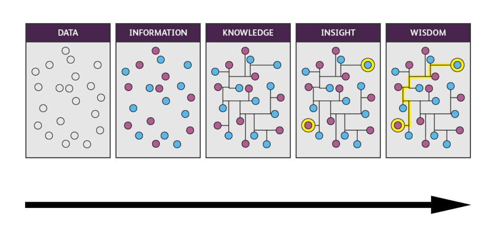

Привет, `%username%`! Как подходить к вопросу организации персональной базы знаний, а главное зачем? Этот и некоторые другие вопросы довольно часто возникают в голове тех, кто так или иначе сталкивается с этой темой. Давай попробуем порассуждать, а возможно даже составим простенький чек-лист, который сможет тебе или твоему другу помочь в этой обширной теме.

### Терминология

Начнем с простого – с терминологии ~~(да, я снова подушню немного, потом проветришь)~~ – так мы сможем с тобой быть уверенными в том, что говорим на одном языке и об одних и тех же вещах. 

- Данные – это сырые сведения или факты о чем-либо, которые не несут никакого смысла. Например, у тебя есть 2 яйца, 150 г муки, 75 г сахара. В текущем виде, это просто сырые факты, которые без контекста не несут никакого смысла;
- Информация – это осмысленные и/или обработанные данные, которые уже стали что-то значить и иметь какой-то контекст. Например, рецепт пирога, который включает следующие ингредиенты: 2 яйца, 150 г муки, 75 г сахара. Именно благодаря контексту, сырые данные становятся информацией;
- Знания – это совокупность информации и методов применения этой информации на практике. Например, имея рецепт пирога, а так же навыки приготовления пирогов, ты имеешь знания в области приготовления пирогов;
- Персональная база знаний – это инструментарий, который позволяет сохранить и взаимодействовать со *знаниями*, а так же дополнять *знания* своими мыслями и выводами. Например, у моей мамы и бабушки были тетради, в которых были записаны не только рецепты пирогов, но и примечания о том, как делать лучше, или что добавить, чтобы было "вкуснее".

Теперь, когда мы с тобой говорим на одном языке и понимаем, что такое *данные*, *информация*, *знания* и *персональная база знаний*, можно перейти к сути диалога – как организовывать ее, а главное зачем?

### Зачем

Начну, как обычно с конца – зачем вести персональную базу знаний? Ответ максимально прост и сложен одновременно. В современном мире человеку приходится сталкиваться с таким объемом данных и информации, какой обычному человеку 50-100 лет назад даже не снился. А если ты еще и связал свою жизнь с IT, то эти объемы еще выше, т.к. это особенность данной сферы деятельности человека. Мозг человека за тот же период не сильно эволюционировал, поэтому часто можно слышать про "*выгорание*", "*высокую когнитивную нагрузку на работе*" и все такое в этом духе. Мозгу нужно помогать, а одним из инструментов помощи может стать персональная база знаний.

Таким образом, персональную базу знаний имеет смысл заводить тогда, когда ты сам решил помочь своему мозгу.

### С какой стороны подойти

Итак, мы с тобой определились с тем, что такое **персональная база знаний** и из чего она состоит. Начнем задавать правильные вопросы.

#### Определи цель

Организация персональной базы знаний рази организации базы знаний – идея максимально провальная. Ты должен понимать, к чему ты стремишься. Например, хорошей и четкой целью может являться следующее – сохранить и доступно организовать знания, чтобы работать/учиться более эффективно.

#### Единственное пространство

Тебе доступно большое количество инструментов, поэтому предстоит попробовать множество из них и выбрать тот, который подходит именно тебе. Лично я живу на Obsidian, при этом знаю не мало людей, кто живет в One Note, Notion, Anytype или Logseq. Главное, чтобы ты выбрал именно один инструмент и создавал на его основе свою персональную базу знаний. Переноси в нее все свои заметки, скриншоты, таблички и прочее. Такое решение позволит тебе эффективнее связывать между собой различные заметки.

#### Страх чистого листа

Это самая частая проблема, с которой сталкивается большинство людей – скачал программу, открыл, а дальше... белый шум. Так вот, выбрав какой-то инструмент, загрузи в него все имеющиеся заметки. Пусть они будут все разными по форматированию – плевать! Важно, что у тебя уже есть то, с чем тебе предстоит поработать. Начни *обрабатывать данные*, превращая их из *информации* в *знания*.

#### Структура и масштабирование

Сразу скажу одну важную вещь – не парься на тему правильной структуры! В самом начале это может только загубить все – ты можешь прийти к состоянию, когда у тебя просто не будет желания работать со своей базой знаний. Просто потому, что ты сделал изначально все "максимально идеально", а на практике это оказалось абсолютно не юзабельно. Дробить на десятки узко специализированных директорий вообще нет смысла – разложишь максимально дробно, но при этом отстрелишь обе ноги с точки зрения дальнейшего взаимодействия с этой информацией.

#### Новое делай понятным

Добавляя новую заметку в персональную базу знаний обдумывай ее. Обдумывай с точки зрения полезности, ценности и применимости – будет ли она тебе полезна завтра? а после завтра? а через неделю/месяц?

Отмечай при формировании заметки полезность нового материала, чтобы не тратить время на рефлексию в этом вопросе, пытаясь заглянуть в себя из прошлого.

#### Идеала не существует

Воспользуйся правилом ленивого человека: не придумывай нового. Базы знаний упрощают жизнь. Не пытайся с первого раза сделать все идеально, потому что:
- не получится, просто не получится;
- база знаний развивается и изменяется вместе с ее владельцем.

Структура, которую ты придумаешь сейчас, через пол года может показаться тебе максимально неудобной и будет требовать доработки напильником.

#### Безжалостное отношение

Не будь [Плюшкиным](https://ru.wikipedia.org/wiki/Плюшкин)! Не собирай данные ради сбора данных. Систематически выполняй ревью содержимого своей базы знаний. Все, что кажется тебе ненужным или "пригодится когда-нибудь" – УДАЛЯЙ! Не держи бардак в голове, и не транслируй его в персональную базу знаний. Информация очень быстро устаревает. Плюшкинизм в принципе 

### Эволюция

Кратко можно описать именно такой картинкой то, как выглядит эволюция сырых данных в знания и мудрость:

Именно тут тебе может быть полезно почитать про **DKIW** – [раз](https://ru.wikipedia.org/wiki/DIKW) и [два](https://simpleone.ru/glossary/dikw-model). Так же рекомендую именно тут ознакомиться со слайдами доклада [Игоря Курочкина](https://enabling.team/experts/ikurochkin) – [Как стать 10x экспертом](https://speakerdeck.com/ikurochkin/kak-stat-10x-ekspiertom), и обзором на этот доклад от [Максима Цепкова](https://mtsepkov.org/Я_—_Максим_Цепков_приветствую_Вас_на_своем_сайте) – [t.me/mtsepkov](https://t.me/mtsepkov/815).

### Рекомендации

Немного личных рекомендаций:

- Не стоит брать чужие и сложные фреймворки для организации контента – очень велик шанс того, что они тебе просто не подойдут. Просто потому, что их делал другой человек под себя, а не под тебя;
- Размер не имеет значения – не стоит переживать, что у тебя всего 10 заметок за два месяца ведения персональной базы знаний. Помни, что важнее не количество заметок, а качество того, что ты в эти заметки пишешь;
- Не копируй, а вдохновляйся – подсматривай в то, как другие организовывают свою работу с базами знаний. Часто можно увидеть интересные приемы, которые можно легко адаптировать под себя и сделать их удобными для себя;
- Систематизируй работу со знаниями – систематически проводи ревью заметок, выкидывая ненужные и редактируя полезные. База знаний будет развиваться вместе с тобой, а ты вместе с базой знаний;

### Итоги

Следуя этому небольшому набору рекомендаций, ты постепенно построишь персональную базу знаний. Не забывай про то, что персональная база знаний – инструмент личной эффективности.

---
Если у тебя есть вопросы, комментарии и/или замечания – заходи в [чат](https://ttttt.me/jtprogru_chat), а так же подписывайся на [канал](https://ttttt.me/jtprogru_channel).
