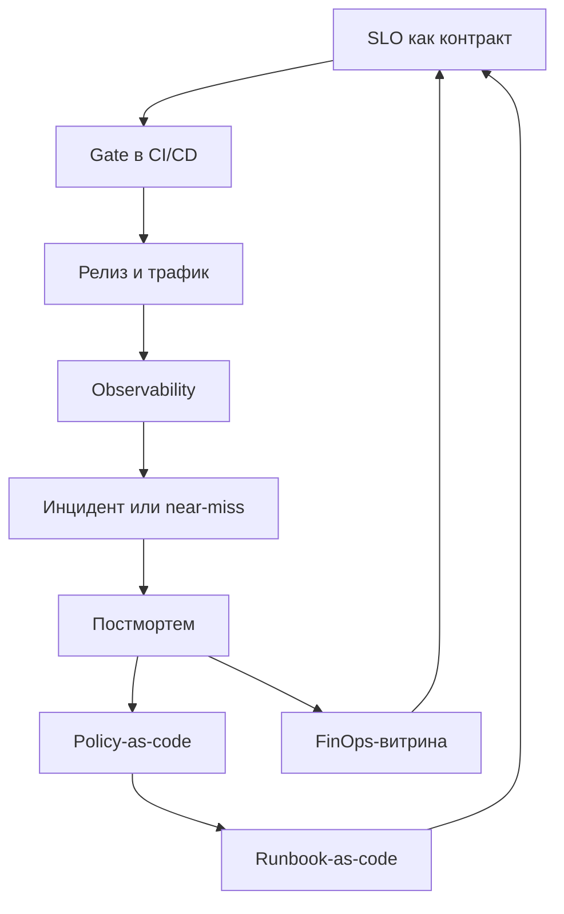

Привет, `%username%`! В [февральской заметке про DIS](/posts/digital-immune-system/) я разбирал концепцию через шесть столпов Gartner — observability, AI-augmented testing, chaos engineering, auto remediation, SRE, supply chain security. Это была карта поверхности: что входит, зачем оно нужно, с чего начать. С тех пор у меня накопилась мысль, которой одной картой не объяснить.

**DIS — это не набор столпов и не каталог инструментов.** Это замкнутая петля обратной связи между архитектурой, SLO, релизной дисциплиной, наблюдаемостью и экономикой надёжности. Глубина концепции — не в том, что внутри шести квадратов, а в том, как они друг друга питают, ограничивают и обучают.

Отличие иммунной системы от статичной защиты — обучение на отклонениях. Если инциденты не меняют политики, gate-ы и лимиты автодействий, никакого иммунитета нет, независимо от того, сколько компонент развёрнуто. DIS у команды или просто набор практик — вопрос не наличия инструментов, а того, замыкается ли цикл «инцидент → разбор → изменение правил».

Дальше — что эта связность означает на уровне инженерных решений, где проходит граница безопасной автоматики, как устроено сознательное право на отказ и почему разговор о DIS — это в том числе разговор экономистов.

## Операциональное определение

Цифровая иммунная система — это совокупность архитектурных ограничений, инженерных практик и оргритуалов, которая:

- минимизирует blast radius и вероятность каскадных отказов;
- переводит редкие ручные героизмы в воспроизводимую автоматику с понятными границами;
- использует наблюдаемость и SLO как язык контрактов между командами;
- учится на каждом отклонении (включая «почти инциденты») и обновляет политику изменений;
- оптимизирует не только аптайм, но и экономику надёжности — стоимость девяточек, цену шума, цену эскалаций.

Определение операциональное: каждый пункт проверяем. Либо есть, либо нет.

## Связность вместо перечисления

DIS обычно описывают через шесть практик: observability, AI-augmented testing, chaos engineering, auto remediation, SRE, supply chain security — в таком виде концепцию упаковал Gartner в [Top Strategic Technology Trends for 2023](https://www.gartner.com/en/articles/gartner-top-10-strategic-technology-trends-for-2023), анонсированных в октябре 2022 года. Каждая закрывает часть проблем, но шесть квадратов в презентации ещё не делают систему иммунной. Иммунитет рождается из связей между ними.

Связь первая — **SLO как gate в CI/CD**. Observability и release safety встречаются в одной точке: метрики ошибок и латентности превращаются в условие, при котором релиз продолжается или останавливается. Если [SLO существуют отдельно от пайплайна](/posts/slo-as-architecture-blueprint/) — это отчёты, не контракты.

Связь вторая — **постмортем как вход в runbook-as-code**. Chaos engineering и auto remediation замыкаются через анализ инцидентов: каждое ручное действие, попавшее в разбор, либо превращается в безопасную автоматику, либо становится поводом изменить архитектуру, чтобы это действие не требовалось.

Связь третья — **policy-as-code как единый центр правил**. OPA, Sentinel или собственное решение собирает в одном месте проверки supply chain, требования к release safety, архитектурные ограничения (blast radius, freeze windows, обязательные canary). Один центр правил — один способ их обновить после инцидента.

Связь четвёртая — **финансы как читатель SLO**. SRE и FinOps говорят на одном языке: стоимость одной девяточки, стоимость минуты простоя для конкретного домена, стоимость флапающего алерта. Без этой связи надёжность остаётся «инженерной заботой» и проигрывает фичам в борьбе за время команды.

Схематически петля выглядит так:

Каждая стрелка — правило, которое команда поддерживает сознательно. Выпадает одна — петля размыкается, DIS возвращается к набору практик, которые работают локально, но не складываются в систему обучения.

## Право на отказ и организованная деградация

Когда я слышу разговоры о надёжности, рамка почти всегда одна — «всё должно работать». Зрелый подход добавляет к ней сознательно спроектированный отказ: что и в каком порядке выключается, когда поддерживать полный функционал уже невозможно.

Право на отказ — это не признание слабости и не план B на случай катастрофы. Это **архитектурная сущность**: контур деградации проектируется так же, как нормальный путь запроса. На уровне дизайна это значит: какие функции выключаются первыми, какие — последними, кто принимает решение об их выключении, какие сигналы триггерят автоматическую деградацию.

Канонический публичный пример — [инцидент GitHub 21 октября 2018](https://github.blog/news-insights/company-news/oct21-post-incident-analysis/). После 43-секундного разрыва между восточными ДЦ orchestrator автоматически промоутнул реплики MySQL, и в данных образовалось расхождение. Команда сознательно остановила доставку 5 миллионов webhook-событий и 80 тысяч Pages-сборок на время восстановления целостности БД — формулировка из постмортема: «explicit choice to partially degrade site usability […] instead of jeopardizing data we had already received from users». Это и есть приоритет «целостность данных > доступность фичи», превращённый в решение под давлением.

Другой угол — деградация как продукт, а не аварийный режим. Cloudflare продаёт [Always Online](https://developers.cloudflare.com/cache/how-to/always-online/) как явный контракт: если origin недоступен, edge отдаст статическую копию из кеша или версию из Internet Archive, динамика честно режется до статики. Клиент покупает «худший, но живой» ответ заранее. Netflix формализовал ту же идею в Hystrix (проект давно в maintenance mode, но паттерн пережил инструмент) и архитектуре рекомендательных пайплайнов: онлайн-расчёт может не уложиться в SLA — тогда отдаётся precomputed fallback вроде неперсонализированной подборки, а не ошибка.

Отсюда три практических следствия.

**Домены отказа определяют, что можно потерять одним блоком**, не теряя весь продукт. Независимые ingress, балансировщики, DNS-резолверы и хранилища секретов на вертикаль. Когда падает один домен — продукт теряет одну способность, а не превращается в белую страницу. Стоимость такой изоляции — выше; стоимость отказа от неё — каскад при первом серьёзном инциденте.

**Self-bootstrap при потере control-зависимостей.** Кэшированные сертификаты и токены, emergency-конфиги, offline-режим для критичных путей. Система должна уметь запуститься или хотя бы продолжить обслуживать существующий трафик, даже если её control plane недоступен — для облачных сервисов это означает, что приватный кластер должен переживать недоступность IAM или API провайдера.

**Региональная репликация решается per-domain**, а не глобально. Для платёжной вертикали приоритет — согласованность; для каталога — доступность. Глобальное «давайте всё реплицировать активно-активно» приводит к тому, что часть доменов плохо ложится в выбранную модель и компенсирует это сложными ad-hoc обходами.

## Граница безопасной автоматики

Auto remediation на бумаге звучит как «система сама перезапускает сервисы и масштабирует ресурсы». На практике у автоматики всегда есть граница, и она важнее самой автоматики.

**Разделение control plane и data plane по уровню автоматизации.** Data plane может рестартиться, переезжать между узлами, масштабироваться самостоятельно — здесь автоматика работает в зоне с предсказуемыми последствиями. Control plane — нет, или с дополнительными гардрейлами: автоматические изменения IAM, политик доступа, маршрутизации трафика между регионами — это операции с длинным blast radius и долгим rollback.

[Глобальный отказ Facebook 4 октября 2021](https://engineering.fb.com/2021/10/05/networking-traffic/outage-details/) — учебник по тому, что происходит, когда control plane завязан сам на себя. Рутинная команда оценки доступности backbone обвалила все межДЦ-линки; audit-инструмент, который должен был такую команду остановить, не сработал из-за бага. DNS-серверы автоматически сняли BGP-анонсы дата-центров — корректная политика «unhealthy = снимаем» превратилась в самоблокировку, когда «unhealthy» стало «всё одновременно». Инженеры на полдня лишились внутренних инструментов диагностики и физического доступа к части помещений. Урок: автоматика control plane должна иметь канал управления, не зависящий от того, что она контролирует.

Зеркальный кейс — [платформа Yandex Infrastructure](https://habr.com/ru/companies/yandex_cloud_and_infra/articles/1004584/), где тот же урок реализован заранее, а не выучен на аварии. Компоненты основного облака выкатывает отдельный редко обновляемый админский контур: сервис не деплоит сам себя, и кольцо «чтобы поднять облако, нужно облако» разорвано архитектурно. Система прав живёт внутри облака, но у дежурного есть аварийный обход — кнопка выдаёт абсолютный доступ мимо IDM, чтобы разбор инцидента не ждал восстановления той самой системы, которая лежит. SSH-сервер написан с нулём онлайновых зависимостей, аутентификация переведена с ключей на сертификаты, и раскатка прав по хостам перестала занимать 15 минут и ушла с критического пути. За шесть лет — три серьёзных инцидента на ~150 000 хостов и ни одного полного краха. «Канал управления, не зависящий от контролируемого» стоит читать не как принцип, а как список конкретных решений, каждое из которых кто-то оплатил временем команды.

**Любое рискованное автодействие — через kill-switch, голосование и bounds.** Bounds по времени — не больше трёх автодействий за пять минут, дальше стоп и эскалация на человека. По объёму — не больше 10% парка за один проход. По типу — никогда для production-control-plane. Конкретные цифры у каждой команды свои, важно другое: лимиты записаны в конфиге автоматики, а не в голове дежурного. Голосование — для решений без однозначно безопасного исхода. Автоматический rollback на предыдущую работающую версию допустим. Автоматическое поднятие шкалы трафика после отказа — нет.

Хрестоматийный кейс отсутствующих bounds — [Knight Capital, 1 августа 2012](https://www.sec.gov/files/litigation/admin/2013/34-70694.pdf). Новый код раскатили на 7 из 8 SMARS-серверов, а на восьмом остался мёртвый код «Power Peg» из 2003 года — и флаг, который новый код переиспользовал, на этом сервере активировал именно его. Никакой проверки «сколько ордеров в секунду — слишком много», никакого rate-cap на исходящий поток не было — за ~45 минут система отправила миллионы дочерних ордеров, набила ~4 миллиона исполнений и сожгла более $460M по оценке SEC, фактически уничтожив компанию. Автоматика без bounds масштабировала ошибку человека быстрее, чем кто-либо успел вмешаться.

**Auto-healing допустим только там, где есть наблюдаемость, reversible-действия и понятный rollback-план.** Если автоматику нельзя откатить одним действием — она работает только с человеком в петле. Это отсеивает большинство «умных» сценариев самовосстановления, которые красиво звучат в обзорах, но в проде разрывают петлю обратной связи.

Та же платформа Яндекса — сильный аргумент в пользу такой строгости. На масштабе ~50 000 приложений компания выбрала не самовосстановление, а быстрый обходной путь для человека: не «система сама чинит», а «дай дежурному дотянуться до системы за секунды». Философия прямо обратная модному auto-healing, и результат по надёжности от этого не пострадал. Полезная поправка к ощущению, что зрелость измеряется долей автоматических действий: измеряется она тем, у кого остаётся возможность вмешаться, когда автоматика ошиблась.

**Runbook-as-code: ручное действие живёт один раз.** Попало в постмортем — либо исчезает (через архитектурное изменение, после которого действие не нужно), либо становится безопасной автоматикой с лимитами. Накопление повторяющихся ручных шагов — главный симптом разорванной петли.

**Release safety как код.** Канареечный релиз с автоматическим rollback по порогам ошибок и латентности, freeze windows на пиковые периоды (новогодние праздники, чёрная пятница, день платежей), обязательные проверки полисей. Это не договорённость с командой, которую можно «в этот раз пропустить» — это код, который останавливает пайплайн.

Главное правило: автоматика делает только то, за что инженер готов отвечать ночью. Всё остальное — под kill-switch и по шагам.

## Экономика надёжности

Самый сильный признак того, что DIS созрел — команды спорят не «по вере», а по экономике. До этого [разговор о надёжности](/posts/reliability-is-a-conversation/) сводится к «нам нужна ещё одна девятка» или «у нас слишком много шума в алертах» — без цифр.

**Стоимость одной девяточки** — конкретная сумма, привязанная к домену отказа. Девятка для платёжного домена и девятка для рекомендательной выдачи стоят разных денег и приносят разную ценность. Глобальный SLO «99.95% по всему сервису» — худший компромисс между этими крайностями.

**Цена шума** — стоимость флапающего алерта. Измеряется в человеко-часах ночной работы, в качестве решений на следующее утро, в проценте пропущенных P1 на фоне P3-шума. Шумовой бюджет — управляемая метрика: команда видит свой flap rate, владеет качеством сигналов и платит за избыточное оповещение тем же бюджетом, что и за реальные инциденты.

**Цена эскалаций.** Путь от P3 до P0 имеет свою стоимость: каждое повышение уровня — это человек, которого подняли среди ночи. Сокращение этого пути через policy-as-code (автоматическая первичная диагностика, маршрутизация к нужному owner-у, обогащение алерта контекстом) — прямая экономия.

**FinOps-витрина «стоимость простоя»** должна жить рядом с MTTR-дашбордом. Один отвечает на «как быстро мы поднимаем», другой — на «во сколько нам обошлась минута». Без второй цифры решения о приоритетах надёжности принимаются «по ощущениям».

**Управляемая девяточность** — целимся не в максимум, а в оптимум. Лишняя девятка стоит дорого: переход с 99.9% на 99.99% кратно увеличивает вложения в инфраструктуру и команду, а прирост пользовательской ценности с этими вложениями несопоставим. Зрелая команда умеет сказать руководству «нам не нужна следующая девятка» и объяснить, почему.

Когда DIS обсуждается на языке денег, руководство принимает решения о надёжности так же, как о фичах. Пока этого языка нет, надёжность живёт только на инженерных совещаниях — а бюджет уходит туда, где ценность показана в деньгах.

## Маркеры зрелого DIS

Как отличить «у нас DIS» от «у нас отдельные практики»? Пять наблюдаемых маркеров. Это диагностика, а не предписание — если выполняются хотя бы три из пяти, у команды есть основа для иммунной системы.

1. **SLO двигают релизы.** Если SLO не закрывает gate в CI/CD — это отчёты для руководства, не контракты с командами.
2. **Класс проблем не повторяется.** Каждый крупный инцидент уменьшает вероятность повторения класса проблем. В правилах и политиках видно, что система «училась»: после инцидента появился новый gate, изменился лимит автоматики, добавилась проверка в policy-as-code.
3. **Автоматика делает только обоснованное.** Каждое автодействие имеет владельца, лимиты и kill-switch. Всё остальное живёт под человеком в петле.
4. **Команды спорят на языке экономики.** Дискуссии о приоритетах надёжности ведутся в терминах стоимости девяточек, шума и эскалаций — не в терминах «у нас плохо с алертами».
5. **Руководство видит стоимость надёжности**, а не только аптайм, и принимает решения на этом языке. На совещании уровня CTO рядом с дашбордом MTTR висит дашборд FinOps.

Ноль маркеров — DIS нет, какие бы инструменты ни были развёрнуты. Все пять — фокус смещается с построения иммунной системы на её эксплуатацию.

## Что ломает DIS на масштабе

Концепция разваливается не из-за плохой архитектуры, а из-за пропуска одного шага в петле. Ниже — типичные failure modes.

**SLO без gate.** Есть метрика, есть SLO, есть [error budget](/posts/burn-rate-is-not-speed/), но релиз не блокируется, когда бюджет исчерпан. Цикл разомкнут: измеряем, но не действуем. Лечение — превратить SLO в условие пайплайна, а не в строчку отчёта.

**Автоматика без лимитов.** Auto-healing пытается «починить» инфраструктурный инцидент — рестартит поды, перекидывает трафик, масштабирует кластер — и тем самым расширяет blast radius. Каждое автодействие нуждается в bounds: сколько раз за период, какой процент парка, при каких условиях остановиться и позвать человека.

**Постмортем без обучения.** Разбор сделан, документ есть, action items записаны — runbook не обновлён, политики не изменены, lessons learned остались на странице в Confluence. Петля «инцидент → разбор → изменение правил» обрывается на втором шаге.

**Шумовой бюджет не управляется.** Flap rate растёт, доверие к алертам падает, инженеры выключают нотификации канала, P1 пропускается на фоне P3-шума. Шум — это управляемая метрика, не побочный эффект; если за ним никто не следит, наблюдаемость деградирует тише и сильнее, чем кажется.

**Экономика отсутствует.** Надёжность обсуждается только инженерами, бизнес принимает решения, не видя стоимости. В этом сценарии любое сокращение бюджета сначала бьёт по надёжности — потому что её ценность не показана в тех же терминах, что и стоимость других направлений.

Любое из этих узких мест разрывает петлю обратной связи и возвращает DIS к набору практик.

## Итого

DIS — это про связность и дисциплину. Архитектурные границы (домены отказа, blast radius), измеряемые обещания (SLO как контракты), проверяемые гипотезы надёжности (нагрузка и хаос как регламент), безопасная автоматика (kill-switch и bounds), управляемый онколл (шумовой бюджет, право стоп-поставки), прозрачная экономика (стоимость девяточек, FinOps-витрина). Ни один из этих элементов отдельно не делает систему иммунной — иммунитет возникает, когда они замыкаются в петлю обучения.

В российском контексте близкую идею развивает «Лаборатория Касперского» под названием **кибериммунитет** — с акцентом на встроенной безопасности (Secure by Design, Secure by Default) и минимизации доверенной кодовой базы. DIS дополняет этот подход петлёй обучения через инциденты и явной экономикой надёжности.

Практический шаг для команды, которая хочет понять, где она стоит на этой шкале — пройтись по пяти маркерам и честно ответить, сколько из них выполняются. Это даст более реалистичную картину, чем аудит инструментов: инструменты — следствие, а не причина.

PS: эта статья — то, что я не разобрал в [февральской заметке про DIS](/posts/digital-immune-system/). Если первая отвечала на «что это такое и из чего состоит», эта — на «что отличает зрелый DIS от витрины из шести квадратов».

## Публичные кейсы

Подборка постмортемов и инженерных описаний, на которых строится бо́льшая часть тезисов выше. Полезна как карта дальнейшего чтения.

**Право на отказ и организованная деградация:**

- [GitHub, 21.10.2018](https://github.blog/news-insights/company-news/oct21-post-incident-analysis/) — сознательная пауза webhooks и Pages ради целостности БД.
- [Cloudflare Always Online](https://blog.cloudflare.com/always-online-v2/) и [интеграция с Internet Archive](https://blog.cloudflare.com/cloudflares-always-online-and-the-internet-archive-team-up-to-fight-origin-errors/) — деградация как продуктовый контракт.
- [Netflix Hystrix](https://github.com/Netflix/Hystrix/wiki/How-it-Works) и [архитектура персонализации](https://netflixtechblog.com/system-architectures-for-personalization-and-recommendation-e081aa94b5d8) — fallback на precomputed-результат, встроенный в пайплайн.
- [Cloudflare, 2.07.2019](https://blog.cloudflare.com/details-of-the-cloudflare-outage-on-july-2-2019/) — global WAF terminate как заранее построенный kill-switch уровня домена.
- [Cloudflare, 18.11.2025](https://blog.cloudflare.com/18-november-2025-outage/) — bypass на prior-version proxy для Workers KV и Access как реактивная деградация.

**Граница безопасной автоматики:**

- [Knight Capital, 1.08.2012](https://www.sec.gov/files/litigation/admin/2013/34-70694.pdf) — переиспользованный флаг + неполный деплой + автоматика без rate-cap, $460M+ за ~45 минут.
- [Facebook BGP, 4.10.2021](https://engineering.fb.com/2021/10/05/networking-traffic/outage-details/) — баг audit-инструмента + автоснятие DNS-анонсов = control plane выпиливает сам себя.
- [AWS S3, 28.02.2017](https://aws.amazon.com/message/41926/) — playbook-инструмент без safety-check на минимальную ёмкость масштабировал опечатку оператора.
- [Cloudflare WAF, 2.07.2019](https://blog.cloudflare.com/details-of-the-cloudflare-outage-on-july-2-2019/) — regex-правило раскатилось глобально без canary, потому что SOP для конфигов отличался от SOP для бинарей.
- [GitLab, 31.01.2017](https://about.gitlab.com/blog/postmortem-of-database-outage-of-january-31/) — оператор стёр primary; параллельно [все пять механизмов бэкапа](https://about.gitlab.com/blog/2017/02/01/gitlab-dot-com-database-incident/) тихо не работали (silent failure).
- [Cloudflare, 18.11.2025](https://blog.cloudflare.com/18-november-2025-outage/) — изменение прав ClickHouse → дубль строк → превышен hard limit → `Result::unwrap()` panic в Rust-проксе → автогенерация плохого файла каждые 5 минут.
- [Discord, 25.03.2026](https://discord.com/blog/behind-the-scenes-of-the-3-25-26-voice-outage) — при вертикальном K8s-rescale termination grace period истёк раньше, чем начался handoff сессий; волна автоматических reconnect'ов добавила thundering herd.
- [Yandex Infrastructure, 10.03.2026](https://habr.com/ru/companies/yandex_cloud_and_infra/articles/1004584/) — не постмортем, а инженерное описание: админский контур, break-glass мимо IDM и SSH с нулём онлайновых зависимостей как заранее построенный ответ на урок Facebook.

**Обратная сторона — где автоматика спасла:**

- [Google Cloud Networking, 2.06.2019](https://status.cloud.google.com/incident/cloud-networking/19009) — первый пункт follow-up в постмортеме — «immediately halted the datacenter automation software».
- [Netflix Chaos Monkey](https://github.com/Netflix/chaosmonkey) и [Simian Army](https://netflixtechblog.com/the-netflix-simian-army-16e57fbab116) — автоматика как тренажёр: регулярная поломка прода посреди рабочего дня приучила архитектуру к фоллбекам.

---

Если у тебя есть вопросы, комментарии и/или замечания – заходи в [чат](https://t.me/jtprogru_chat), а так же подписывайся на [канал](https://t.me/jtprogru_channel).

О способах отблагодарить автора можно почитать на странице "[Донаты](https://jtprog.ru/donations/)".
