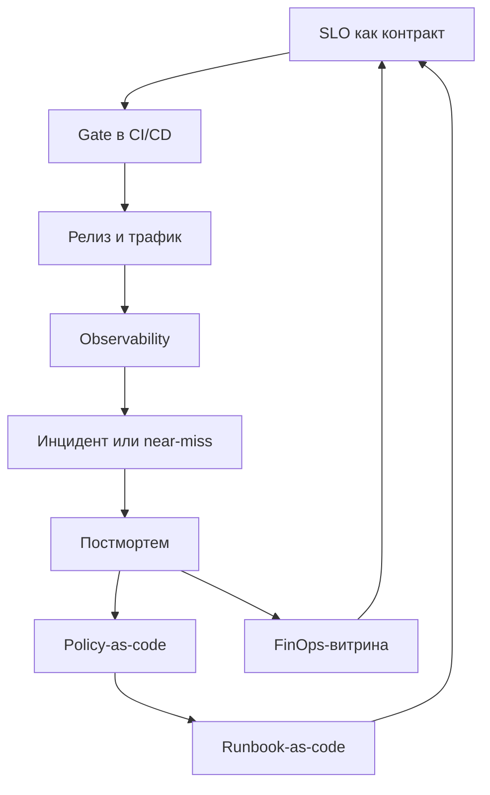

Привет, `%username%`! В [февральской заметке про DIS](/posts/digital-immune-system/) я разбирал концепцию через шесть столпов Gartner — observability, AI-augmented testing, chaos engineering, auto remediation, SRE, supply chain security. Это была карта поверхности: что входит, зачем оно нужно, с чего начать. С тех пор накопилось мыслей, которые в эту карту уже не влезают.

**DIS держится на связях.** Архитектура, SLO, релизная дисциплина, наблюдаемость и экономика надёжности замкнуты в одну петлю обратной связи — вот что отличает иммунную систему от склада инструментов. Шесть столпов отвечают на вопрос «из чего собрано». Интереснее другое: как эти шесть друг друга питают, ограничивают и обучают.

Статичная защита ловит известное. Иммунная система учится на отклонениях — этим и отличается. Инциденты не меняют политики, gate-ы и лимиты автодействий? Значит, иммунитета нет, сколько бы компонент ты ни развернул. Проверяется это одним вопросом: замыкается ли у тебя цикл «инцидент → разбор → изменение правил».

Дальше разбираю, что связность означает в инженерных решениях, где проходит граница безопасной автоматики, как проектируется сознательное право на отказ и почему про DIS в какой-то момент приходится говорить с финансистами.

## Операциональное определение

Цифровая иммунная система — это совокупность архитектурных ограничений, инженерных практик и оргритуалов, которая:

- минимизирует blast radius и вероятность каскадных отказов;
- переводит редкие ручные героизмы в воспроизводимую автоматику с понятными границами;
- использует наблюдаемость и SLO как язык контрактов между командами;
- учится на каждом отклонении (включая «почти инциденты») и обновляет политику изменений;
- считает деньги наравне с аптаймом: стоимость девяточек, цену шума, цену эскалаций.

Определение операциональное: каждый пункт можно проверить у себя за полчаса. Либо есть, либо нет.

## Связность вместо перечисления

DIS обычно описывают через [шесть практик](/posts/digital-immune-system/#шесть-столпов-dis) — в таком виде концепцию упаковал Gartner в [Top Strategic Technology Trends for 2023](https://www.gartner.com/en/articles/gartner-top-10-strategic-technology-trends-for-2023), анонсированных в октябре 2022 года. Каждая закрывает часть проблем, но шесть квадратов в презентации ещё не делают систему иммунной. Иммунитет рождается из связей между ними.

У самого термина, кстати, судьба показательная. Из топ-трендов Gartner DIS выпал сразу после 2023 года — в списках 2024, 2025 и [2026](https://www.gartner.com/en/newsroom/press-releases/2025-10-20-gartner-identifies-the-top-strategic-technology-trends-for-2026) его уже нет, а сама концепция переехала в [Hype Cycle for Emerging Technologies 2024](https://www.gartner.com/en/newsroom/press-releases/2024-08-21-gartner-2024-hype-cycle-for-emerging-technologies-highlights-developer-productivity-total-experience-ai-and-security), причём в security-компанию к AI TRiSM и cybersecurity mesh. Знаменитый прогноз «инвестировавшие в digital immunity к 2025 году сократят downtime на 80%» Gartner публично так и не проверил. Инженерные лидеры вывеску тоже не подхватили: AWS называет то же самое continuous resilience, Google и Meta[^meta] — reliability engineering, Microsoft — reliability maturity. Термином пользуются в основном аутсорсеры вроде [Infosys TechCompass](https://www.infosys.com/iki/techcompass/digital-immune-system.html) и HCLTech. Хоронить концепцию из-за этого не стоит: все шесть практик живее всех живых и развиваются активнее, чем в 2022-м. Просто бренд не прижился, а содержание разошлось по индустрии под другими именами — и дальше я говорю «DIS» именно про содержание.

Связь первая — **SLO как gate в CI/CD**. Observability и release safety встречаются в одной точке: метрики ошибок и латентности превращаются в условие, при котором релиз продолжается или останавливается. Если [SLO живут отдельно от пайплайна](/posts/slo-as-architecture-blueprint/), ты получил красивый отчёт для руководства и ничего больше.

Связь вторая — **постмортем как вход в runbook-as-code**. Chaos engineering и auto remediation замыкаются через анализ инцидентов: каждое ручное действие, попавшее в разбор, либо превращается в безопасную автоматику, либо становится поводом изменить архитектуру, чтобы это действие не требовалось.

Связь третья — **policy-as-code как единый центр правил**. OPA, Sentinel или своя самописка — неважно; важно, что проверки supply chain, требования к release safety и архитектурные ограничения (blast radius, freeze windows, обязательные canary) лежат в одном месте. Один центр правил — один способ их обновить после инцидента.

Связь четвёртая — **финансы как читатель SLO**. SRE и FinOps говорят на одном языке: стоимость одной девяточки, стоимость минуты простоя для конкретного домена, стоимость флапающего алерта. Без этой связи надёжность остаётся «инженерной заботой» и проигрывает фичам в борьбе за время команды. Каждый раз.

Схематически петля выглядит так:

Каждая стрелка — правило, которое команда поддерживает сознательно. Выпадает одна — петля размыкается, DIS возвращается к набору практик, которые работают локально, но не складываются в систему обучения.

## Право на отказ и организованная деградация

Когда я слышу разговоры о надёжности, рамка почти всегда одна — «всё должно работать». Зрелый подход добавляет к ней сознательно спроектированный отказ: что и в каком порядке выключается, когда поддерживать полный функционал уже невозможно.

Право на отказ — **архитектурная сущность**: контур деградации проектируешь так же, как нормальный путь запроса. И отвечаешь на четыре вопроса: какие функции выключаются первыми, какие последними, кто жмёт кнопку и какие сигналы триггерят автоматическую деградацию без человека.

Канонический публичный пример — [инцидент GitHub 21 октября 2018](https://github.blog/news-insights/company-news/oct21-post-incident-analysis/). После 43-секундного разрыва между восточными ДЦ orchestrator автоматически промоутнул реплики MySQL, и в данных образовалось расхождение. Команда сознательно остановила доставку 5 миллионов webhook-событий и 80 тысяч Pages-сборок на время восстановления целостности БД — формулировка из постмортема: «explicit choice to partially degrade site usability […] instead of jeopardizing data we had already received from users». Это и есть приоритет «целостность данных > доступность фичи», превращённый в решение под давлением.

Другой угол: деградацию можно продавать. Cloudflare продаёт [Always Online](https://developers.cloudflare.com/cache/how-to/always-online/) как явный контракт: если origin недоступен, edge отдаст статическую копию из кеша или версию из Internet Archive, динамика честно режется до статики. Клиент покупает «худший, но живой» ответ заранее. Netflix формализовал ту же идею в Hystrix (проект давно в maintenance mode, но паттерн пережил инструмент) и архитектуре рекомендательных пайплайнов: онлайн-расчёт не уложился в SLA — сервис отдаёт precomputed fallback, неперсонализированную подборку вместо пятисотки. Свежее продолжение той же линии — [service-level prioritized load shedding](https://netflixtechblog.com/enhancing-netflix-reliability-with-service-level-prioritized-load-shedding-e735e6ce8f7d): приоритизированный сброс нагрузки переехал с edge внутрь отдельных сервисов, где команда сама решает, какими запросами жертвовать первыми. Проверку боем устроил инфраструктурный сбой: на восстановлении Netflix поймал двенадцатикратный всплеск pre-fetch-запросов с Android-устройств, и шеддинг это съел. Показательно, куда сместился центр тяжести Netflix за десять лет: от «сломай прод и посмотри» к деградации, встроенной в каждый сервис как штатный механизм.

Отсюда три практических следствия.

**Домены отказа определяют, какой кусок продукта можно уронить целиком.** Независимые ingress, балансировщики, DNS-резолверы и хранилища секретов на вертикаль. Падает один домен — продукт теряет одну способность и остаётся живым. Без изоляции пользователь получает белую страницу. Стоимость такой изоляции — выше; стоимость отказа от неё — каскад при первом серьёзном инциденте.

**Self-bootstrap, когда control-зависимости отвалились.** Кэшированные сертификаты и токены, emergency-конфиги, offline-режим для критичных путей. Система запускается или хотя бы дотягивает существующий трафик, даже когда её control plane недоступен. Для облака это значит: приватный кластер переживает падение IAM или API провайдера.

**Региональную репликацию решаешь per-domain.** Для платёжной вертикали приоритет — согласованность; для каталога — доступность. Глобальное «давайте всё реплицировать активно-активно» приводит к тому, что часть доменов плохо ложится в выбранную модель и компенсирует это сложными ad-hoc обходами.

## Граница безопасной автоматики

Auto remediation на бумаге звучит как «система сама перезапускает сервисы и масштабирует ресурсы». На практике у автоматики всегда есть граница, и она важнее самой автоматики.

**Control plane и data plane автоматизируешь по-разному.** Data plane может рестартиться, переезжать между узлами, масштабироваться самостоятельно — здесь автоматика работает в зоне с предсказуемыми последствиями. Control plane — нет, или с дополнительными гардрейлами: автоматические изменения IAM, политик доступа, маршрутизации трафика между регионами — это операции с длинным blast radius и долгим rollback.

[Глобальный отказ Facebook 4 октября 2021](https://engineering.fb.com/2021/10/05/networking-traffic/outage-details/)[^meta] — учебник по тому, что происходит, когда control plane завязан сам на себя. Рутинная команда оценки доступности backbone обвалила все межДЦ-линки; audit-инструмент, который должен был такую команду остановить, не сработал из-за бага. DNS-серверы автоматически сняли BGP-анонсы дата-центров — корректная политика «unhealthy = снимаем» превратилась в самоблокировку, когда «unhealthy» стало «всё одновременно». Инженеры на полдня лишились внутренних инструментов диагностики и физического доступа к части помещений. Урок: у автоматики control plane должен быть канал управления, не завязанный на то, что она контролирует.

Зеркальный кейс — [платформа Yandex Infrastructure](https://habr.com/ru/companies/yandex_cloud_and_infra/articles/1004584/), где тот же урок заложили заранее, до аварии. Компоненты основного облака выкатывает отдельный редко обновляемый админский контур: сервис не деплоит сам себя, и кольцо «чтобы поднять облако, нужно облако» разорвано архитектурно. Система прав живёт внутри облака, но у дежурного есть аварийный обход — кнопка выдаёт абсолютный доступ мимо IDM, чтобы разбор инцидента не ждал восстановления той самой системы, которая лежит. SSH-сервер написан с нулём онлайновых зависимостей, аутентификация переведена с ключей на сертификаты, и раскатка прав по хостам перестала занимать 15 минут и ушла с критического пути. За шесть лет — три серьёзных инцидента на ~150 000 хостов и ни одного полного краха. За красивой фразой «канал управления, не зависящий от контролируемого» стоит вот такой список конкретных решений, и каждое кто-то оплатил временем команды.

**Любое рискованное автодействие — через kill-switch, голосование и bounds.** Bounds по времени — не больше трёх автодействий за пять минут, дальше стоп и эскалация на человека. По объёму — не больше 10% парка за один проход. По типу — никогда для production-control-plane. Конкретные цифры у каждой команды свои, важно другое: лимиты записаны в конфиге автоматики, а не в голове дежурного. Голосование — для решений без однозначно безопасного исхода. Автоматический rollback на предыдущую работающую версию допустим. Автоматическое поднятие шкалы трафика после отказа — нет.

Хрестоматийный кейс отсутствующих bounds — [Knight Capital, 1 августа 2012](https://www.sec.gov/files/litigation/admin/2013/34-70694.pdf). Новый код раскатили на 7 из 8 SMARS-серверов, а на восьмом остался мёртвый код «Power Peg», от которого Knight отказался ещё в 2003-м — и флаг, который новый код переиспользовал, на этом сервере активировал именно его. Хуже того, в 2005-м из Power Peg вынесли счётчик исполненных акций и после этого не перетестировали: останавливаться после заполнения родительского ордера код разучился. Никакой проверки «сколько ордеров в секунду — слишком много», никакого rate-cap на исходящий поток не было — за ~45 минут система отправила миллионы дочерних ордеров, набила ~4 миллиона исполнений и сожгла более $460M по оценке SEC, фактически уничтожив компанию. Автоматика без bounds масштабировала ошибку человека быстрее, чем кто-либо успел вмешаться.

**Auto-healing допустим только там, где есть наблюдаемость, reversible-действия и понятный rollback-план.** Если автоматику нельзя откатить одним действием — она работает только с человеком в петле. Это отсеивает большинство «умных» сценариев самовосстановления, которые красиво звучат в обзорах, но в проде разрывают петлю обратной связи.

Та же платформа Яндекса — сильный аргумент в пользу такой строгости. На масштабе ~50 000 приложений там сделали ставку на скорость доступа человека: дежурный дотягивается до системы за секунды, вместо того чтобы ждать, пока она починит себя сама. Философия прямо обратная модному auto-healing, и результат по надёжности от этого не пострадал. Полезная поправка к ощущению, что зрелость измеряется долей автоматических действий: измеряется она тем, у кого остаётся возможность вмешаться, когда автоматика ошиблась.

Meta зашла с третьей стороны и автоматизировала диагноз. Платформа [DrP](https://engineering.fb.com/2025/12/19/data-infrastructure/drp-metas-root-cause-analysis-platform-at-scale/) — это root cause analysis как сервис: 300+ команд, 2000 анализаторов, 50 тысяч автоматических расследований в день и снижение MTTR на 20–80%. Автоматика действий там тоже есть, но центр тяжести смещён в диагноз: платформа приносит дежурному ранжированную гипотезу и оставляет решение ему. Ещё раньше туда же [подключили LLM](https://engineering.fb.com/2024/06/24/data-infrastructure/leveraging-ai-for-efficient-incident-response/) — ранжировать подозрительные изменения при расследовании инцидента. Логика та же, что у Яндекса с break-glass: автоматический диагноз — безопасная зона. Ошибётся анализатор — дежурный потеряет минуты на проверку гипотезы, а не прод.

**Runbook-as-code: ручное действие живёт один раз.** Попало в постмортем — либо исчезает (через архитектурное изменение, после которого действие не нужно), либо становится безопасной автоматикой с лимитами. Накопление повторяющихся ручных шагов — главный симптом разорванной петли.

**Release safety как код.** Канареечный релиз с автоматическим rollback по порогам ошибок и латентности, freeze windows на пиковые периоды (новогодние праздники, чёрная пятница, день платежей), обязательные проверки полисей. Договорённость с командой можно «в этот раз пропустить». Код, который останавливает пайплайн, — нельзя.

Главное правило: автоматика делает только то, за что инженер готов отвечать ночью. Всё остальное — под kill-switch и по шагам.

## Экономика надёжности

Самый сильный признак зрелого DIS — споры переезжают с веры на экономику. До этого [разговор о надёжности](/posts/reliability-is-a-conversation/) сводится к «нам нужна ещё одна девятка» или «у нас слишком много шума в алертах» — без цифр.

**Стоимость одной девяточки** — конкретная сумма, привязанная к домену отказа. Девятка для платёжного домена и девятка для рекомендательной выдачи стоят разных денег и приносят разную ценность. Глобальный SLO «99.95% по всему сервису» — худший компромисс между этими крайностями.

**Цена шума** — стоимость флапающего алерта. Измеряется в человеко-часах ночной работы, в том, какие решения принимаются на следующее утро, в проценте пропущенных P1 на фоне P3-шума. Шумовой бюджет — управляемая метрика: команда видит свой flap rate, владеет качеством сигналов и платит за избыточное оповещение тем же бюджетом, что и за реальные инциденты.

**Цена эскалаций.** Путь от P3 до P0 имеет свою стоимость: каждое повышение уровня — это человек, которого подняли среди ночи. Срежешь этот путь через policy-as-code — автоматическая первичная диагностика, маршрутизация к нужному owner-у, обогащение алерта контекстом — и это сразу деньги.

**FinOps-витрина «стоимость простоя»** висит рядом с MTTR-дашбордом. Один отвечает на «как быстро мы поднимаем», другой — на «во сколько нам обошлась минута». Без второй цифры приоритеты надёжности расставляют «по ощущениям».

**Управляемая девяточность.** Целишься в оптимум, а максимум оставляешь тем, кому его оплатят. Лишняя девятка стоит дорого: переход с 99.9% на 99.99% кратно увеличивает вложения в инфраструктуру и команду, а прирост пользовательской ценности с этими вложениями несопоставим. Зрелая команда умеет сказать руководству «нам не нужна следующая девятка» и объяснить, почему.

Сколько у тебя стоит минута простоя платёжного пути? Если ответа нет, весь дальнейший разговор про девятки — вкусовщина, и спорить в нём будет тот, кто громче.

Когда про DIS говорят на языке денег, руководство принимает решения о надёжности так же, как о фичах. Пока этого языка нет, надёжность живёт только на инженерных совещаниях, а бюджет уходит туда, где ценность показана в деньгах.

## Чужие лестницы зрелости

Прежде чем предлагать свою диагностику, честный вопрос: может, готовая линейка уже есть? Я пошёл проверять и обнаружил показательную вещь. **Сводной модели зрелости DIS не существует.** Gartner её не публиковал: ни [статья-первоисточник](https://www.gartner.com/en/articles/what-is-a-digital-immune-system-and-why-does-it-matter), ни [глоссарий](https://www.gartner.com/en/information-technology/glossary/digital-immune-system) уровней не предлагают, а в названиях платных Hype Cycle модель зрелости DIS не значится. Зато в 2023–2025 стадийные модели появились у тех, кто термин не употребляет вовсе — и по ним хорошо видно, куда индустрия смотрит на самом деле.

Самая близкая к «лестнице зрелости DIS» вещь на рынке — [Reliability Maturity Model](https://learn.microsoft.com/en-us/azure/well-architected/reliability/maturity-model) из Azure Well-Architected Framework, появившаяся в 2025 году. Пять уровней: Get resilient → Self-preservation → Recovery readiness → Maintain stability → Stay resilient. SRE как роль появляется на третьем уровне, выделенная SRE-функция и safe deployment practices — на четвёртом, а пятый честно объявлен бесконечным: устойчивость к рискам, которые ещё не случались. Ирония в том, что «гартнеровскую» модель зрелости в итоге написал Microsoft.

AWS пошёл другим путём, и для этого поста он показательнее. [Resilience Lifecycle Framework](https://docs.aws.amazon.com/prescriptive-guidance/latest/resilience-lifecycle-framework/introduction.html) — пять стадий, сознательно замкнутых в круг: Set Objectives → Design and Implement → Evaluate and Test → Operate → Respond and Learn. Последняя стадия возвращает тебя к первой: выучил урок инцидента — пересмотрел цели. AWS независимо пришёл к тому же выводу, вокруг которого построен весь этот пост: зрелость — это замкнутая петля, а не этаж, на который поднялся и остался. Инструментальная обвязка тоже живая: [Resilience Hub](https://aws.amazon.com/about-aws/whats-new/2024/12/aws-resilience-hub-fault-injection-service-recommendations/) с конца 2024 года сам рекомендует эксперименты Fault Injection Service под конкретную архитектуру — chaos engineering из ручной дисциплины превращается в подсказку сервиса.

У CNCF есть [Cloud Native Maturity Model](https://maturitymodel.cncf.io/) от рабочей группы Cartografos: пять уровней по четырём измерениям — People, Process, Policy, Technology. Для нашей темы интересны верхние ступени: chaos engineering как штатная операция появляется на четвёртом уровне, автоматическое восстановление в known good state — на пятом. То есть автоматика самовосстановления и здесь оказалась вершиной лестницы. Входным билетом её не считает никто.

По отдельным столпам DIS лестницы существуют давно, но живут независимо друг от друга. Chaos engineering — классическая Chaos Maturity Model из книги Netflix/O'Reilly с осями sophistication и adoption, плюс практические руководства по внедрению у [Gremlin](https://www.gremlin.com/community/tutorials/chaos-engineering-adoption-guide) и [eBook Harness](https://www.harness.io/resources/the-chaos-engineering-maturity-model). Observability — [Grafana Observability Journey](https://grafana.com/blog/2024/01/29/how-to-improve-your-observability-strategy-introducing-the-observability-journey-maturity-model/) (Reactive → Proactive → Systematic) и [модель New Relic](https://docs.newrelic.com/docs/new-relic-solutions/observability-maturity/introduction/). Reliability целиком — [Reliability Maturity Model](https://www.usenix.org/publications/loginonline/reliability-maturity-model) в журнале [;login:](https://www.usenix.org/publications/loginonline) от USENIX (absent → reactive → proactive → strategic → visionary) и опросник [Google CRE Production Maturity Assessment](https://sre.google/static/pdf/cloud-cre-production-maturity-assessment.pdf). Обе — гугловые, и мерят они разное: первая описывает зрелость организации и её отношение к надёжности, вторая опрашивает про готовность конкретного прода. Supply chain — [SLSA](https://slsa.dev/spec/latest/levels) с уровнями L0–L3, единственная по-настоящему формализованная лестница из всех шести столпов. А для auto remediation индустриального стандарта нет вовсе — только вендорские блоги, каждый со своей нумерацией.

Лестницы, которая охватывала бы устойчивость целиком, ни Google, ни Meta не предлагают — только компонентные модели из абзаца выше. Вместо общей шкалы у обеих эволюция метода. Google в статье [«The Evolution of SRE at Google»](https://www.usenix.org/publications/loginonline/evolution-sre-google) (журнал [;login:](https://www.usenix.org/publications/loginonline) от USENIX, авторы Tim Falzone и Ben Treynor Sloss, основатель Google SRE) признал, что классическая модель error budgets перестала покрывать системы, где допустимый ущерб равен нулю, и переходит на [STAMP/STPA](https://sre.google/resources/practices-and-processes/stpa/) — системный анализ опасностей вместо подсчёта бюджета ошибок. Meta вкладывается в автоматизацию диагноза, о которой я писал выше. Обе стратегии сводятся к «поменяй способ думать об отказах». Для лестниц как жанра это плохая новость.

Академия к теме только подбирается. Единственная известная мне работа, которая целенаправленно строит именно DIS Maturity Model — [«A Conceptual Model of Digital Immune System to Increase the Resilience of Technology Ecosystems»](https://link.springer.com/chapter/10.1007/978-3-031-59465-6_6) Беате Краузе и Яниса Грабиса (RCIS 2024, Springer): концептуальная модель устойчивости технологической экосистемы в контексте европейской регуляторики NIS2 и DORA. Судя по [продолжению 2025 года](https://link.springer.com/chapter/10.1007/978-3-031-92471-2_13), до опубликованной шкалы уровней дело пока не дошло. А в ноябре 2025 вышла первая целая книга про DIS — [«Digital Immune System: Principles and Practices»](https://onlinelibrary.wiley.com/doi/book/10.1002/9781394383788) (Wiley-Scrivener): уклон в security и AI, но отдельная глава про экономику внедрения там есть. Приятно: не мне одному кажется, что разговор про DIS — это в том числе разговор экономистов.

Итог ревизии: компонентные лестницы есть, цельной — нет. Ни одна из существующих моделей не проверяет главного — замыкается ли петля между компонентами. Поэтому дальше — пять вопросов на связность вместо шестой лестницы.

## Маркеры зрелого DIS

Как отличить «у нас DIS» от «у нас отдельные практики»? Пять наблюдаемых маркеров. Это диагностика, не предписание: набрал три из пяти — основа для иммунной системы у тебя есть.

1. **SLO двигают релизы.** SLO, который не закрывает gate в CI/CD, остаётся отчётом для руководства.
2. **Класс проблем не повторяется.** Каждый крупный инцидент уменьшает вероятность повторения класса проблем. В правилах и политиках видно, что система «училась»: после инцидента появился новый gate, изменился лимит автоматики, добавилась проверка в policy-as-code.
3. **Автоматика делает только обоснованное.** Каждое автодействие имеет владельца, лимиты и kill-switch. Всё остальное живёт под человеком в петле.
4. **Команды спорят на языке экономики.** Приоритеты надёжности обсуждают в рублях: стоимость девяточек, шума, эскалаций. Фразу «у нас плохо с алертами» на таком совещании перебивают вопросом «сколько это стоит».
5. **Руководство видит стоимость надёжности** и принимает решения на этом языке. На совещании уровня CTO рядом с дашбордом MTTR висит дашборд FinOps.

Ноль маркеров — DIS нет, какие бы инструменты ни были развёрнуты. Все пять — фокус смещается с построения иммунной системы на её эксплуатацию.

## Что ломает DIS на масштабе

Разваливается всё тихо: кто-то пропускает один шаг в петле, и дальше система живёт по инерции. Архитектура при этом обычно нормальная. Ниже — типичные failure modes.

**SLO без gate.** Есть метрика, есть SLO, есть [error budget](/posts/burn-rate-is-not-speed/), но релиз не блокируется, когда бюджет исчерпан. Цикл разомкнут: измеряем, но не действуем. Лечение: сделать SLO условием пайплайна.

**Автоматика, которой никто не поставил границ.** Auto-healing пытается «починить» инфраструктурный инцидент — рестартит поды, перекидывает трафик, масштабирует кластер — и тем самым расширяет blast radius. Каждому автодействию нужны bounds: сколько раз за период, какой процент парка, при каких условиях остановиться и позвать человека.

**Постмортем без обучения.** Разбор сделан, документ есть, action items записаны — runbook не обновлён, политики не изменены, lessons learned остались на странице в Confluence, которую с тех пор никто не открывал. Петля «инцидент → разбор → изменение правил» обрывается на втором шаге.

**За шумом никто не следит.** Flap rate растёт, доверие к алертам падает, инженеры выключают нотификации канала, P1 пропускается на фоне P3-шума. Шум — управляемая метрика. Брошенный без присмотра, он деградирует наблюдаемость тише и сильнее, чем кажется.

**Про деньги молчат.** Надёжность обсуждают только инженеры, бизнес решает вслепую. Любое сокращение бюджета в таком раскладе первым делом бьёт по надёжности: её ценность просто не переведена в те же единицы, что и всё остальное.

Любое из этих узких мест разрывает петлю обратной связи и возвращает DIS к набору практик.

## Итого

DIS — это про связность и дисциплину. Архитектура режет blast radius на домены отказа. SLO превращает обещания в измеримый контракт. Нагрузка и хаос по регламенту проверяют гипотезы надёжности. Автоматика работает под kill-switch и bounds. Онколл живёт в шумовом бюджете и имеет право остановить поставку. Экономика показывает, во сколько всё это обошлось. Ни один элемент по отдельности систему иммунной не делает — иммунитет возникает, когда они замыкаются в петлю обучения.

Про российский контекст и **кибериммунитет** я уже писал в [февральской заметке](/posts/digital-immune-system/#связь-с-другими-концепциями). Здесь добавлю только одно: DIS дополняет этот подход петлёй обучения через инциденты и явной экономикой надёжности.

Хочешь понять, где стоишь — пройдись по пяти маркерам и честно посчитай, сколько выполняется. Картина получится честнее, чем от аудита инструментов или примерки чужих лестниц из предыдущей секции: инструменты и уровни идут следом за связностью, а не наоборот.

PS: эта статья — то, что я не разобрал в [февральской заметке про DIS](/posts/digital-immune-system/). Если первая отвечала на «что это такое и из чего состоит», эта — на «что отличает зрелый DIS от витрины из шести квадратов».

## Публичные кейсы

Подборка постмортемов, инженерных описаний и моделей зрелости, на которых строится бо́льшая часть тезисов выше. Полезна как карта дальнейшего чтения.

**Право на отказ и организованная деградация:**

- [GitHub, 21.10.2018](https://github.blog/news-insights/company-news/oct21-post-incident-analysis/) — сознательная пауза webhooks и Pages ради целостности БД.
- [Cloudflare Always Online](https://blog.cloudflare.com/always-online-v2/) и [интеграция с Internet Archive](https://blog.cloudflare.com/cloudflares-always-online-and-the-internet-archive-team-up-to-fight-origin-errors/) — деградация как продуктовый контракт.
- [Netflix Hystrix](https://github.com/Netflix/Hystrix/wiki/How-it-Works) и [архитектура персонализации](https://netflixtechblog.com/system-architectures-for-personalization-and-recommendation-e081aa94b5d8) — fallback на precomputed-результат, встроенный в пайплайн.
- [Cloudflare, 2.07.2019](https://blog.cloudflare.com/details-of-the-cloudflare-outage-on-july-2-2019/) — global WAF terminate как заранее построенный kill-switch уровня домена.
- [Cloudflare, 18.11.2025](https://blog.cloudflare.com/18-november-2025-outage/) — bypass на prior-version proxy для Workers KV и Access как реактивная деградация.

**Граница безопасной автоматики:**

- [Knight Capital, 1.08.2012](https://www.sec.gov/files/litigation/admin/2013/34-70694.pdf) — переиспользованный флаг + неполный деплой + автоматика без rate-cap, $460M+ за ~45 минут.
- [Facebook BGP, 4.10.2021](https://engineering.fb.com/2021/10/05/networking-traffic/outage-details/) — баг audit-инструмента + автоснятие DNS-анонсов = control plane выпиливает сам себя.
- [AWS S3, 28.02.2017](https://aws.amazon.com/message/41926/) — playbook-инструмент без safety-check на минимальную ёмкость масштабировал опечатку оператора.
- [Cloudflare WAF, 2.07.2019](https://blog.cloudflare.com/details-of-the-cloudflare-outage-on-july-2-2019/) — regex-правило раскатилось глобально без canary, потому что SOP для конфигов отличался от SOP для бинарей.
- [GitLab, 31.01.2017](https://about.gitlab.com/blog/postmortem-of-database-outage-of-january-31/) — оператор стёр primary; параллельно [все пять механизмов бэкапа](https://about.gitlab.com/blog/2017/02/01/gitlab-dot-com-database-incident/) тихо не работали (silent failure).
- [Cloudflare, 18.11.2025](https://blog.cloudflare.com/18-november-2025-outage/) — изменение прав ClickHouse → дубль строк → превышен hard limit → `Result::unwrap()` panic в Rust-проксе → автогенерация плохого файла каждые 5 минут.
- [Discord, 25.03.2026](https://discord.com/blog/behind-the-scenes-of-the-3-25-26-voice-outage) — при вертикальном K8s-rescale termination grace period истёк раньше, чем начался handoff сессий; волна автоматических reconnect'ов добавила thundering herd.
- [Yandex Infrastructure, 10.03.2026](https://habr.com/ru/companies/yandex_cloud_and_infra/articles/1004584/) — не постмортем, а инженерное описание: админский контур, break-glass мимо IDM и SSH с нулём онлайновых зависимостей как заранее построенный ответ на урок Facebook.

**Обратная сторона — где автоматика спасла:**

- [Google Cloud Networking, 2.06.2019](https://status.cloud.google.com/incident/cloud-networking/19009) — первый пункт follow-up в постмортеме — «immediately halted the datacenter automation software».
- [Netflix Chaos Monkey](https://github.com/Netflix/chaosmonkey) и [Simian Army](https://netflixtechblog.com/the-netflix-simian-army-16e57fbab116) — автоматика как тренажёр: регулярная поломка прода посреди рабочего дня приучила архитектуру к фоллбекам.

**Модели зрелости и свежие публикации (2024–2026):**

- [Azure Well-Architected Reliability Maturity Model](https://learn.microsoft.com/en-us/azure/well-architected/reliability/maturity-model) — пять уровней от Get resilient до Stay resilient; ближайший на рынке аналог «лестницы зрелости DIS».
- [AWS Resilience Lifecycle Framework](https://docs.aws.amazon.com/prescriptive-guidance/latest/resilience-lifecycle-framework/introduction.html) — пять стадий циклом, а не лестницей; финальная стадия Respond and Learn возвращает к пересмотру целей.
- [CNCF Cloud Native Maturity Model](https://maturitymodel.cncf.io/) — chaos engineering на четвёртом уровне, автоматическое восстановление на пятом.
- [The Evolution of SRE at Google](https://www.usenix.org/publications/loginonline/evolution-sre-google) (журнал [;login:](https://www.usenix.org/publications/loginonline) от USENIX) и [STPA на sre.google](https://sre.google/resources/practices-and-processes/stpa/) — отказ от error budgets как универсального инструмента в пользу системного анализа опасностей.
- [DrP: Meta's Root Cause Analysis Platform at Scale](https://engineering.fb.com/2025/12/19/data-infrastructure/drp-metas-root-cause-analysis-platform-at-scale/) и [Leveraging AI for efficient incident response](https://engineering.fb.com/2024/06/24/data-infrastructure/leveraging-ai-for-efficient-incident-response/) — автоматизация диагноза вместо автоматизации действия.
- [Netflix: service-level prioritized load shedding](https://netflixtechblog.com/enhancing-netflix-reliability-with-service-level-prioritized-load-shedding-e735e6ce8f7d) — деградация как штатный механизм каждого сервиса.
- [DORA Research](https://dora.dev/) — отчёты 2024–2025: метрики throughput/instability и reliability как операционная характеристика.
- [Krauze, Grabis — A Conceptual Model of Digital Immune System…](https://link.springer.com/chapter/10.1007/978-3-031-59465-6_6) (RCIS 2024, Springer, полный текст платный) и [продолжение 2025 года](https://link.springer.com/chapter/10.1007/978-3-031-92471-2_13) — единственная академическая попытка построить именно DIS Maturity Model.
- [Digital Immune System: Principles and Practices](https://onlinelibrary.wiley.com/doi/book/10.1002/9781394383788) (Wiley-Scrivener, ноябрь 2025, платная) — первая книга целиком про DIS, включая главу об экономике внедрения.
- Gartner: [What Is a Digital Immune System and Why Does It Matter](https://www.gartner.com/en/articles/what-is-a-digital-immune-system-and-why-does-it-matter), [глоссарий](https://www.gartner.com/en/information-technology/glossary/digital-immune-system), [Hype Cycle for Emerging Technologies 2024](https://www.gartner.com/en/newsroom/press-releases/2024-08-21-gartner-2024-hype-cycle-for-emerging-technologies-highlights-developer-productivity-total-experience-ai-and-security) — первоисточники; часть страниц Gartner прячет за регистрацию.
- [Infosys TechCompass: Digital Immune System](https://www.infosys.com/iki/techcompass/digital-immune-system.html) — редкий пример живого использования термина у сервисных компаний.

[^meta]: Meta Platforms Inc. (владелец Facebook и Instagram) признана экстремистской организацией, её деятельность запрещена на территории РФ. Упоминается здесь исключительно в инженерном контексте.
