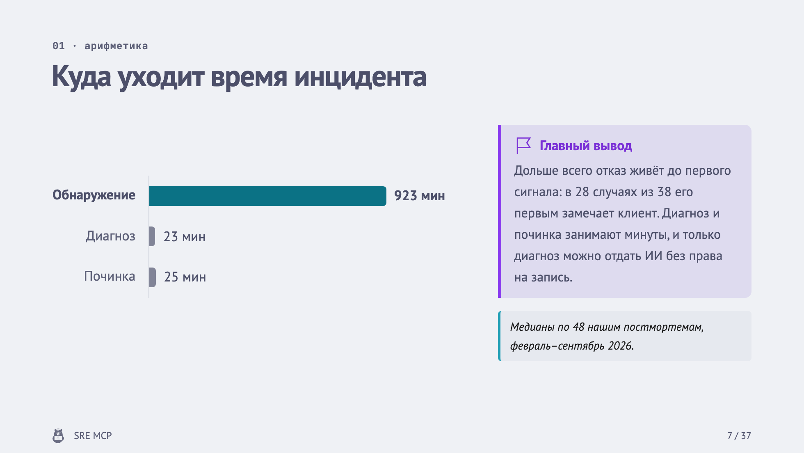
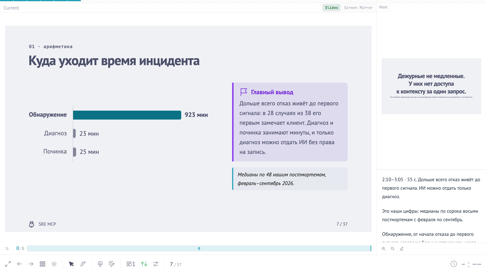
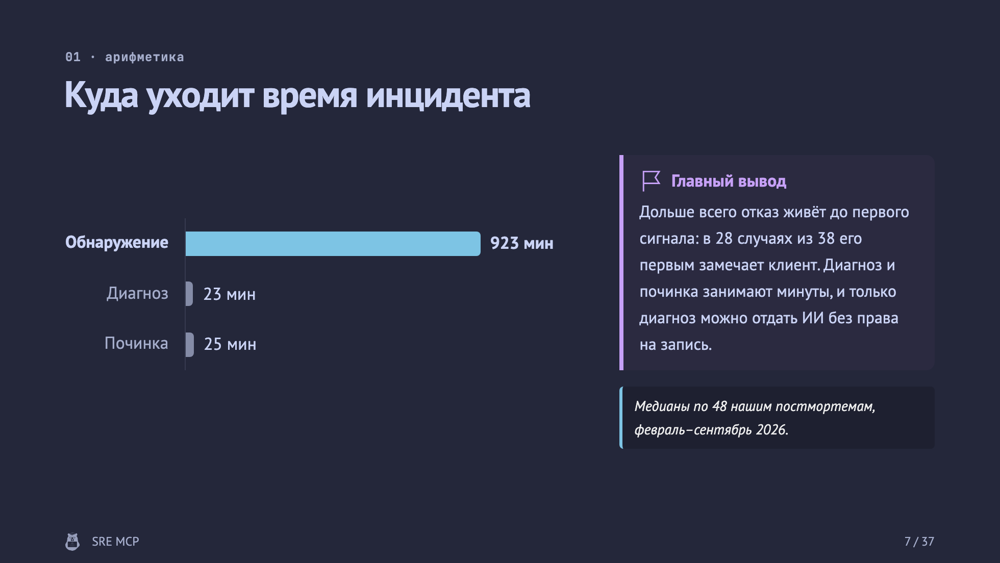

Привет, `%username%`! Слайды я собираю там же, где пишу посты и правлю конфиги: в редакторе, в Markdown и с git под боком. Мышкой блоки не двигаю, шрифты от слайда к слайду не выравниваю, а вместо «финал_v3_точно_финал.pptx» у меня `git log`.

Делается это на [Slidev](https://sli.dev). Написать про него я собирался ещё в декабре 2023-го, а руки дошли только сейчас: к Стачке собрал на нём доклад про SRE MCP, и репозиторий получился таким, что его удобно разобрать по косточкам.

После этого поста у тебя будет своя презентация: по файлу на слайд, с заметками спикера рядом с текстом, с PDF одной командой и сайтом, который выкатывается на GitHub Pages по `git push`. Все примеры взяты из живого репозитория [nastachku-2026](https://github.com/jtprogru/nastachku-2026), результат можно [полистать в браузере](https://jtprogru.github.io/nastachku-2026/).



- [Github Actions для блогера](/posts/github-actions/) — как по пушу собирается и выкатывается этот блог;
- [Taskfile](/posts/taskfile/) — про `make` и его более молодого сменщика, пригодится для обёрток вокруг сборки;
- [Как декодировать QR-код руками](/posts/how-read-qr-code/) — на случай, если на финальном слайде у тебя будет QR.


## Зачем слайдам git

Презентацию переписывают много раз. У моего доклада 46 коммитов за девять дней, и почти каждый из них — правка формулировки, перестановка слайдов или попытка влезть в слот. В pptx такая история выглядит как папка с копиями одного файла. Здесь это обычный `git diff`, по которому видно, что поменялось и зачем.

Оформление при этом живёт отдельно от содержания. Тема ставится зависимостью, и следующий доклад начинается со строчки `theme: bear`. Копировать прошлую презентацию и вычищать из неё чужие слайды больше не надо.

И из одних исходников получаются сразу сайт и PDF, оба в светлой и тёмной теме.

Плата за всё это — Node.js в зависимостях и вёрстка руками там, где не хватило готовой раскладки. Кому такой подход не подойдёт, скажу в конце.

## Что понадобится

- Node.js 22.12 или новее: это требование `@slidev/cli` 53;
- npm, он приезжает вместе с Node.js;
- git и аккаунт на GitHub, если нужен деплой;
- `make` — по желанию, для обёрток;
- Markdown на уровне README. Vue знать не обязательно, пока хватает готовых компонентов.

Команды ниже проверены на Slidev 53.0.0 и Node.js 26.

## Шаг 1. Заведи проект

```bash
npm init slidev@latest
```

Стартер спросит имя проекта и предложит сразу поставить зависимости и запустить dev-сервер. В созданной папке важны две вещи: `slides.md` с самими слайдами и `package.json` с тремя скриптами — `dev`, `build` и `export`. Каталоги `components/`, `pages/` и `snippets/` лежат там как примеры, их можно сносить.

Если от автозапуска отказался, подними сервер сам. Проект я назвал `my-talk`, у тебя будет то имя, которое ты ввёл стартеру:

```bash
cd my-talk
npm install
npm run dev
```

Проверка: браузер открыл `http://localhost:3030` с титульным слайдом. Поправь заголовок в `slides.md` и сохрани файл — слайд обновится без перезагрузки страницы.

Что стоит запомнить сразу:

| Адрес или клавиша | Что делает |
| --- | --- |
| `/presenter` | режим докладчика: текущий слайд, следующий, заметки и таймер |
| `/overview` | все слайды списком вместе с заметками |
| `o` | сетка слайдов для быстрого перехода |
| `g` | перейти к нужному слайду |
| `d` | переключить светлую и тёмную тему |

## Шаг 2. Напиши слайд

Презентация в Slidev — это Markdown-файл, в котором слайды разделены строкой `---`. У слайда три части: frontmatter с настройками, тело и заметки спикера в HTML-комментарии в самом конце.

```md
---
layout: statement
---

# Дежурный не чинит.<br>Дежурный ищет.

Ночь, тикет, четырнадцать дашбордов.

<!--
Крючок, 40 секунд. Сцену знает каждый дежурный, из неё вырастает весь доклад.
-->
```

`layout` выбирает раскладку: `statement` ставит одну мысль по центру экрана, `two-cols-header` даёт заголовок и две колонки, `section` рисует разделитель блока. Без этого поля слайд получает раскладку `default`.

Самый первый frontmatter в файле работает за двоих. Он настраивает титульный слайд и заодно всю презентацию, поэтому называется headmatter:

```yaml
---
theme: bear
layout: cover
title: 'SRE MCP'
author: Михаил Савин
transition: slide-left
drawings:
  persist: false
---
```

Теперь слайд посложнее, с графиком и врезкой:

```md
<Kicker>01 · арифметика</Kicker>

# Куда уходит время инцидента

<div class="grid grid-cols-[1.6fr_1fr] gap-12 items-center mt-6">

<BarChart unit=" мин" :items="[{ label: 'Обнаружение', value: 923, highlight: true }, { label: 'Диагноз', value: 23 }, { label: 'Починка', value: 25 }]" />

<div>

<Callout type="important" title="Главный вывод">

Дольше всего отказ живёт до первого сигнала: в 28 случаях из 38 его первым замечает клиент. Диагноз и починка занимают минуты, и только диагноз можно отдать ИИ без права на запись.

</Callout>

> *Медианы по 48 нашим постмортемам, февраль–сентябрь 2026.*

</div>

</div>
```



В этом куске три вещи, на которых держится вся вёрстка в Slidev.

Теги с заглавной буквы — Vue-компоненты. `Kicker`, `BarChart` и `Callout` приехали из темы, импортировать их не надо. Данные для графика лежат прямо в слайде, и когда поменяется цифра, картинку перерисовывать не придётся.

Классы у `<div>` — утилиты UnoCSS, по синтаксису как в Tailwind. `grid grid-cols-[1.6fr_1fr] gap-12` раскладывает слайд на две колонки без единой строчки CSS.

Пустые строки вокруг Markdown внутри HTML-тегов обязательны. Без них парсер примет содержимое за сырой HTML, и вместо жирного текста ты увидишь звёздочки.

## Шаг 3. Разложи слайды по файлам

Стартер предлагает писать всё в один `slides.md`. На десяти слайдах это удобно. На сорока, да ещё с заметками спикера, у меня вышло бы больше полутора тысяч строк в одном файле, и любой `diff` превратился бы в кашу.

Slidev умеет подключать слайд из другого файла через `src:`. Тогда `slides.md` остаётся оглавлением:

```md
---
# ── 01 · Арифметика MTTR ──
src: ./pages/01-mttr/00-section.md
---

---
src: ./pages/01-mttr/01-mttr.md
---

---
src: ./pages/01-mttr/02-thesis.md
---
```

А сами слайды лежат по одному в файле:

```txt
.
├── slides.md              # headmatter, титул и порядок слайдов
├── pages/
│   ├── 00-intro/
│   │   ├── 01-hook.md
│   │   └── 02-speaker.md
│   ├── 01-mttr/
│   │   ├── 00-section.md  # разделитель блока
│   │   ├── 01-mttr.md
│   │   └── 02-thesis.md
│   └── backup/            # бэкап-слайды «если спросят»
├── components/            # свои Vue-компоненты
├── public/                # картинки и QR-коды
├── setup/routes.ts        # правка маршрутов, см. шаг 4
└── style.css              # глобальные правки поверх темы
```

Правила, которые у меня прижились:

- папка — блок доклада, `NN` в её имени совпадает с номером блока на слайдах;
- файл называется `MM-слаг.md`, где `MM` — позиция слайда внутри блока. Вставил слайд в середину — перенумеруй соседей, иначе порядок файлов в папке разойдётся с порядком в презентации;
- frontmatter слайда живёт в файле страницы, в `slides.md` остаются только `src:` и `hide:`;
- YAML-комментарий над первым `src:` блока работает как заголовок раздела в оглавлении.

После этого `slides.md` на всю презентацию занимает 240 строк, переставить слайд — значит перенести три строки, а правка текста трогает ровно один файл.

## Шаг 4. Дай слайдам имена

По умолчанию адрес слайда — его номер: `/7`, `/21`. Стоит вставить один слайд в начало, и все ссылки внутри презентации вместе с сохранёнными закладками начинают вести не туда.

Лечится это полем `routeAlias` во frontmatter слайда:

```md
---
routeAlias: gates
---
```

Теперь слайд открывается по адресу `/gates` и останется там, куда бы ты его ни переставил. Алиас у меня совпадает со слагом файла без номера. К повторяющимся слагам добавляю префикс блока: `mttr-section`, `permissions-thesis`.

На алиасы опираются и переходы по клику. Итоговый слайд с карточками у меня работает как меню: на вопросах из зала по карточке можно прыгнуть к нужной теме.

```md
<Card to="gate-1" kicker="gate 01" title="Read-only">Токен не может писать</Card>
<Card to="gate-4" kicker="gate 04" title="Аудит на сервере">Журнал пишет не агент</Card>
```

`Card` — компонент темы. Без неё то же самое делает встроенный `<Link to="gates">текст ссылки</Link>`.

Остаётся одна шероховатость: корень сайта и `/presenter` Slidev жёстко ведёт на `/1`. Чтобы номер не всплывал даже при первом открытии, маршруты можно поправить в `setup/routes.ts`:

```ts
import { defineRoutesSetup } from '@slidev/types'

export default defineRoutesSetup((routes) => {
  for (const route of routes) {
    if (route.path === '')
      route.redirect = { path: '/cover' }
    else if (route.path === '/presenter')
      route.redirect = { path: '/presenter/cover' }
  }
  return routes
})
```

Здесь `cover` — алиас титульного слайда. Он задаётся в headmatter той же строкой `routeAlias: cover`.

Проверка: открой `http://localhost:3030/`. В адресной строке должно оказаться `/cover`, а не `/1`.

## Шаг 5. Заметки спикера и клики

Последний HTML-комментарий на слайде — заметка спикера. В зале её не видно, а в режиме докладчика она стоит рядом со слайдом.

Список, который должен появляться по пунктам, оборачивается в `<v-clicks>`. Маркер `[click]` в заметке привязывает абзац к клику, и в режиме докладчика подсвечивается та фраза, до которой ты дошёл:

```md
<v-clicks>

1. Запустил WAFaaS и собрал команду SRE
2. Запустил SRE-комьюнити и подкаст про SRE

</v-clicks>

<!--
0:50–1:15 · 25 с. Без биографии: по фразе на клик.

[click] Запускал WAFaaS и собирал команду SRE.

[click] Запустил SRE-комьюнити и подкаст.

Переход: «Об этом и доклад».
-->
```

Заметку я пишу по одному шаблону. Первая строка — тайминг и главная мысль слайда. Дальше текст, который произношу. Потом переход к следующему слайду. В конце справка: цифры и детали, которые нужны на вопросах, но вслух не идут.



На `/overview` те же заметки лежат списком рядом с миниатюрами, а в углу стоит счётчик. У моего доклада там 37 слайдов, 67 кликов и 4 284 слова. По этим цифрам удобно прикидывать хронометраж ещё до первого прогона.

## Шаг 6. Спрячь, а не удаляй

Первый план доклада был расписан на 25:25. На живых прогонах он занял 37 минут при слоте в 30 вместе с вопросами. Пришлось ужиматься до 18:20, и шесть слайдов из показа ушли.

Удалять я их не стал. В `slides.md` у каждого появилась одна строка:

```md
---
src: ./pages/01-mttr/04-research.md
hide: true
---
```

Слайд остаётся на своём месте в оглавлении, со своим номером файла и заметкой. В заметке к каждому скрытому слайду у меня записано, что поправить на соседях, если его вернуть. Чтобы вернуть, достаточно убрать `hide: true`.

## Шаг 7. Тема, компоненты и картинки

Стартер приезжает с темой `seriph`. Другую можно выбрать в [галерее](https://sli.dev/resources/theme-gallery): пишешь её имя в `theme:`, и dev-сервер сам предложит поставить пакет.

Я пользуюсь своей, [slidev-theme-bear](https://github.com/jtprogru/slidev-theme-bear). В npm её нет, она ставится прямо из GitHub:

```bash
npm i -D github:jtprogru/slidev-theme-bear
```

В ней семнадцать своих раскладок, компоненты для врезок, карточек, графиков и схем, шрифты с кириллицей в зависимостях и проверка контраста по WCAG AA. Код темы открыт для некоммерческого использования, а вот медведь мой: в форке бренд придётся заменить на свой.


Всё, чего нет в теме, лежит в самом проекте:

- `components/` — свои Vue-компоненты, подключаются автоматически по имени файла. У меня их два: схема архитектуры и логотип конференции. В шаблоне организаторов логотип был только в PNG, поэтому он обведён в вектор и вставлен инлайном: так он перекрашивается вместе с темой и не ломается в PDF;
- `public/` — статика. Файл `public/avatar.jpg` доступен на слайде как `/avatar.jpg`;
- `style.css` — глобальные правки поверх темы. У меня там одна CSS-переменная, которая делает маскота монохромным;
- `<style>` в конце файла слайда — стили только для него. Выручает на плотных слайдах: основной текст уменьшается, а заголовки остаются в размере темы и не прыгают от слайда к слайду;
- иконки — через Iconify. Ставишь набор командой `npm i -D @iconify-json/simple-icons` и пишешь `<simple-icons-go />`. Иконки наследуют цвет текста и перекрашиваются вместе с темой.

## Шаг 8. Собери PDF

Экспорт идёт через headless-браузер, поэтому сначала нужен Playwright:

```bash
npm i -D playwright-chromium
npx slidev export
```

Проверка: рядом со `slides.md` появился `slides-export.pdf`, и страниц в нём столько же, сколько слайдов в презентации без скрытых.

Полезные флаги:

| Флаг | Что делает |
| --- | --- |
| `--dark` | экспорт в тёмной теме |
| `--with-clicks` | отдельная страница на каждый клик |
| `--range 1,4-5` | только выбранные слайды |
| `--format png` | по картинке на слайд |
| `--format pptx` | pptx, в котором каждый слайд лежит картинкой |
| `--output <файл>` | своё имя файла вместо `slides-export` |



Добавь `slides-export*.pdf` в `.gitignore`: стартер создаёт его без этой строки.

Организаторы обычно просят файл, и PDF тут надёжнее всего. А pptx из Slidev годится разве что как запасной вариант: слайды в нём лежат картинками, текст не выделяется и не правится.

## Шаг 9. Выложи слайды на GitHub Pages

`slidev build` собирает статический сайт в `dist/`. На GitHub Pages сайт живёт в подкаталоге с именем репозитория, и об этом ему надо сказать флагом `--base`:

```bash
npx slidev build --base /nastachku-2026/
```

Дальше workflow `.github/workflows/build.yaml`, который делает то же самое на каждый push в `main`:

```yaml
---
name: GitHub Pages

'on':
  workflow_dispatch: {}
  push:
    branches:
      - main

jobs:
  deploy:
    runs-on: ubuntu-latest

    permissions:
      contents: read
      pages: write
      id-token: write

    environment:
      name: github-pages
      url: ${{ steps.deployment.outputs.page_url }}

    steps:
      - uses: actions/checkout@v7

      - uses: actions/setup-node@v7
        with:
          node-version: 'lts/*'

      - name: Install dependencies
        run: npm install

      - name: Build
        run: npm run build -- --base /nastachku-2026/

      - uses: actions/configure-pages@v6

      - uses: actions/upload-pages-artifact@v5
        with:
          path: dist

      - name: Deploy
        id: deployment
        uses: actions/deploy-pages@v5
```

В своём репозитории поменяй `/nastachku-2026/` на его имя и один раз включи Pages: Settings → Pages → Source → GitHub Actions.

Проверка: после зелёного прогона слайды открываются по адресу `https://<логин>.github.io/<репозиторий>/`.

Заодно я включил Dependabot: раз в неделю он приносит обновления npm-зависимостей и версий actions.

## Makefile, чтобы не помнить флаги

```make
node_modules: package.json package-lock.json
	npm ci
	@touch node_modules

.PHONY: dev
dev: node_modules
	npm run dev

.PHONY: build
build: node_modules
	npm run build

THEME ?= light

.PHONY: export
export: node_modules
	npm run export -- $(if $(filter dark,$(THEME)),--dark --output slides-export-dark.pdf)
```

Весь трюк в первой цели. `node_modules` объявлен обычной файловой целью, которая зависит от манифестов. Зависимости ставятся, только если каталога нет или `package.json` с локом новее него. Поэтому `make dev` на свежем клоне работает сразу, а второй `make build` подряд ничего не переустанавливает.

`make export THEME=dark` кладёт тёмный PDF в отдельный файл, светлый при этом не перезаписывается.

## Тонкие места, на которых легко споткнуться

- **`hide: true` выкидывает слайд целиком.** Из показа, из сборки и из PDF, и ссылка на него перестаёт работать. Скрытых слайдов «на всякий случай», до которых можно дойти кнопкой со слайда «Вопросы», так не сделать. Мои бэкапы поэтому лежат в конце презентации под `hide: true`, а ответы на эти вопросы записаны в заметках.
- **Заметки спикера едут в публичную сборку.** На выложенном сайте работает `/presenter`, и твой текст вместе с ответами на острые вопросы может прочитать кто угодно. Если это в планы не входит, собирай с `--without-notes`.
- **Прямая ссылка на слайд на GitHub Pages отдаёт код 404.** Браузер при этом покажет нужный слайд: Slidev кладёт копию `index.html` в `404.html`, и роутер разбирается сам. А вот `curl`, проверка ссылок и превью в мессенджерах увидят честный 404. Если прямые ссылки важны, смотри в сторону `--router-mode hash`.
- **Первый Markdown-заголовок слайда становится его названием.** Поэтому надзаголовок перед `#` нельзя написать как `###`: названием слайда станет он. В теме для этого отдельный компонент `Kicker`.
- **SVG через `` не перекрашивается.** `currentColor` внутри `` превращается в чёрный, и на тёмной теме логотип пропадает. Всё, что должно менять цвет вместе с темой, вставляй инлайном через компонент.
- **Шрифты из сети.** Slidev умеет подтягивать шрифты из Google Fonts, и на площадке без интернета это неприятный сюрприз. В моей теме шрифты лежат в зависимостях, и слайды показываются офлайн.
- **Dependabot и тема из GitHub.** Зависимость вида `github:jtprogru/slidev-theme-bear#v0.3.1` он предлагал «обновить» до v0.2.0. Тему пришлось добавить в `ignore` и бампать руками.
- **Новому слайду алиас нужен сразу.** Без `routeAlias` он откроется по номеру, и первая же перестановка сломает ссылку на него.

## Кому Slidev не подойдёт

- Организаторы требуют pptx по своему шаблону и собираются править его сами. Картинки внутри pptx им не помогут.
- Над слайдами работает несколько человек, и не все из них дружат с git.
- Нужна презентация на пять слайдов к завтрашнему синку. Поднимать ради неё Node.js-проект дольше, чем нарисовать слайды руками.

## Что с этим делать на практике

1. Запусти `npm init slidev@latest`, выбери тему и убедись, что dev-сервер поднялся.
2. Сразу разложи слайды по `pages/NN-блок/MM-слаг.md` и раздай им `routeAlias`.
3. Пиши заметку спикера вместе со слайдом, а не накануне: тайминг, текст, переход, справка.
4. Прогони доклад вслух с таймером и спрячь лишнее через `hide: true`.
5. Сделай `npx slidev export` и пролистай PDF глазами: переносы, плотные слайды, тёмная тема.
6. Включи деплой на Pages и реши, едут ли заметки в публичную сборку.

Как всё это выглядит в сборе, можно подсмотреть в [nastachku-2026](https://github.com/jtprogru/nastachku-2026): там же лежит README с правилами, по которым устроена презентация.

На этом всё! Profit!
