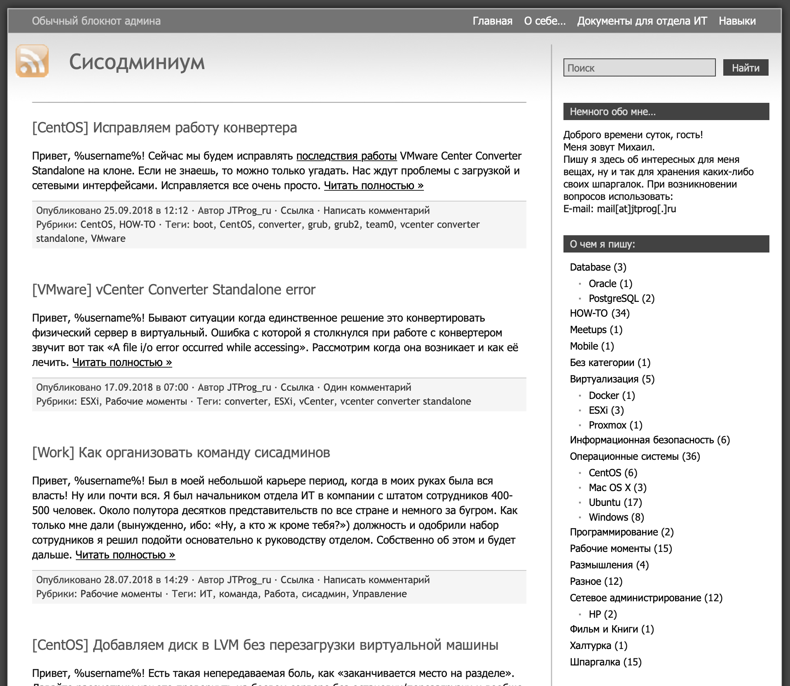

Привет, `%username%`! Я хочу объявить время перемен и глобальных изменений как минимум потому, что я задолбался.

## Немного истории

Этот бложик [jtprog.ru](http://jtprog.ru) живет уже довольно давно, с августа 2014 если быть точным, а до того времени он жил около года как субдомен на [wordpress.com](http://wordpress.com), где и публиковались первые статьи.

Изначально данный сайт задумывался как "записная книжка админа" доступная всем и каждому. Знаю что таких "записных книжек" было и остается вагон и маленькая тележка. Я всегда считал, что делиться знаниями – это ПРАВИЛЬНО! И я до сих пор считаю правильным "делиться знаниями". Потому и создал однажды блог "Сисодминиум", куда записывал изначально всякие рабочие моменты, инструкции, наблюдения и просто заметки.

В 2014 году бложик жил на Wordpress и выглядел примерно вот так:

А в 2019 уже немного по другому:

Ну а как сейчас выглядит бложик – думаю и так ясно. Правда появились темная и светлая тема (переключатель возле заголовка – я предпочитаю темную).

## Проблема

Как и большинство авторов нормальных текстовых блогов (а не вот эти ваши с ютубов), я начал сталкиваться с проблемой: "Не формат!"

Для себя я изначально определелил бложик как "записную книжку админа" и всё, что не являлось инструкцией я пытался либо привести к состоянию инструкции, либо убирал из публикуемых.

И вот постепенно время идет, мы все растём и меняемся. Я понял что пришло время для глобального изменения блога.

Если раньше это был исключительно "блокнот с рабочими заметками" или что-то вроде Wiki за авторством меня, то теперь это будет полностью МОЙ бложик.

Ну а что? Я владелец, я автор, я имею право, как мне кажется.

## Планы, мысли и идеи

Долго ли коротко ли, но планировать надо и стоит хотя бы иногда прикидывать куда дальше двигаться. Я стал замечать, что у меня растет канал в телеге – рекомендую подписаться! А еще растет мой Твиттер – иногда всякую попогарь или что-то с тэгом [#осторожнотред](https://twitter.com/search?q=%23осторожнотред&src=typed_query&f=live) скидываю туда.

Ну и подумал я, что раз есть спрос на мое мнение, раз есть спрос на мою помощь (в телеге не редко прилетают вопросы). Надо с этим что-то делать.

Короче я как сейчас модно, оформил себе страничку на [Patreon](https://www.patreon.com/jtprogru) и скоро там будут выкладываться некоторый контент, за который не стыдно и попросить монетку. А на этом блоге будут анонсы этих платных постов.

Так же на Patreon будут выкладываться мои собесы. Я уже начал составлять список компаний, куда можно попытаться пройти собес под запись. А пробничек записи моего собеседования уже лежит на [SoundCloud](https://soundcloud.com/jtprog_ru/sobesedovanie-devops). Знаю что со звуком лажа, но куда деваться – все совершают ошибки. В том собесе себеседовали меня на позицию DevOps уровня middle/middle+.

Меня посетила идея: хочу начать собеседовать людей – чисто для практики. Уже давно заметил: многие заваливают собесы потому, что не умеют их проходить. Хочу за скромное вознаграждение собеседовать ребят и девчат, которые в самом начале карьеры с целью "потренироваться" в прохождении собеседований. Точную стоимость пока не скажу, но условно говоря "купи мне хороший большой кофе в кафе". Заанонсирую эту инфу у себя в [канале](https://ttttt.me/jtprogru_channel) – рекомендую подписаться.

## Дезигн энд ребрендинг

Обновленными логотипом и названием уже можно любоваться прям сейчас. Чуть позже обновлю везде логотип, а название возможно будет еще меняться. Считай что я в творческом поиске себя.

Лого я быстренько накидал в [Canvas](https://www.canva.com/design/play?create=&category=tACZCvjI6mE&referrer=logo-landing-page) как логотип для лендоса. Я не особо силен в дизайне, но то что я сделал меня первоначально устроило. А как говорил мой учитель: "Лучшее – враг хорошего!"

Короче говоря, тут будет появляться контент не только строго определенной тематики как это было раньше, а все чем я посчитаю нужным поделиться. Не гарантирую что не буду писать про то "как съездил на море" или что-то в этом духе, но посмотрим как оно пойдет.

Просто помимо всякий инструкций вроде [Дружим Android и Ubuntu 14.04](https://jtprog.ru/android-and-ubuntu/), которая до сих пор пользуется спросом. Или же вроде [Перенос сайта на хостинг с BitrixVM](https://jtprog.ru/bitrixvm-hosting/), или же [Что показывает atop?](https://jtprog.ru/man-atop/), будут еще появляться статьи с моим мнением касательно чего-либо (возможно даже политики – кто знает). А некоторые статьи будут лишь анонсами того, что опубликовано в Patreon.

Будет интересно или не очень. Но я решил попробовать менять всё.

---

Если у тебя есть вопросы, комментарии и/или замечания – заходи в [чат](https://ttttt.me/jtprogru_chat), а так же подписывайся на [канал](https://ttttt.me/jtprogru_channel).

О способах отблагодарить автора можно почитать на странице "[Донаты](https://jtprog.ru/donations/)". Попасть в закрытый Telegram-чат единомышленников "BearLoga" можно по ссылке на [Tribute](https://web.tribute.tg/s/oRV).
