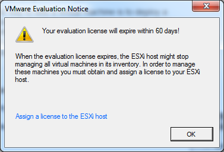

По роду своей деятельности часто приходится работать с таким продуктом как гипервизор ESXi версии 5.5 от VMware. Были попытки использовать версию 6.0, но они не увенчались успехом, т.к. она еще не стабильна. 

Часто приходится тестировать какие-то решения и программные комплексы. И честно говоря нет никакого желания для "служебных игрулек" покупать лицензию на данный продукт. К тому же у ESXi есть триальный период 60 дней с момента установки.



Таким образом получается, я использую все возможности не для продакшн и не для бизнес целей, а ~~чисто поиграться~~ ради экспериментов и каких-либо тестов. Но вот в чем косяк бывает: сидишь такой весь в раздумьях и занятый чем-то, а потом херак и тебе надо подключиться к какой-либо виртуалке на таком гипервизоре, а тебе говорят, что у тебя кончился пробный период и пожалуйста обнови лицензию заплатив некоторое количество денежек. Ну а по скольку я человек ленивый и не располагаю таким баблищем, то мне проще снести гипервизор и поставить заново. Вполне себе разумное решение на первый взгляд. Ты пользовался, знакомился с продуктом, а потом удалил его, т.к. понял что это не то. Но спустя пару минут ты решил еще кое-что проверить и потестировать и ставишь с нуля ESXi и дальше пользуешься триальной версией.

Но переустановка слишком долгое дело. И для тех кому лень переустанавливать вот простой способ как продлить триальный период:

Логинимся по `ssh` на гипервизор и выполняем следующие команды:
```bash
rm -r /etc/vmware/license.cfg
cp /etc/vmware/.#license.cfg /etc/vmware/license.cfg
/etc/init.d/vpxa restart
```

После этого мосмело подключаться клиентом и он нам снова скажет, что у нас есть 60 дней в запасе на наши глупости. И все наши виртуалки запущенные на гипервизоре снова доступны.

На этом все!

ЗЫЖ Данная схема подходит и для версии ESXi 5.1
