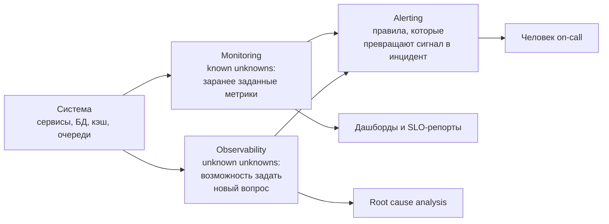
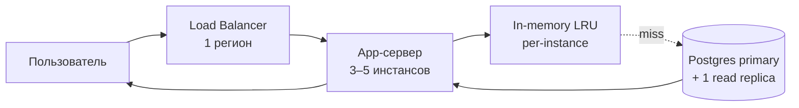
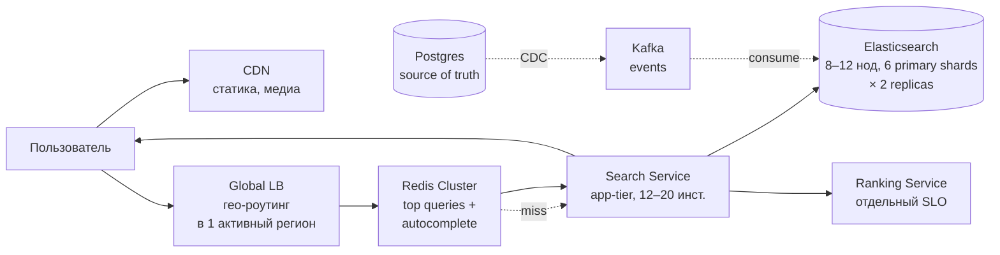
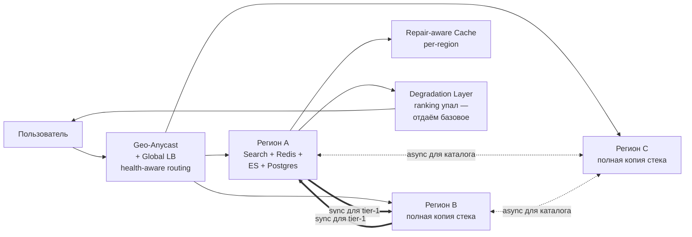

Привет, `%username%`! На системном дизайне 9 из 10 кандидатов начинают с компонентов: API gateway, Kafka, Redis, Postgres-реплики, шардинг, CDN. Это не дизайн — это плакат с логотипами. Дизайн начинается с вопроса, на который почти никто не отвечает первым: «какой надёжности я обещаю и почему именно этой, а не другой?».

Без числа в этом ответе — `99.5`, `99.9`, `99.99` — все архитектурные решения ниже становятся вопросом эстетики. С числом — превращаются в инженерные ограничения, которые решают за тебя, нужна ли вторая БД-реплика, имеет ли смысл repair-aware кэш и сколько регионов держать в active-active.

В этой статье я беру одну каноничную задачу с собеса — **поиск каталога маркетплейса** — и прокручиваю её сквозь три уровня SLO: `99.0%`, `99.9%`, `99.99%`. На каждом уровне меняется не «настройка пары флагов», а сама архитектура. Главный тезис: SLI/SLO — это не SRE-декорация поверх готовой системы, а **интерфейс между System Design и бизнесом**. Тот самый, через который аналитик, бэкенд и SRE говорят на одном языке.

## Что ты унесёшь из статьи

Статья длинная (~55 000 знаков), поэтому сразу — что заберёт каждая ЦА:

- **Аналитик / продакт.** Рамка для перевода бизнес-метрик в SLI и для разговора с инженерами в стиле «а если снизим SLO с 99.99% до 99.9% — что освободится?».
- **Бэкенд-инженер.** Как один и тот же поиск каталога превращается в три разные системы при смене таргета SLO — read path, кэш, индекс, фейловер.
- **SRE / DevOps.** Error budget как валюта в спорах «фича vs рефакторинг» + типовые ошибки выбора SLI: что делать, когда дашборд зелёный, а пользователи — в саппорте.

Общий блок для всех: разница между **Observability**, **Monitoring** и **Alerting** — в одной схеме, без воды.

## TL;DR (если читать дальше уже некогда)

Если у тебя нет 30 минут на длинный разбор — четыре тезиса, к которым приходит статья:

1. **SLO выбирается до архитектуры, а не после.** Поднять SLO задним числом — это переписать систему, а не «добавить мониторинга». Снизить — освободить бюджет, но не вернуть деньги.
2. **Один и тот же кейс на трёх SLO (`99.0%` / `99.9%` / `99.99%`) — это три разные системы.** Меняется не «настройка флагов», а топология, технологии, capacity, RTO/RPO, операционная модель и стоимость (`1×` → `4–6×` → `15–25×` baseline).
3. **SLI вешаются на шаги критичного пользовательского пути (CUJ), а не «на сервис в целом».** «99.9% по системе» — это псевдо-метрика, которая прячет деградацию ключевого шага за здоровьем фоновых эндпоинтов.
4. **Error budget работает как валюта в спорах «фича vs рефакторинг», только если есть записанная error budget policy.** Без неё SLO — это график на дашборде, а не дисциплина.

Дальше — как до этих четырёх тезисов прийти через один сквозной кейс. Если интересует только инженерная кульминация — переходи сразу к разделу [Один кейс — три SLO — три архитектуры](#один-кейс--три-slo--три-архитектуры).

## Кейс: поиск каталога маркетплейса

Чтобы не разговаривать абстракциями, возьмём одну сквозную задачу. Формулирую как на собеседовании:

> Спроектируйте сервис поиска и выдачи карточек товаров для крупного маркетплейса. На вход — поисковый запрос пользователя и фильтры (категория, цена, доставка, регион). На выход — отранжированный список карточек с превью, пагинация, фасеты.

Параметры — реалистичные для маркетплейса масштаба Ozon / Wildberries / Avito, но «приглаженные» под удобство арифметики:

| Характеристика | Значение |
|---|---|
| Активный каталог | ~50M товаров |
| Пиковый RPS на поиск | ~30 000 запросов/сек |
| Активных одновременных пользователей | ~200 000 |
| Доля mobile-трафика | ~70% |
| География | 5 регионов, основной — central RU |
| Целевая P50 латентность read path | < 150 ms |
| Целевая P99 латентность read path | < 500 ms |
| Сезонные пики (BF, распродажи) | x3–x5 от обычного RPS |

Бизнес-контекст, про который часто забывают на собесе, и зря:

- **Поиск — главный драйвер конверсии.** По публичным отчётам (SimilarWeb, ContentSquare, материалы крупных маркетплейсов) на больших площадках 40–70% покупок начинается с поисковой строки, не с категорий или баннеров. Конкретный процент гуляет по сегментам и площадкам, но порядок одинаков. Любая деградация поиска — это прямая просадка GMV, не «инженерная неприятность».
- **Эластичность по latency измерима.** Цифры из публикаций Amazon (Greg Linden, 2006), Akamai (2017), Google/SOASTA (2017) и Deloitte (2020) разнятся по методологии и сегменту, но порядок сходится: каждые `+100 ms` latency на ключевом read path стоят примерно `−0.5…1.5%` конверсии. Для маркетплейса с GMV $10M в день это $50–150k недополученной выручки **в день**, если такой регресс закрепится по ключевому read path. Это не разовый ущерб, а просадка, в которую конвертируется latency на ключевом пути.
- **Стоимость недоступности нелинейна.** 5 минут даунтайма обычным вторником и 5 минут даунтайма в Чёрную пятницу — это разные деньги в десятки раз. SLO должно учитывать сезонность, иначе оно меряет не то.

Эти три факта — ровно то, что превращает SLI/SLO из «инженерной гигиены» в инструмент бизнес-разговора. Я буду к ним возвращаться в каждом следующем разделе.

## Что обычно ломается на собесе без SLO

Послушаешь сотню system-design интервью — и складывается узнаваемый паттерн ответа.

### Типичная траектория

1. **Уточнили требования.** «Сколько пользователей? Какая нагрузка?» — кандидат услышал «много», и в голове щёлкнуло «значит, надо много всего».
2. **Нарисовали API.** REST с парой эндпоинтов, gateway, auth-middleware. Пока без сюрпризов.
3. **Добавили слой данных.** Postgres / MySQL — «реляционка для каталога норм». Кто-то сразу предложит Elasticsearch, потому что слышал про full-text search.
4. **Поставили кэш.** Redis — потому что «Redis fast». Без обсуждения, что именно кэшируем, какой hit rate ожидаем, как инвалидируем при изменении цены или остатков.
5. **Подняли реплики.** «На чтение пойдут реплики, на запись — мастер». Без обсуждения, насколько асинхронная репликация критична: а если пользователь не увидит свой только что выложенный товар?
6. **Зашардировали.** Чаще всего по `category_id` или `seller_id`. Потому что «у больших так».
7. **Накинули CDN и очередь.** Kafka — куда же без неё. Async-обработка событий, чтобы «развязать сервисы».

К концу интервью на доске — красивая распределённая система. Интервьюер кивает. Кандидат уверен, что справился.

### Что в этой траектории не так

Простой тест. Ответь сам себе: **какое из решений выше изменилось бы, если бы требование к доступности было `99.0%`, а не `99.99%`?** А если бы P99 была не 500 ms, а 2 секунды?

Если ответ «никакое» — значит, дизайн не привязан к требованиям к надёжности. Кандидат строил систему «как принято», а не «как нужно бизнесу». А раз все решения принимались независимо от целевого SLO — значит, любые из них могут быть и преждевременными, и недостаточными одновременно. Точно сказать нельзя, потому что точки отсчёта нет.

Чтобы было совсем больно — разберём по решениям:

- **Кэш Redis.** Имеет смысл, если твой SLO по latency — десятки миллисекунд для горячих запросов или ты упираешься в нагрузку на БД при текущем availability-таргете. При расслабленном SLO P99 = 2 секунды кэш в read path — преждевременная оптимизация: ты поднимаешь эксплуатационную сложность (инвалидация, прогрев, репликация Redis-кластера, отдельный SLO на сам кэш) ради цели, которая выполнима и без него.
- **Реплики на чтение.** Имеют смысл, если твой SLO availability такой, что мастер-only архитектура не уложится в бюджет ошибок при типовом MTTR. На SLO `99.0%` (~7 часов даунтайма в месяц) одного хорошо настроенного primary с мониторингом и быстрым backup-восстановлением часто достаточно.
- **Шардинг.** Оправдан, когда объём данных или write QPS упирается в один инстанс физически. До этого — это удвоение операционной нагрузки (rebalancing, hot shards, резолв cross-shard запросов) без выигрыша по SLI, ради которого его делают.
- **Multi-region active-active.** Имеет смысл при SLO availability `99.99%`+ или когда регуляторика обязывает (data residency, ФЗ-149/ФЗ-152/ФЗ-242/GDPR-аналоги). На `99.9%` обычно дешевле и предсказуемее active-passive с автоматическим failover и RTO в минутах.

Каждое из этих решений — правильное в одних условиях и преждевременное в других. Условия задаёт SLO. Без него ты выбираешь архитектуру не под задачу, а под насмотренность.

### Главный сдвиг — направление дизайна

Хороший дизайн идёт **сверху вниз**: бизнес-цель → критичный пользовательский путь (CUJ, critical user journey) → SLI на каждый шаг этого пути → SLO как контракт → архитектура, которая в этот SLO укладывается с разумным запасом.

Плохой дизайн идёт **снизу вверх**: «у крутых ребят такая схема — нарисуем такую же». На выходе получается архитектура, в которую любой SLO «впихнуть можно постфактум» — потому что под её требования не задавали ни одного числа, и теперь любая цифра одинаково годится для отчётности и одинаково плохо отражает реальное поведение системы.

В следующих разделах я разворачиваю верхний путь — сверху вниз — на нашем кейсе с маркетплейсом. Начнём с шага 1: как из функциональных требований получается тот самый критичный пользовательский путь.

## Шаг 1: от ФТ к критичному пользовательскому пути

Раз направление дизайна сверху вниз — нужна точка отсчёта на самом верху. Это **функциональные требования (ФТ)**: что система делает в терминах пользователя и продукта. Не «использует Elasticsearch», а «возвращает релевантную выдачу по запросу».

### ФТ для нашего кейса

- Принять поисковый запрос (текст + фильтры) от авторизованного и анонимного пользователя.
- Подбирать товары из активного каталога с учётом региона и доступной доставки.
- Ранжировать результаты с учётом релевантности, цены, рейтинга продавца и персонализации.
- Возвращать пагинированную выдачу с фасетами (категории, ценовые диапазоны, бренды).
- Поддерживать sorting (price asc/desc, popularity, rating).
- Подсказки и автодополнение по мере набора запроса.

Это всё одинаково «функциональные требования» — но **не одинаково критичные**. Если автодополнение тормозит на 200 ms, пользователь поморщится. Если выдача не приходит вовсе — он закроет вкладку и пойдёт к конкуренту. ФТ сами по себе плоские, в них нет приоритета. Этот приоритет приносит **критичный пользовательский путь**.

### Критичный пользовательский путь (CUJ — critical user journey)

Это сценарий пользователя, который напрямую кормит ключевую бизнес-метрику. У маркетплейса бизнес-метрика — GMV, точка входа в неё — поиск, точка выхода — клик в карточку и далее в корзину. Получаем такой путь:

> Пользователь приходит на сайт с намерением купить → формулирует запрос → получает релевантную выдачу → выбирает товар → переходит в карточку.

Это и есть «золотой путь», за который держимся в дизайне. Всё, что не обслуживает этот путь напрямую (статистика для аналитики, A/B-эксперименты, персональные рекомендации в стороннем виджете), может быть менее надёжным — и это нормально.

> [!note] Терминологическая дисциплина
> Дальше по тексту слово **«сервис»** работает в двух разных значениях, и я их буду стараться разводить явно:
>
> - **Пользовательский сервис** — это CUJ (поиск каталога целиком). К нему привязаны SLI и SLO.
> - **Микросервис** — это юнит деплоя (Search Service, Ranking Service на схеме архитектуры). К нему привязаны Golden Signals для внутренней диагностики, но **не отдельный набор SLI**.
>
> Один пользовательский сервис может реализовываться десятью микросервисами — но SLI по-прежнему 4–8, не 4–8 × 10. К этому различию ещё вернёмся в разделе про типичные ошибки.

### Декомпозиция пути на шаги

Дальше путь режется на дискретные шаги, каждый из которых станет отдельной точкой измерения:

| # | Шаг | Что делает система | Что замечает пользователь |
|---|---|---|---|
| 1 | Загрузка поискового интерфейса | Отдать HTML/SPA-bundle, инициализировать клиент | Страница появилась, поле поиска кликабельно |
| 2 | Автодополнение (suggest) | На каждое нажатие клавиши вернуть top-N подсказок | Подсказки появляются «без задержки» |
| 3 | Отправка запроса | Получить query + фильтры, направить в search backend | Лоадер крутится недолго |
| 4 | Получение выдачи | Поиск в индексе, ранжирование, обогащение карточек | Выдача отрисовалась, скроллится плавно |
| 5 | Применение фильтра / сортировки | Реквест с уточнёнными параметрами | Список перестроился без рывков |
| 6 | Клик в карточку | Переход на страницу товара, прелоад данных | Карточка открылась, цена и наличие актуальны |

Эти шесть шагов — каркас, на котором будет висеть всё дальнейшее. На каждый шаг повесим SLI, на каждый SLI — SLO. И увидим, что они **не равноценны**: шаг 4 (получение выдачи) для бизнеса принципиально важнее, чем шаг 2 (автодополнение). А значит, и инженерных усилий на их надёжность нужно несоизмеримо больше.

### Почему это важно: ловушка «среднего по системе»

На многих собеседованиях кандидат, отвечая на «какую ты доступность хочешь», говорит «99.9% по системе». Это бесполезное число: если оно посчитано как «суммарный аптайм всех эндпоинтов», оно скрывает то, что выдача упала на 30 минут, а суммарно «вышло 99.9%, потому что autocomplete и health-чеки крутились». Пользователь страдал, дашборд зелёный.

Шаги критичного пути — антидот этой ловушки. Каждый шаг получает свою цифру, и провал шага 4 невозможно «размазать» доступностью соседних шагов.

## Шаг 2: НФТ как свойства шагов, а не системы

Когда есть карта шагов, нефункциональные требования (НФТ) перестают быть размытым «надёжно, быстро, безопасно». Они становятся набором конкретных свойств **каждого шага**.

### Свойства, которые нас интересуют

Для read-heavy критичного пути маркетплейса базовый набор НФТ выглядит так:

- **Латентность.** Сколько миллисекунд занял шаг. Меряем перцентилями (P50/P95/P99), не средним — оно скрывает хвосты, а хвосты и есть пользовательская боль.
- **Доступность.** Доля успешных шагов. Не «200/всего HTTP», а именно «шаг выполнен корректно с точки зрения сценария».
- **Корректность.** Получил ли пользователь ожидаемый результат. Для шага 4 — вернулась ли релевантная выдача или 0 результатов из-за бага в ранжировании.
- **Свежесть.** Насколько актуальны данные. Цена и наличие на карточке после клика — критичная свежесть; popularity-score в ранжировании — терпит часовую задержку.
- **Целостность.** Не «исчезает» ли часть результатов из-за частичного сбоя ноды или таймаута к шарду. Это специфично для распределённого поиска и шардированных индексов.

### Привязка свойств к шагам пути

Не каждое свойство одинаково важно на каждом шаге. Покажу таблицей, какие НФТ для каких шагов нашего кейса критичны:

| Шаг | Латентность | Доступность | Корректность | Свежесть | Целостность |
|---|---|---|---|---|---|
| 1. Загрузка интерфейса | средне | высоко | низко | низко | низко |
| 2. Autocomplete | высоко | средне | средне | низко | низко |
| 3. Отправка запроса | средне | высоко | низко | низко | низко |
| 4. Получение выдачи | **высоко** | **высоко** | **высоко** | средне | **высоко** |
| 5. Фильтр / сортировка | высоко | высоко | высоко | средне | высоко |
| 6. Клик в карточку | средне | высоко | высоко | **высоко** | низко |

Сразу видно: шаг 4 — концентратор НФТ, на нём горят почти все колонки. Шаг 6 особенно требователен к свежести — потому что показать пользователю карточку с «вчерашней» ценой (а на чекауте уже другая) — это худший UX и часто прямой ущерб бизнесу через возвраты и репутацию.

### Главное смещение от привычных НФТ из ТЗ

Классические нефункциональные требования — «система должна обеспечивать 99.9% доступности» — это **средневзвешенное по чему попало**. Они одинаково оценивают и autocomplete, и финальную выдачу. В реальной эксплуатации это приводит к двум симметричным болям:

1. **Деньги тратятся не туда.** Команда вкладывает усилия в надёжность шагов, которые этого не требуют (autocomplete с 99.99% — приятно, но конверсию не трогает), а критичные шаги остаются на «общем уровне».
2. **Алерты молчат, когда болит.** Дашборд показывает зелёный «99.9% по системе», пока шаг 4 деградирует и теряет каждую десятую выдачу. Эту потерю топит «здоровье» десятка других эндпоинтов и фоновых хелсчеков.

НФТ-по-шагам убирают эту усреднённость. Следующий шаг сверху вниз — превращаем эти свойства в **измеримые SLI**, чтобы было что мерить и за что отчитываться. Но прежде чем давать формулу — нужен общий словарь, без него разговор про SLI получится поверхностным.

## Шаг 3: SLI как индикатор пользовательского опыта

### Сначала — общий словарь: Observability ≠ Monitoring ≠ Alerting

В SRE-практике три термина часто валят в одну кучу, и тогда любой разговор про SLI разваливается на терминологические уточнения. Развожу их через **цель** каждой практики:

- **Monitoring (мониторинг)** отвечает на заранее заданные вопросы. Ты знаешь, что хочешь видеть: «жив ли primary», «какая P99 у эндпоинта `/search`», «не растёт ли latency». На каждую заготовку — метрика или дашборд. Это про **known unknowns** — вещи, о которых ты знаешь, что они могут пойти не так, и хочешь их видеть.
- **Observability (наблюдаемость)** — свойство системы, которое позволяет дойти до **нового** вопроса. Не «жив ли primary», а «почему именно в этом конкретном запросе latency 4 секунды». Высокая observability означает, что у тебя достаточно данных (метрик, структурированных логов, трейсов с tail-based sampling, событий) и инструментов поверх них, чтобы задать системе вопрос, который ты не предусмотрел заранее. Это про **unknown unknowns** — про неожиданности, которых ты не ждал. Такое разведение «monitoring = known unknowns / observability = unknown unknowns» — рамка из «Distributed Systems Observability» Cindy Sridharan (O'Reilly, 2018) и развитая инженерами Honeycomb (Charity Majors et al.); внутри Google SRE Workbook грань между ними размытее, и я сознательно беру более жёсткую формулировку — на ней легче строить дизайн.
- **Alerting (алертинг)** — действие по событию. Это слой, надстроенный над мониторингом и observability: правила, которые превращают наблюдаемое состояние в инцидент с пейджингом. Алерт — это не метрика, это **обещание разбудить человека**, и за него надо отвечать. Alert fatigue — отдельная боль, и лечится она burn-rate-алертами, а не увеличением количества правил.

Связь между ними — на одной схеме:

В этой триаде SLI — это специально выделенные метрики из мониторинга, которые отражают пользовательский опыт. SLO — правило поверх SLI, которое мы хотим выполнять. Алерты по burn-rate — правила поверх SLO. Observability — страховка на случай, когда SLO сгорает, и нужно понять, **почему именно сейчас и в этом запросе**. Иначе говоря: мониторинг, SLI и SLO живут в плоскости «всё ли в порядке по тем критериям, которые мы назначили». Observability — в плоскости «что именно сейчас не так и почему», когда привычные метрики не дают ответа.

Теперь, с этим словарём — переходим к самому SLI.

### Что такое SLI

**SLI (Service Level Indicator)** — измеримая характеристика, которая отражает качество одного аспекта обслуживания пользователя. Ключевое слово — **отражает**. SLI меряет не «что система делает», а «насколько хорошо это видит пользователь».

Каноническая формула SLI — доля «хороших» событий от всех релевантных:

$$ \text{SLI} = \dfrac{\text{количество хороших событий}}{\text{количество всех релевантных событий}} \times 100\% $$

Что такое «хорошее событие» и какие события «релевантны» — определяется **явно**, иначе SLI получится бесполезным. Самая частая ошибка здесь — посчитать «все HTTP 2xx» как «хорошие». Так делать нельзя по двум причинам:

1. **Не все 2xx одинаковы.** Запрос, ответивший `200 OK` за 5 секунд, формально успешен, но для пользователя это провал. SLI должен учитывать порог по латентности, иначе он маскирует деградацию.
2. **Не все запросы одинаковы.** Health-чек с другого сервиса тоже летит как HTTP-запрос, но на пользовательский опыт не влияет. Если он попал в знаменатель — SLI размылся.

### Формат хорошего SLI

У хорошего SLI всегда три явные части:

- **Числитель.** Что считаем «хорошим» — порог по времени, корректности, объёму. Должно быть ясно, что туда входит, а что нет.
- **Знаменатель.** Какие события считаем релевантными — фильтр по эндпоинту, источнику трафика, типу запроса. Должно быть ясно, какие исключаем.
- **Окно агрегации.** За какой период считаем — 5 минут для алертов, 30 дней для отчётности. Без окна SLI — не число, а описание формы.

### Конкретные SLI для нашего кейса

Возьмём ключевые шаги из таблицы НФТ и сформулируем для них SLI. Останавливаюсь на четырёх — этого достаточно, чтобы показать механику; в реальном проде их обычно 4–8 на сервис.

**SLI-1 — Latency-SLI на шаге 4 «получение выдачи».**

> Доля поисковых запросов, на которые система ответила за время `< 500 ms`, от всех релевантных поисковых запросов с пользовательского трафика, за окно 30 дней.

- **Числитель:** запросы с `status in {200, 204}` AND `request_duration < 500 ms`.
- **Знаменатель:** запросы с `status in {200, 204, 5xx}` плюс таймауты, исключая 4xx-валидационные ответы (всё, что не health-check, не synthetic-проба, не вызов внутреннего сервиса).
- **Окно:** 30 дней rolling.

Заметь две вещи. Во-первых, **5xx в знаменателе**: не учитывать их — значит нарисовать оптимистичную картинку, в которой провал «технически не считается». Во-вторых, **4xx-ответы пользовательского трафика в знаменатель не идут** — по канонической Google SRE-практике (глава «Service Level Objectives» в SRE Workbook, O'Reilly, 2018) это корректное отвержение невалидного запроса (например, поисковая строка пустая или превышает лимит длины), система отработала ожидаемо. Включать их в знаменатель — раздуть его и сделать SLI оптимистичнее, чем он есть на самом деле.

**SLI-2 — Availability-SLI на шаге 4.**

> Доля поисковых запросов, завершившихся успешно (не 5xx, не таймаут), от всех релевантных запросов, за окно 30 дней.

Это «классическая» availability. Но смотрим только на пользовательский трафик в шаг 4, не «по системе целиком». Знаменатель тот же, что у SLI-1, — 4xx-валидационные ответы исключены.

**SLI-3 — Correctness-SLI на шаге 4.**

> Доля поисковых запросов, вернувших непустую и валидную выдачу, от всех запросов, для которых должна была быть хотя бы одна позиция (не 0-result-by-design).

Этот SLI сложнее, потому что нужно знать «должна была быть выдача или нет». Обычно меряется через офлайн-сэмплинг: берём X% запросов, прогоняем эталонный поиск, сравниваем долю «должно быть, но не было».

**SLI-4 — Freshness-SLI на шаге 6 «клик в карточку».**

> Доля переходов в карточку, на которых цена и наличие отображены не старше 60 секунд от истинного состояния товара.

Этот SLI напрямую защищает от ситуации «увидел одну цену в выдаче — на чекауте другая». Без него ты рискуешь не техническим инцидентом, а **репутационным**: пользователь зол, возвраты растут, рейтинг продавцов падает.

Аналогичные SLI можно и нужно построить для autocomplete, фильтра, отправки запроса — но повторять механику дальше не буду, она одинаковая. Достаточно понять принцип: один шаг — один или несколько SLI, каждый с явным числителем, знаменателем и окном.

### Что мы НЕ берём как SLI

Контрпримеры, чтобы калибровать чутьё:

- **CPU/Memory utilization.** Это **служебный сигнал**, а не SLI. Пользователь не страдает от того, что у тебя CPU 80% — он страдает только если это превратилось в latency или 5xx. Утилизация — причина, SLI — следствие.
- **Количество подов в реплике.** Тоже служебный. Метрика для capacity planning, не для SLO.
- **Среднее время ответа.** Опасный «псевдо-SLI». Скрывает хвосты — а хвосты это и есть пользовательская боль. Только перцентили: P95 как минимум, P99 для критичных шагов.

Дальше — превращаем SLI в обещание самим себе. То есть в SLO.

## Шаг 4: SLO как контракт и error budget математически

**SLO (Service Level Objective)** — целевое значение SLI на оговорённом окне. Если SLI отвечает на вопрос «как было», то SLO — «как мы обещаем, что должно быть».

Формула:

$$ \text{SLO}: \text{SLI} \geq T \text{ (на окне } W) $$

Где `T` — таргет (например, `99.9`), `W` — окно агрегации (например, 30 дней rolling).

### SLO для нашего SLI-1

Берём SLI-1 (latency-SLI поиска: доля запросов `< 500 ms`):

> SLO: 99.9% поисковых запросов отвечают быстрее `500 ms` на rolling-окне 30 дней.

Это полноценный контракт. И он автоматически рождает второй важный объект — **error budget**.

### Error budget математически

Error budget — это **разрешённая доля «плохих» событий** за период:

$$ \text{Error Budget} = 1 - \text{SLO} $$

Для SLO `99.9%` это `0.1%`, или 1 «плохой» запрос из 1000.

Дальше переводим в абсолютные значения. Берём типовой день нашего маркетплейса:

- Пиковый RPS: `30 000 запросов/сек`.
- Средний по дню (с учётом ночи): `~10 000 запросов/сек`.
- Запросов в сутки: `10 000 × 86 400 ≈ 864 000 000`.
- Запросов за 30-дневное окно: `~26 миллиардов`.
- Допустимая доля «плохих» при SLO `99.9%`: `0.1%`.
- **Бюджет ошибок за 30 дней: ~26 миллионов запросов.**

Если перевести в эквивалент простоя — двумя срезами, на пике и при средней нагрузке за сутки:

| SLO | Бюджет ошибок | На пике (30k RPS) | При средней нагрузке (~10k RPS) |
|---|---|---|---|
| 99.0% | ~260M запросов | ~2 ч 24 мин | ~7 ч 13 мин |
| 99.9% | ~26M запросов | ~14 мин 27 с | ~43 мин 20 с |
| 99.99% | ~2.6M запросов | ~1 мин 27 с | ~4 мин 20 с |
| 99.999% | ~260K запросов | ~8.7 с | ~26 с |

Две колонки — потому что бюджет ошибок «горит» неравномерно. На пике RPS ты расходуешь запросы в три раза быстрее, чем в среднем по суткам, — поэтому инцидент в Чёрную пятницу обходится сильно дороже, чем тот же инцидент во вторник в 4 утра. Колонка «На пике» — про худший случай, на который надо проектировать SLO; колонка «При средней нагрузке» — про календарный «эквивалент полного простоя», который чаще видят в отчётах.

Это не просто разные числа — это разные **физические возможности**. На пике 8.7 секунд в месяц означают, что человек не успеет даже заметить пейдж: реакция должна быть автоматической. 7 часов в месяц при средней нагрузке — означают, что можно позволить себе ручной разбор каждого инцидента.

### Что error budget значит на практике

Бюджет — не «допустимый ущерб», а **бюджет на риск**. На него тратятся:

- **Деплои.** Каждый релиз — ставка из бюджета. Откат + время на восстановление = израсходованные ошибки.
- **Эксперименты.** A/B-тесты, постепенный rollout, фиче-флаги — потенциальные источники регрессии.
- **Учения.** Game days, chaos engineering, плановые отказы — расходуют бюджет, но взамен дают уверенность в стабильности на реальных инцидентах.

Если бюджет полностью сгорел до конца окна — это сигнал к **freeze: остановить рискованные деплои и вкладываться в reliability**, пока окно не сдвинется. Если бюджет жирный — это **разрешение рисковать**: ускорять выкатки, экспериментировать, рефакторить.

К теме «бюджет как валюта в спорах» вернусь в разделе про error budget как арбитр. Сейчас важно зафиксировать одно: **SLO без error budget — это пожелание, а не контракт.** Бюджет — то, что превращает SLO из табло в инструмент принятия решений.

Дальше — главный технический разбор статьи. Берём один и тот же поиск маркетплейса и прокручиваем сквозь три уровня SLO: 99.0%, 99.9%, 99.99%. Покажу, что меняется в архитектуре, что — в стоимости, что — в эксплуатационной нагрузке.

## Один кейс — три SLO — три архитектуры

Дальше беру тот же поиск маркетплейса с теми же параметрами и проектирую **три разные системы**. Меняется структура read path, выбор технологий, capacity, RTO/RPO, эксплуатационная модель. Остаётся постановка задачи, объём каталога (50M), пиковый RPS (30k), 5 регионов, 70% mobile.

Структура каждого подраздела одинаковая: бюджет → схема read path → числа (capacity, RTO/RPO, кэш, индекс) → что добавилось по сравнению с предыдущим уровнем и зачем → чего намеренно НЕ делаем.

### SLO 99.0%: «дешёвая надёжность» для не-критичных сценариев

**Бюджет:** ~260M «плохих» запросов за 30 дней, или **~2 ч 24 мин** полного даунтайма на пике / **~7 ч 13 мин** при средней нагрузке. Почти полный рабочий день на инциденты в месяц — много, но реально выживаемо при ручной операционной модели.

**Когда уместно:** внутренние инструменты, ранний MVP стартапа, неосновные feature-paths в большом продукте (например, search в каталоге сторонних услуг, не кормящий основную конверсию).

**Read path:**

**Числовые прикидки:**

- **Capacity.** 30k RPS пика → при `99.0%` можно потерять ~300 запросов/сек без нарушения SLO. Один хорошо настроенный Postgres primary с trigram-индексом на `title/description` тянет 1–3k RPS read на сложных запросах с фильтрами и фасетами, до 5–8k RPS — на простых коротких запросах с маленькой выборкой (P99 < 200 ms, при правильном connection pooling). Read replica удваивает чтение, итого `~2–15k RPS` в зависимости от профиля. На пике 30k ты либо урежешь long-tail запросы кэшем приложения, либо примешь деградацию — бюджет позволяет.
- **Кэш.** In-memory LRU на каждом app-инстансе, размер `~256 MB`. Hit rate 30–40% на популярных запросах. Без Redis — отдельный сервис добавил бы операционную сложность, нерелевантную для этого SLO.
- **Полнотекстовый индекс.** `pg_trgm` + `tsvector` поверх 50M товаров занимают `3–5×` от размера индексируемых текстовых полей (title, description, attributes-text). Для нашего каталога с расширенными текстовыми атрибутами это порядка `1.5–2.5 TB` индексов. Реалистично на одной мощной машине (NVMe, 256 GB RAM).
- **RTO.** До 30–60 минут на ручной failover на реплику. Автоматизации нет — стоит отдельный сервис.
- **RPO.** До 5 минут (типовая асинхронная репликация Postgres).
- **Алерты.** На симптомы: 5xx-rate, P99 latency, replication lag. Реакция оператором, не автоматическая remediation.

**Почему этого достаточно — счёт по бюджету.** Бюджет 99.0% — это `~7 часов даунтайма в месяц` при средней нагрузке. Типовой худший случай выхода из строя primary с восстановлением из `pg_basebackup` + PITR — `30–90 минут` от пейджа до возобновления read path (включая ручное переключение приложений на реплику и прогрев кэша). Даже два таких инцидента в месяц съедают `~3 часа` — это меньше половины бюджета. Платить за синхронную репликацию, автоматический failover-tooling (Patroni / RepMgr / Stolon) и дежурную команду, способную их обслуживать, на этом уровне SLO нечем: бюджет покрывает ручной MTTR с большим запасом. На 99.9% этого запаса уже нет — отсюда и Active-passive failover на следующем уровне.

**Что намеренно НЕ делаем:**

- Не поднимаем Elasticsearch — он добавит +1 систему-источник истины, требующую отдельного индексирования, мониторинга и SLO. На 99.0% это лишний оверхед.
- Не делаем шардинг — одна машина с 256 GB RAM в 2025 году утаскивает 50M документов с trigram-индексом без проблем.
- Не делаем multi-region даже active-passive. Бюджет 7 часов покрывает любой региональный инцидент с ручным восстановлением.

**Стоимость:** обозначу как **1× baseline** для последующего сравнения.

### SLO 99.9%: рабочий production-уровень

**Бюджет:** ~26M «плохих» запросов за 30 дней, или **~14 мин 27 с** полного даунтайма на пике / **~43 мин 20 с** при средней нагрузке. На инцидент при средней нагрузке остаётся минут 20–30 — хватает на автоматический failover, но не на ручной разбор каждого 5xx.

**Когда уместно:** основные пользовательские пути в среднем e-commerce, обычный production. Большинство сервисов в индустрии живут в этом диапазоне.

**Read path:**

**Числовые прикидки:**

- **Capacity.** 30k RPS пика → допустимо терять ~30 запросов/сек. На Elasticsearch при 50M документов и `6 primary shards × 1 replica` (~33 GB на шард, в коридоре best-practice 30–50 GB): запрос идёт в координатор, координатор делает fan-out на 6 шардов, агрегирует. Целевая нагрузка `30–40k RPS` с запасом. На 8–12 ES-нодах (`64–128 GB RAM` каждая) держится с P99 в районе `300–400 ms` чистого ES-времени.
- **Кэш Redis.** Кластер на 3–6 нодах, `~50 GB` под топовые запросы и autocomplete. Hit rate `65–75%` — ключевой множитель: при 70% hit rate на ES падает только 30% от 30k RPS, то есть `~9k RPS`. Это уже посильно для умеренного ES-кластера. Прогрев после деплоя — 5–10 минут на горячих топ-1000 запросах.
- **Индексирование.** Postgres → Debezium / собственный CDC → Kafka → потребитель в ES. Lag индексирования: `15–60 секунд` на типовых изменениях, `2–5 минут` на массовых обновлениях цен (например, при загрузке от продавца XML-фида). Это **freshness-SLI** — ценник старше 60 секунд считается «плохим событием» по SLI-4.
- **Структура документа и размер индекса.** Каждая карточка в ES — денормализованный документ: `title, description, attributes (10–20 полей), price, stock, seller_rating, geo, popularity`. Размер ~3–5 KB на документ. `50M × 4 KB = ~200 GB primary` + 200 GB replica = 400 GB Lucene-данных. На 12 нодах ≈ ~33 GB на ноду, рабочее множество легко помещается в RAM.
- **Failover.** Active-passive между двумя AZ внутри региона. RTO `1–3 минуты` через автоматический promote secondary. RPO ~30 секунд через CDC.
- **Алерты.** Multi-window multi-burn-rate: две пары окон со своими threshold — быстрая пара `5 мин + 1 час` с burn-rate `14.4×` (срабатывает на острый инцидент за минуты, 2% бюджета за час) и медленная пара `30 мин + 6 часов` с burn-rate `6×` (ловит «тихую» деградацию, 5% бюджета за 6 часов). Это табличные значения из главы Alerting on SLOs в Google SRE Workbook. Подробно про burn-rate как множитель — в моей предыдущей статье [«Скорость сгорания бюджета ошибок»](/burn-rate-is-not-speed/).

**Что добавилось по сравнению с 99.0%:**

- Отдельный поисковый индекс (ES) — потому что `pg_trgm` на 30k RPS + ranking + facets уже не вытянет с нужной P99.
- Redis-кластер — без него ES под пиком пришлось бы масштабировать в 3–4 раза.
- CDC + Kafka — из-за разделения source of truth и поискового индекса нужна асинхронная синхронизация. Это новый слой риска (lag, потеря событий) и новый SLO на freshness.
- Active-passive failover — потому что 43 минуты бюджета мало для ручного переключения.
- Burn-rate-алерты — потому что классические «5xx > 1%» при 0.1% бюджета будут срабатывать слишком поздно или генерить шум.

**Что намеренно НЕ делаем:**

- Не делаем active-active multi-region. На 99.9% это избыточно: один регион с грамотным failover между AZ покрывает бюджет с большим запасом, а active-active добавляет проблем синхронизации (split-brain, write-write конфликты, кросс-региональные чтения по сети).
- Не делаем repair-aware кэш — на 99.9% достаточно правильного TTL и event-driven invalidation.
- Не делаем graceful degradation на уровне UI («поиск работает, ranking упал»). Это усложнение, на которое стоит идти при `99.99%+`.

**Стоимость:** **4–6× baseline** в инфраструктуре, **2–3× baseline** в людях (нужна команда SRE с дежурствами, отдельные процессы для Kafka и ES).

### SLO 99.99%: дорогая надёжность для tier-1 сценариев

**Бюджет:** ~2.6M «плохих» запросов за 30 дней, или **~1 мин 27 с** полного даунтайма на пике / **~4 мин 20 с** при средней нагрузке. На инцидент остаются секунды-минуты — реакция должна быть **автоматической**. Ручной разбор перед remediation = превышение бюджета.

**Когда уместно:** tier-1 пользовательские сценарии в крупном бизнесе уровня Ozon/Wildberries или сопоставимого по GMV, где минута даунтайма стоит сотни тысяч долларов и оправдывает мультипликатор инфраструктуры. Платёжные шлюзы, биржи, ключевые поисковые сценарии больших маркетплейсов.

**Read path:**

**Числовые прикидки:**

- **Capacity.** 30k RPS пика делятся между 3 регионами `~по 10k RPS` нормально. Но **каждый регион должен один переварить 100% трафика** при отказе двух других — то есть sized под `30–40k RPS`. Это утроение инфраструктуры по сравнению с одним регионом 99.9%, плюс запас.
- **Кросс-региональная синхронизация индексов.** ES → Kafka MirrorMaker (или managed cross-region streaming) → ES в каждом регионе. Lag `5–30 секунд` между регионами в нормальном режиме, `1–3 минуты` при региональной сетевой деградации. Eventually consistent модель данных — для поиска приемлемо, для цен/наличия (freshness-SLI) — узкое место, требующее отдельной стратегии (часто — fetch цены при клике в карточку из локального region-БД).
- **Repair-aware кэш.** Когда регион вышел из деградации и снова healthy, кэш в нём может содержать `«грязные»` ключи — данные, менявшиеся в других регионах, но не доехавшие. Решение: каждый ключ в кэше помечен суффиксом версии данных (`hash` или `LSN`); при возврате региона — проактивный прогрев топовых ключей со свежими версиями. Это отдельный сервис, обычно in-house.
- **Graceful degradation.** Если ranking-сервис упал — поиск отдаёт базовое ранжирование (popularity + recency) без персонализации. Если упал autocomplete — прячем подсказки, оставляя ввод. Если упал ES — отдаём кэш-результаты + предупреждение «возможно, не самые свежие». Каждый из этих режимов — отдельный код-path и отдельный SLI.
- **Failover.** Автоматический на уровне geo-anycast / global LB, RTO `5–30 секунд` на регион. Health-чеки агрегируют SLI критичного пути, а не пинг сервера.
- **RPO.** Околонулевой для критичных данных (заказы, корзина) через synchronous replication между двумя регионами + async на третий. Для каталога/индекса — `до 1 минуты`.
- **Алерты.** Multi-window multi-burn-rate с поджатыми окнами: быстрая пара `2 мин + 1 час` с threshold `36×` (для tier-1 порог берут агрессивнее, чем 14.4× — иначе быстрый алерт догонит инцидент уже после исчерпания бюджета) + медленная пара `15 мин + 3 часа` с threshold `~10×` для затяжной деградации. Auto-remediation для известных классов: автоматический drain региона при превышении burn-rate, автоматический rollback деплоя.

**Что добавилось по сравнению с 99.9%:**

- Multi-region active-active — потому что 1 минута 27 секунд бюджета на пике не покрывают ни один региональный инцидент (4 мин 20 с в среднем — тоже).
- Repair-aware кэш — потому что после возврата региона данные могут разойтись, и без проактивного прогрева накопится freshness-долг, съедающий SLI-4.
- Graceful degradation — потому что без неё любой отказ зависимости (ranking, persona) забирает весь бюджет.
- Auto-remediation — потому что человек физически не успевает посмотреть пейдж за 1 мин 27 с пикового бюджета, не то что разобраться.
- Канареечный rollout с автоматическим откатом по burn-rate — каждый деплой иначе ставит весь бюджет.

**Что намеренно НЕ делаем (и здесь это особенно важно):**

- Не идём в `99.999%` без очень сильного бизнес-обоснования. 26 секунд в месяц требуют существенно более сложной модели резервирования, чем 99.99%: multi-cloud или multi-provider, независимые DNS, частично независимые кодовые базы, подходы из telecom/aerospace. Это часто **дешевле решить через UX** — например, кэшированием выдачи на клиенте на минуту, чтобы из 100% даунтайма пользователь увидел только новые сессии.

**Стоимость:** **15–25× baseline** в инфраструктуре, **8–10× baseline** в людях (24/7 SRE, регулярные game days, отдельная команда reliability engineering).

### Сводная таблица: SLO как бюджет на сложность

| Аспект | 99.0% | 99.9% | 99.99% |
|---|---|---|---|
| Бюджет на пике (30 дней) | ~2 ч 24 мин | ~14 мин 26 с | ~1 мин 27 с |
| Бюджет при средней нагрузке (30 дней) | ~7 ч 12 мин | ~43 мин | ~4 мин 20 с |
| Бюджет в запросах (30 дней) | ~260M | ~26M | ~2.6M |
| Регионы | 1 | 1 (active-passive AZ) | 3+ (active-active) |
| Поисковый индекс | `pg_trgm` в Postgres | Elasticsearch (8–12 нод) | ES per region |
| Кэш | In-memory LRU на app | Redis cluster (~50 GB) | Repair-aware Redis × N |
| Индексирование | Триггеры в БД | CDC + Kafka | Cross-region MirrorMaker |
| Failover | Ручной, RTO 30–60 мин | Авто между AZ, RTO 1–3 мин | Авто между регионами, RTO 5–30 с |
| RPO | ~5 мин | ~30 с | ~0 для tier-1 / ~1 мин для каталога |
| Алерты | На симптомы | Multi-window burn-rate | + Auto-remediation |
| Деплои | Без особых процедур | Постепенный rollout | Канарейка + auto-откат |
| Graceful degradation | Нет | Частично | Полная |
| **Инфраструктура (× baseline)** | **1×** | **4–6×** | **15–25×** |
| **Люди (× baseline)** | **1×** | **2–3×** | **8–10×** |
| Когда оправдано | Внутренние tools, MVP, не-критичные пути | Production e-commerce средней руки | Tier-1 в крупном бизнесе |

### Главный вывод раздела

Один и тот же кейс на трёх SLO — это **три разные инженерные задачи**. Не «та же задача с разными настройками», а с разной топологией, разными технологиями, разной операционной моделью, разной стоимостью.

Из этого следуют две вещи, которые часто упускают:

1. **Поднять SLO задним числом — это переписать систему**, а не «добавить мониторинга». Если архитектура построена под 99.0%, поднять её до 99.99% означает: добавить регионы, переписать индексирование под cross-region, ввести graceful degradation, перепроектировать кэш. Не «настройка пары флагов» — **рефакторинг порядка половины кодовой базы**.
2. **Снизить SLO задним числом** освобождает бюджет, но **не возвращает потраченных денег**. Если ты построил под 99.99%, а реально нужно 99.9% — лишний регион уже куплен, репликация уже настроена, команда SRE уже нанята. Снижение SLO в этом случае имеет смысл только перед следующим циклом капекса.

Поэтому SLO выбирается **до** дизайна, а не после. И выбирается **с участием бизнеса** — потому что цифра в нём в итоге привязана к деньгам, а не к самочувствию инженеров.

## SLA: что уходит наружу

Третий и последний термин «троицы» — **SLA (Service Level Agreement)**. Это контракт с пользователем (или клиентом, партнёром, регулятором), оформленный обычно юридически, с финансовыми санкциями за нарушение.

Принципиальное отличие от SLO:

| | SLO | SLA |
|---|---|---|
| Кому обещаем | Самим себе (внутри команды/компании) | Внешнему пользователю или клиенту |
| Последствия нарушения | Перераспределение бюджета на reliability, freeze | Финансовые санкции, отток, репутация |
| Гранулярность | Может быть сколько угодно (по шагу, по сегменту) | Обычно одно-два простых числа |
| Частота пересмотра | Раз в квартал | Раз в год или реже |

### Главное правило: SLA ≤ SLO − запас

Самая частая ошибка — поставить SLA равным SLO. Например, инженеры обещают себе 99.99%, и юристы пишут пользователю «гарантируем 99.99%». В этом случае любое попадание в нижнюю границу SLO — уже автоматически нарушение SLA.

Правильно: между SLO и SLA должен быть **запас**, обычно один-два разряда `9`.

- SLO 99.99% → SLA 99.9% или 99.95%.
- SLO 99.9% → SLA 99.5%.

Запас не стоит ничего — это просто разница между «что мы хотим внутри» и «что мы готовы юридически защищать снаружи».

### И ещё одно важное

SLA пишется не на ту же метрику, что SLO. SLA обычно — это **availability в чистом виде** (грубое «отвечает / не отвечает»). SLO — набор тонких индикаторов (latency, freshness, correctness). Ты внутри живёшь на сложной картине из 4–8 SLI, наружу выдаёшь одну простую цифру с запасом.

## Golden Signals, RED, USE — какую призму брать и когда

Кейс выше показал три разные системы под три SLO. Прежде чем переходить к разговору про error budget как арбитр в спорах, важно понять — а каким набором метрик мы вообще смотрим на эти системы. В SRE-сообществе живут три популярных набора-призмы для метрик:

- **Golden Signals** — `Latency, Traffic, Errors, Saturation`. Универсальный набор для пользовательских сервисов. Введён Rob Ewaschuk и закреплён в Google SRE Book (глава «Monitoring Distributed Systems», O'Reilly, 2016).
- **RED** — `Rate, Errors, Duration`. Подмножество Golden Signals, ориентированное на запрос-ответные сервисы. Введён Tom Wilkie (Weaveworks, ныне Grafana Labs) в докладе «The RED Method» (2017).
- **USE** — `Utilization, Saturation, Errors`. Для ресурсов: CPU, диск, память, сеть. Введён Brendan Gregg в «Systems Performance» (2-е изд., 2020) и серии постов на brendangregg.com (2012+).

Эти призмы часто валят в одну кучу и спорят, какая «правильная». Спор бессмысленный — они отвечают на **разные вопросы**.

### Golden Signals — самая полная призма для сервиса

Если ты только начинаешь и не знаешь, что меряет — начни с Golden Signals на каждый твой сервис:

- **Latency.** Сколько времени занял успешный запрос (отдельно — неуспешный, потому что медленный 500 искажает картину).
- **Traffic.** Сколько запросов обрабатываем (RPS, qps, events/sec).
- **Errors.** Доля «плохих» — 5xx, таймауты, протокольные ошибки, неуспешные заказы.
- **Saturation.** Насколько ресурс заполнен — очередь, пул соединений, утилизация worker-ов.

В нашем кейсе для search-сервиса Golden Signals разворачиваются так:

- **Latency:** P50/P95/P99 на эндпоинт `/search`, разбитые по типу запроса (autocomplete vs full search).
- **Traffic:** RPS на `/search`, отдельно по регионам.
- **Errors:** доля 5xx + таймаутов к ES + ошибок ranking-сервиса.
- **Saturation:** размер очереди в Kafka-consumer индексирования, пул коннектов в ES, hit rate Redis.

Эти четыре сразу дают **верхнеуровневую картину здоровья сервиса**. SLI ты выбираешь из них (обычно — Latency и Errors), но мониторить нужно все четыре.

### RED — тот же набор, проще запомнить

RED (`Rate, Errors, Duration`) — это Golden Signals минус `Saturation`. Удобный мнемоник, особенно для request/response-сервисов: каждый эндпоинт обязательно имеет три метрики и хотя бы один дашборд по ним.

Когда брать RED вместо Golden Signals: если ты делаешь дашборд per-endpoint в большом сервисе и не хочешь ставить четыре графика на каждый эндпоинт. Saturation — ресурсная метрика, и она часто живёт отдельно (на дашборде ресурсов или инфраструктуры), а не на дашборде эндпоинтов.

### USE — призма для ресурсов, не для сервисов

USE (`Utilization, Saturation, Errors`) — про **ресурс**, не про сервис. Когда мерить:

- **CPU** — utilization = % busy, saturation = run queue, errors = throttling.
- **Диск** — utilization = busy time, saturation = await, errors = bad sectors / IO errors.
- **Сеть** — utilization = bandwidth %, saturation = drops, errors = retransmits.
- **Пул соединений** — utilization = used/max, saturation = очередь ожидания, errors = таймауты.

USE — для **диагностики**, не для SLO. Никогда не делай SLO на CPU utilization напрямую — это служебный сигнал. Но USE-метрики бесценны, когда burn-rate-алерт сработал и нужно быстро понять, **где** в стеке давит.

### Когда какую призму брать — простое правило

| Ситуация | Призма |
|---|---|
| Дашборд верхнего уровня по сервису | Golden Signals |
| Дашборд per-endpoint в большом сервисе | RED |
| Дашборд ресурса (CPU, диск, БД-пул) | USE |
| Выбор кандидатов в SLI | Golden Signals → Latency и Errors |
| Диагностика после burn-rate-алерта | USE — где жмёт по ресурсам |

### Главное смещение

Призмы не противоречат — они **дополняют**. У зрелой команды есть все три уровня дашбордов:

- **Верхний** — Golden Signals + дашборд SLI/SLO с burn-rate. Заходишь и сразу видишь, всё ли в порядке с пользовательским опытом.
- **Средний** — RED по эндпоинтам. Заходишь, когда верхний показывает деградацию, и видишь, какой эндпоинт вносит вклад.
- **Нижний** — USE по ресурсам. Заходишь, когда RED показывает, какой эндпоинт болит, и нужно понять, в каком ресурсе упёрлись.

## Error budget как арбитр в спорах «фича vs рефакторинг»

Самый недооценённый эффект от грамотного SLO — это не алерты и не отчёты. Это то, что бюджет ошибок становится **валютой в архитектурных спорах**, и решения принимаются на цифрах, а не на ощущениях.

### Классический спор без бюджета

Сценарий, знакомый каждому, кто работал в продуктовой команде дольше года:

> **Продакт:** «Нам нужно срочно выкатить персонализированную выдачу до Чёрной пятницы».  
> **SRE:** «Мы только что прошли через два инцидента из-за деплоя. Я хочу заморозить деплои на неделю и провести post-mortem».  
> **Продакт:** «Каждая неделя задержки — это $500k недополученной выручки».  
> **SRE:** «Каждый инцидент — это репутация».

Без бюджета этот спор решается **властью**. Кто громче, выше по иерархии или ближе к CEO — тот побеждает. Решения принимаются эмоционально, обе стороны выходят с ощущением, что их аргументы недослушаны.

### Тот же спор с бюджетом

> **Продакт:** «Хочу выкатить персонализацию до BF».  
> **SRE:** «Бюджет на этот месяц — 26M запросов. За последние две недели мы сожгли 22M на двух инцидентах. У нас осталось 4M на оставшиеся 16 дней. Вот burn-rate-график за неделю».  
> **Продакт:** «Сколько бюджета съедает выкатка персонализации?»  
> **SRE:** «По прошлым выкаткам сопоставимого риска — медианно 3–4M запросов на постепенный rollout. То есть канарейка съест от 75% до 100% оставшегося бюджета. Если что-то пойдёт не так — превышаем SLO до конца окна».  
> **Продакт:** «Сколько ждать, пока бюджет восстановится?»  
> **SRE:** «Окно rolling, считается на последних 30 днях — каждые сутки самые старые сутки выпадают, новые входят. Самые тяжёлые инциденты были 28 и 25 дней назад: через 2–5 дней они выпадут из окна, и мы откатимся к ~10M свободного бюджета без всяких новых усилий».  
> **Продакт:** «До BF — 24 дня. Подождём 5 дней, потом выкатываем канарейку — рискуем уже на восстановленном бюджете, а не на остатках от инцидентов».

Спор кончился за 5 минут, без эмоций, на цифрах. Это и есть «бюджет как валюта»: он переводит инженерное «надо подождать» и продуктовое «надо быстрее» в **единицу измерения, значимую обеим сторонам**.

Это сводится к трём операционным следствиям, которые я уже разбирал в Шаге 4 как «на что тратится бюджет»: решение «деплоить vs морозить», переключение на reliability при систематическом сгорании, осознанная трата бюджета на учения и эксперименты. Здесь добавляется только одно: каждое из этих следствий теперь становится **цифровым аргументом в диалоге**, а не «инженерным интуитивным решением».

### Что разрушает «бюджет как арбитр»

- **Несогласованный SLO.** Если бюджет в глазах продакта — «инженерная штука», он не примет его как аргумент. SLO нужно **согласовывать** с продуктом, а не объявлять.
- **SLO без явного оперативного следствия.** Если «бюджет сгорел» не запускает freeze автоматически, это просто график на дашборде. Должна быть **записанная политика**, что делать.
- **Слишком жёсткое SLO.** Если SLO нереалистичный («99.99% на сервисе, который объективно может только 99.9%»), бюджет всё время в минусе, и команда привыкает его игнорировать. Лучше реалистичный SLO с дисциплиной, чем красивая цифра, в которую никто не верит.

Бюджет — это не магический инструмент, а **дисциплина**. Он работает, если команда договорилась его соблюдать. Не работает — если нет.

## Типичные ошибки выбора SLI/SLO и чек-лист

Соберу в один блок самые частые ошибки, которые ломают SLO-практику. Часть из них уже разобрана в основных разделах — в этом блоке они сведены в одну строку для самопроверки. Развёрнутые контрпримеры — в соответствующих главах выше.

### Ошибка 1. SLI = «всё, что не 5xx»

**Правильно:** SLI — это `success AND fast`, и оба критерия записаны явно. Полный разбор — в Шаге 3 (про «хорошее событие»).

### Ошибка 2. SLO «по системе» вместо SLO «по шагу пути»

**Правильно:** SLO живёт на каждом шаге критичного пути, а не на сервисе в целом. Развёрнуто — в Шаге 1 (ловушка «среднего по системе»).

### Ошибка 3. SLO без error budget policy

SLO написано, бюджет считается, но что делать, когда бюджет сгорел — не записано. В итоге команда живёт в режиме «дашборд красный, ну ладно, продолжаем выкатку».

**Правильно:** записанная политика: при превышении burn-rate `X×` за окно `Y` минут — freeze деплоев до конца окна / привлечение reliability-команды / эскалация. Без процедуры SLO — это украшение. Развёрнуто — в разделе «Что разрушает „бюджет как арбитр“».

### Ошибка 4. SLO = SLA

**Правильно:** между SLO и SLA — запас один-два разряда `9`. Подробнее — в разделе «SLA: что уходит наружу».

### Ошибка 5. Среднее вместо перцентилей

**Правильно:** SLI на latency — это перцентиль (P95/P99), не среднее. Развёрнуто — в Шаге 3, блок «Что мы НЕ берём как SLI».

### Ошибка 6. SLI на CPU/Memory utilization

**Правильно:** SLI — на пользовательских следствиях (latency, errors). Утилизация — служебная метрика для USE-дашборда. Развёрнуто — в Шаге 3, блок «Что мы НЕ берём как SLI».

### Ошибка 7. Слишком много SLI

«У нас 50 SLI на сервис» — означает, что SLI никто не читает, и алерты по ним — шум. SLI должен фокусировать внимание, а не размывать его.

Маленькое терминологическое уточнение, без которого пункт читается двусмысленно: **«сервис» здесь — пользовательский сервис в смысле CUJ**, а не каждый микросервис в твоей архитектуре. На один CUJ (поиск каталога) — 4–8 SLI; на ranking-микросервис, который обслуживает этот же CUJ, не нужно отдельно вешать ещё 4–8. Иначе «50 SLI» получаются арифметически — суммой по микросервисам, — и читать их никто не будет.

**Правильно:** 4–8 SLI на пользовательский сервис (CUJ), привязанных к ключевым шагам пути. Если хочется больше — это, скорее всего, сигнал, что внутри одного «сервиса» спрятаны два CUJ, и его пора разделить. Развёрнуто — в Шаге 3, блок «Конкретные SLI для нашего кейса».

### Ошибка 8. SLO выбран копированием

«У Google 99.99%, у нас тоже будет». Без разговора с бизнесом, без расчёта стоимости, без понимания, тянет ли архитектура.

**Правильно:** SLO выбирается из двух чисел — что **окупается** (бизнес) и что **достижимо** (архитектура). Между ними может быть зазор — он отражает либо недоинвест в reliability, либо переинвест в обещания.

### Ошибка 9. SLO не пересматривается

Поставили SLO 99.9% год назад, написали в Confluence, забыли. Бизнес-контекст изменился, нагрузка выросла в 10 раз, продукт перешёл в зрелую фазу — SLO остался прежним.

**Правильно:** SLO пересматривается раз в квартал минимум, в idle-режиме — раз в полгода. Каждый пересмотр — короткий ритуал «изменилось ли что-то в бизнесе или в системе, что меняет нужное число».

### Ошибка 10. SLO выбран без учёта зависимостей

Сервис обещает 99.99%, но критически зависит от внешнего сервиса с 99.5%. Математика: твой SLO не может быть выше произведения SLO твоих критичных зависимостей.

**Правильно:** при выборе SLO учитывай **dependency budget**. Если у тебя 3 последовательные критичные зависимости с 99.9% каждая, твой достижимый максимум — `~99.7%`. Для опциональных или параллельных зависимостей формула мягче — но любую цепочку нужно явно проговорить.

### Чек-лист: 10 вопросов до утверждения SLO

Если ответ «нет» хотя бы на один — SLO ещё не готов.

- [ ] Привязан ли SLO к конкретному шагу критичного пути, а не к сервису целиком?
- [ ] Прописаны ли числитель, знаменатель и окно агрегации?
- [ ] Пройдён ли тест «5xx за 5 секунд = плохое событие»?
- [ ] Используется ли перцентиль, а не среднее?
- [ ] Есть ли error budget в абсолютных значениях для текущего объёма трафика?
- [ ] Есть ли записанная error budget policy (что делать при сгорании)?
- [ ] Есть ли запас между SLO и SLA (если SLA вообще обещаем)?
- [ ] Согласованы ли числа с бизнесом (а не «команда придумала»)?
- [ ] Учтены ли SLO критичных зависимостей в верхней границе нашего?
- [ ] Назначена ли дата следующего пересмотра?

## Заключение: SLO — это мост между системой и деньгами

Я начинал статью с тезиса, что архитектура без SLO — это эстетика, не инженерия. К концу хочется его уточнить.

SLO — не просто **constraint** на архитектуру, хотя я почти всю статью акцентировал именно это. SLO — это **общий язык** между четырьмя ролями, которые иначе говорят на разных:

- **Продакт / аналитик** говорит: конверсия, retention, GMV, NPS.
- **Бэкенд** говорит: P99, шарды, hit rate, репликация.
- **SRE** говорит: error budget, burn rate, MTTR, blast radius.
- **Бизнес** говорит: деньги, репутация, регуляторика.

SLO — это формат, в котором все четверо могут договориться. «Поднять availability с 99.9% до 99.99% стоит 4× инфраструктуры и сэкономит N часов даунтайма в год, что на нашем GMV $X — это `Y` денег. Делаем или нет?». Этот вопрос имеет ответ, к которому пришли все четверо. Без SLO такого вопроса просто не существует — есть только предчувствия.

### Что сделать в понедельник

1. **Возьми один пользовательский путь и разложи его на шаги.** Не сервис целиком — один сценарий, шесть-семь шагов, как в нашем кейсе. На каждый шаг — кандидаты в SLI. Это упражнение делается за два часа и показывает, где ты измеряешь не то.
2. **Сравни свои текущие SLO с реальными зависимостями.** Если твой SLO выше произведения SLO критичных зависимостей — ты обещаешь больше, чем можешь дать. Цифру лучше пересмотреть до того, как её пересмотрит пользователь.
3. **Напиши error budget policy на одну страницу.** Что происходит при превышении burn-rate `X×` за `Y` минут? Кто принимает решение freeze? Без этого документа SLO остаётся графиком на дашборде, а не дисциплиной.

Спасибо, что дочитал до конца. Эта статья — переработанная версия плана несостоявшегося доклада для [System Design World](https://t.me/system_design_world). Если у тебя есть свой опыт работы с SLO в системе высокой нагрузки — особенно интересны истории, как менялся выбор SLO с ростом продукта или после крупного инцидента — пиши в комменты или в мой Telegram-канал «[Мишка на сервере](https://t.me/jtprogru_channel)».

---

Если у тебя есть вопросы, комментарии и/или замечания – заходи в [чат](https://ttttt.me/jtprogru_chat), а так же подписывайся на [канал](https://ttttt.me/jtprogru_channel).

О способах отблагодарить автора можно почитать на странице "[Донаты](https://jtprog.ru/donations/)". 
