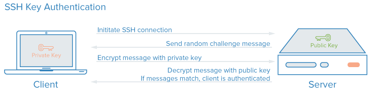
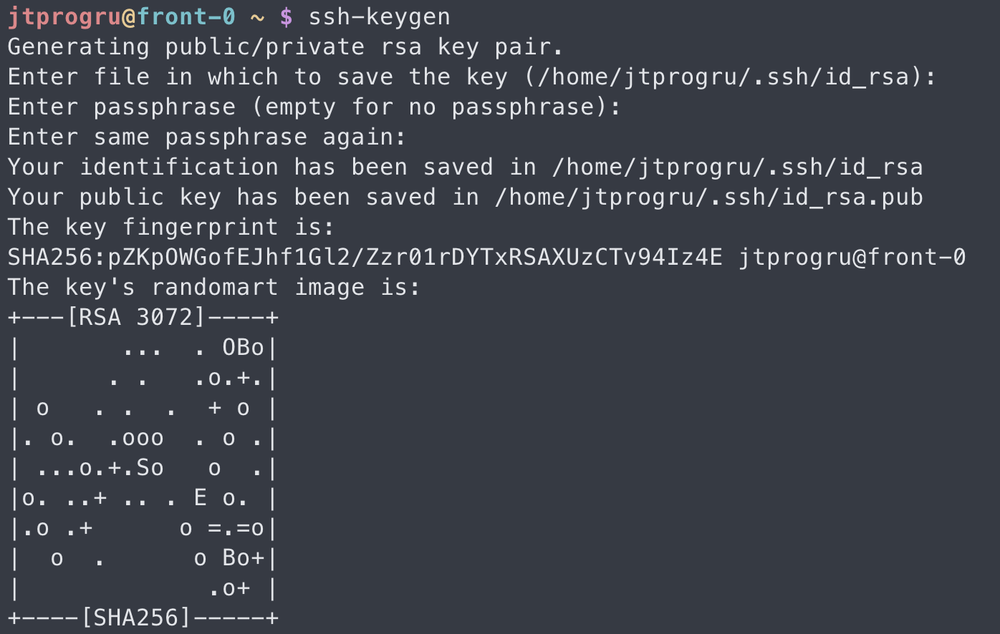
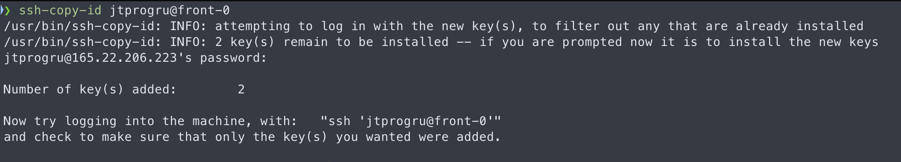
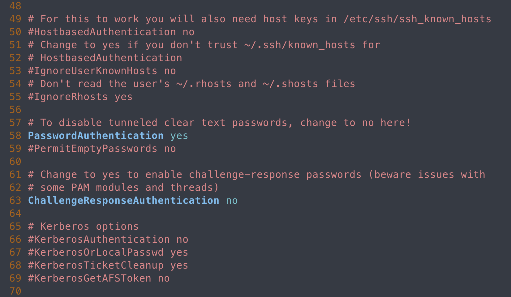

Привет, `%username%`! В 21-ом веке на сервера уже никто не ходит руками, а если требуется такое, то ходить по паролю – моветон!

Рассмотрим процедуру создания ключа авторизации для хождения на сервер по `SSH`. Таких инструкций вагон и маленькая тележка, но мне нужна моя – чтоб кидать ссылку на нее.

## Что это такое и как работает

`SSH` или `Secure Shell` – зашифрованный протокол, который используется для взаимодействия и удаленного управления серверами. Если ты хочешь что-либо сделать на удаленном сервере, то тебе придется воспользоваться `SSH` и работать через терминал.

SSH сервер умеет аутентифицировать пользователя с использованием различных алгоритмов. Чаще всего используется аутентификация по паролю. Это достаточно просто, но не безопасно. Пароль передается по безопасному каналу, но в большинстве случаев сложность и длинна пароля оставляет желать лучшего. В современном мире вычислительные мощности делают перебор очень простым. Но аутентификация по ключу более надежна.

Каждая пара ключей состоит из открытого и закрытого ключа. Секретный ключ сохраняется на стороне клиента и не должен быть доступен кому-либо еще. Утеря приватного ключа позволяет третьему лицу войти на сервер, если не была настроена дополнительная аутентификация по паролю.

Открытый ключ загружается на удаленный сервер, к которому необходимо получить доступ. Его нужно добавить в специальный файл `~/.ssh/authorized_keys` того пользователя, под которым планируется ходить на сервер.

Когда клиент попытается выполнить проверку подлинности через этот ключ, сервер отправит сообщение, зашифрованное с помощью открытого ключа, если клиент сможет его расшифровать и вернуть правильный ответ - аутентификация пройдена.



## Создание пары ключей

Для создания ключей есть утилита `ssh-keygen`, которая входит в набор утилит `OpenSSH`. По умолчанию создается пара 2048 битных RSA ключей, которая подойдет не только для SSH, но и для большинства других ситуаций.

И так, генерация ключей ssh выполняется командой:

```bash
ssh-keygen
```



Утилита предложит выбрать расположение ключей. По дефолту ключи хранятся в скрытой директории `~/.ssh/`. Если ничего не вводить, то секретный ключ будет называться `id_rsa`, а публичный `id_rsa.pub`.

Затем утилита предложит ввести пароль для шифрования ключа на диске. Его  указывать не обязательно. Использование шифрования для ключа имеет только один минус - необходимость вводить пароль, и несколько преимуществ:

- Пароль используется только на локальной машине для расшифровки ключа;
- Секретный ключ хранится в закрытом каталоге и у ssh-клиента нет доступа к нему пока не введен пароль;
- Если злоумышленник хочет взломать аутентификацию по ключу SSH, ему понадобится доступ к вашей системе и ваш пароль с помощью которого зашифрован ключ;

Но все же, это необязательное дополнение и если не хотите, то вы можете просто нажать Enter. Тогда доступ по ключу ssh будет выполняться автоматически и вам не нужно будет что-либо вводить.

## Закинем ключ на сервер

Самый простой способ скопировать ключ на удаленный сервер – это использовать утилиту `ssh-copy-id`. Она тоже входит в пакет программ `OpenSSH`. Но для работы этого метода вам нужно иметь пароль доступа к серверу по SSH. Синтаксис команды:

```bash
ssh-copy-id username@remote_host
```



При первом подключении к серверу система может его не распознать, поэтому вам нужно ввести `yes`. Затем введите ваш пароль пользователя на удаленном сервере. Утилита подключится к удаленному серверу и используя содержимое ключа `id.rsa.pub` загрузит его на сервер в файл `~/.ssh/authorized_keys`. Дальше можно выполнять аутентификацию с помощью этого ключа.

Если при генерации ключа был введен пароль для его шифрования, то система дополнительно попросит его ввести.

## Отключение авторизации по паролю

Если пароль больше не будет использоваться, то для увеличения безопасности системы лучше его вовсе отключить. Но убедитесь, что ключ надежно сохранен и вы его не потеряете, потому что по паролю вы больше не войдете. Авторизуйтесь на сервере, затем откройте конфигурационный файл `/etc/ssh/sshd_config` и найдите там директиву `PasswordAuthenticatin`. Нужно установить ее значение в `No`:

```bash
sudo vim /etc/ssh/sshd_config
```

```ini
PasswordAuthentication no
```



Теперь сохраните файл и перезапустите службу `ssh`:

```bash
sudo systemctl restart ssh.service
```

Дальше будет работать только подключение по ключу ssh, а пароль не будет приниматься совсем.

## Выводы

Ручная настройка доступа по ssh-ключу выглядит очень просто – видно из текста выше. На этом всё!

---
Если у тебя есть вопросы, комментарии и/или замечания – заходи в [чат](https://ttttt.me/jtprogru_chat), а так же подписывайся на [канал](https://ttttt.me/jtprogru_channel).
