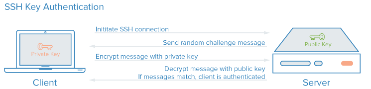
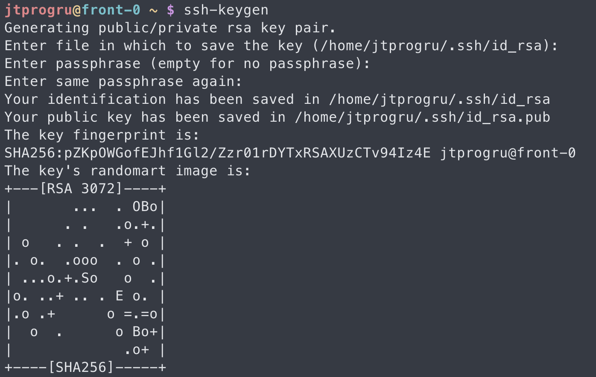
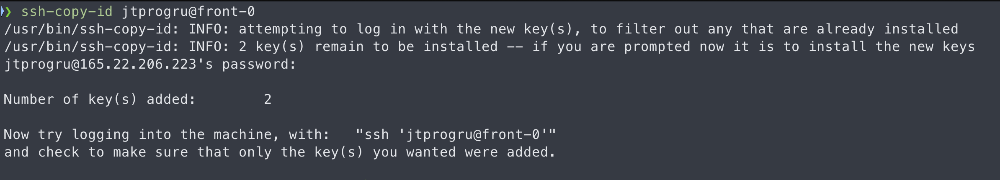
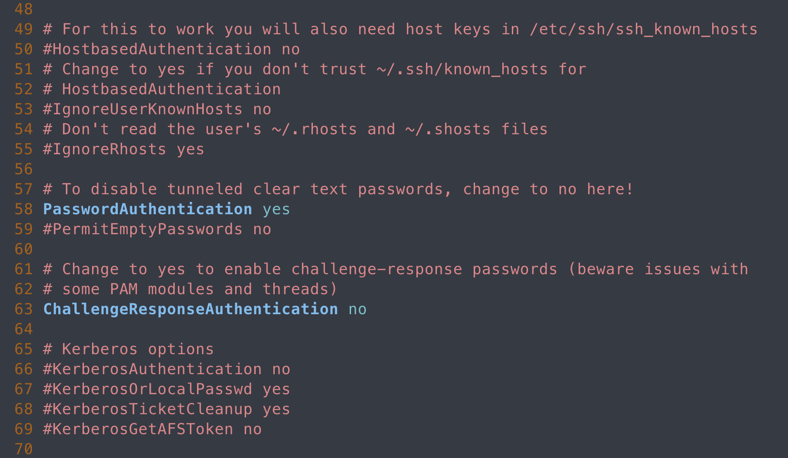

Привет, `%username%`! В 21-ом веке на сервера уже никто не ходит руками, а если требуется такое, то ходить по паролю – моветон!

Рассмотрим процедуру создания ключа авторизации для хождения на сервер по `SSH`. Таких инструкций вагон и маленькая тележка, но мне нужна моя – чтоб кидать ссылку на нее.

> 🔄 **Обновлено 2026-05-15**: общая инструкция по `ssh-keygen`/`ssh-copy-id`/отключению паролей валидна. Поправил пару вещей про дефолтный тип ключа и добавил в конец раздел про современную практику — `ed25519`, FIDO2-ключи (`sk-ed25519`) и SSH-агенты типа 1Password/KeePassXC/YubiKey Agent.

## Что это такое и как работает

`SSH` или `Secure Shell` – зашифрованный протокол, который используется для взаимодействия и удаленного управления серверами. Если ты хочешь что-либо сделать на удаленном сервере, то тебе придется воспользоваться `SSH` и работать через терминал.

SSH сервер умеет аутентифицировать пользователя с использованием различных алгоритмов. Чаще всего используется аутентификация по паролю. Это достаточно просто, но не безопасно. Пароль передается по безопасному каналу, но в большинстве случаев сложность и длинна пароля оставляет желать лучшего. В современном мире вычислительные мощности делают перебор очень простым. Но аутентификация по ключу более надежна.

Каждая пара ключей состоит из открытого и закрытого ключа. Секретный ключ сохраняется на стороне клиента и не должен быть доступен кому-либо еще. Утеря приватного ключа позволяет третьему лицу войти на сервер, если не была настроена дополнительная аутентификация по паролю.

Открытый ключ загружается на удаленный сервер, к которому необходимо получить доступ. Его нужно добавить в специальный файл `~/.ssh/authorized_keys` того пользователя, под которым планируется ходить на сервер.

Когда клиент попытается выполнить проверку подлинности через этот ключ, сервер отправит сообщение, зашифрованное с помощью открытого ключа, если клиент сможет его расшифровать и вернуть правильный ответ - аутентификация пройдена.



## Создание пары ключей

Для создания ключей есть утилита `ssh-keygen`, которая входит в набор утилит `OpenSSH`. Исторически по умолчанию `ssh-keygen` создавал пару 2048-битных RSA-ключей. Сейчас осмысленный дефолт — **ed25519**: короче, быстрее, и при этом криптостойкость выше, чем у RSA-3072. Поэтому генерим именно ed25519:

```bash
ssh-keygen -t ed25519 -C "you@host"
```

Если без флагов:

```bash
ssh-keygen
```

это тоже сработает, но получится RSA-3072 (новые версии OpenSSH подняли дефолтную длину с 2048). Лучше явно указывать тип — так понятнее и тебе, и тем, кто потом будет читать конфиг.



Утилита предложит выбрать расположение ключей. По дефолту ключи хранятся в скрытой директории `~/.ssh/`. Если ничего не вводить, то для `ed25519` секретный ключ будет называться `id_ed25519`, а публичный `id_ed25519.pub` (по аналогии — для RSA это `id_rsa`/`id_rsa.pub`, для ECDSA — `id_ecdsa`/`id_ecdsa.pub`).

Затем утилита предложит ввести пароль для шифрования ключа на диске. Его  указывать не обязательно. Использование шифрования для ключа имеет только один минус - необходимость вводить пароль, и несколько преимуществ:

- Пароль используется только на локальной машине для расшифровки ключа;
- Секретный ключ хранится в закрытом каталоге и у ssh-клиента нет доступа к нему пока не введен пароль;
- Если злоумышленник хочет взломать аутентификацию по ключу SSH, ему понадобится доступ к вашей системе и ваш пароль с помощью которого зашифрован ключ;

Но все же, это необязательное дополнение и если не хотите, то вы можете просто нажать Enter. Тогда доступ по ключу ssh будет выполняться автоматически и вам не нужно будет что-либо вводить.

## Закинем ключ на сервер

Самый простой способ скопировать ключ на удаленный сервер – это использовать утилиту `ssh-copy-id`. Она тоже входит в пакет программ `OpenSSH`. Но для работы этого метода вам нужно иметь пароль доступа к серверу по SSH. Синтаксис команды:

```bash
ssh-copy-id username@remote_host
```



При первом подключении к серверу система может его не распознать, поэтому вам нужно ввести `yes`. Затем введите ваш пароль пользователя на удаленном сервере. Утилита подключится к удаленному серверу и используя содержимое ключа `id.rsa.pub` загрузит его на сервер в файл `~/.ssh/authorized_keys`. Дальше можно выполнять аутентификацию с помощью этого ключа.

Если при генерации ключа был введен пароль для его шифрования, то система дополнительно попросит его ввести.

## Отключение авторизации по паролю

Если пароль больше не будет использоваться, то для увеличения безопасности системы лучше его вовсе отключить. Но убедитесь, что ключ надежно сохранен и вы его не потеряете, потому что по паролю вы больше не войдете. Авторизуйтесь на сервере, затем откройте конфигурационный файл `/etc/ssh/sshd_config` и найдите там директиву `PasswordAuthenticatin`. Нужно установить ее значение в `No`:

```bash
sudo vim /etc/ssh/sshd_config
```

```ini
PasswordAuthentication no
```



Теперь сохраните файл и перезапустите службу `ssh`:

```bash
sudo systemctl restart ssh.service
```

Дальше будет работать только подключение по ключу ssh, а пароль не будет приниматься совсем.

## Дальше: FIDO2 и ssh-агенты

Когда базовая схема «ключик на диске + парольная фраза» уже работает, есть смысл сделать ещё один шаг — убрать сам факт «секретный ключ лежит файлом, который можно скопировать».

### Аппаратные ключи: `sk-ed25519`

Поддержка FIDO2-ключей появилась в OpenSSH 8.2 (февраль 2020) и к 2026-му уже стабильно работает на всём, включая Windows 10/11. Секретный материал живёт **внутри** аппаратного токена (YubiKey, Nitrokey, OnlyKey) и физически не покидает его. Чтобы подключиться, нужно дотронуться до ключа.

```bash
# обычный FIDO2-ключ (нужно подключение токена + touch)
ssh-keygen -t ed25519-sk -C "you@host (yubikey)"

# resident-вариант — секрет хранится на самом токене, можно
# использовать с другой машины без файла с приватной частью
ssh-keygen -t ed25519-sk -O resident -C "you@host (yubikey resident)"
```

Получаешь пару `id_ed25519_sk` / `id_ed25519_sk.pub`. Публичную часть так же кидаешь на сервер через `ssh-copy-id`. При коннекте OpenSSH спросит touch у токена. Скопировать такой ключ нельзя — даже если кто-то залез на твой ноут.

### SSH-агенты вместо файлов

Альтернативный подход — отдать секрет менеджеру паролей или системе, у которой есть своя криптография. Тогда `~/.ssh/id_*` файлов вообще нет, а ssh использует агент.

Полезные варианты в 2026-м:

- **[1Password SSH agent](https://developer.1password.com/docs/ssh/agent/)** — генерирует ed25519 внутри 1Password, биометрия (Touch ID / Windows Hello) на каждое использование. Удобнее всего, если 1Password всё равно стоит.
- **[KeePassXC SSH agent](https://keepassxc.org/docs/#faq-ssh-agent)** — то же самое, только open-source и локально.
- **[gpg-agent с YubiKey](https://github.com/drduh/YubiKey-Guide)** — классика для тех, кто живёт в GPG-стеке. Сложнее в настройке, но даёт PGP + SSH из одного токена.
- **[`yubikey-agent`](https://github.com/FiloSottile/yubikey-agent)** — простой агент для YubiKey без всего PGP-обвеса.

Идея у всех одинаковая: подключаешься к серверу — клиент дёргает агент по сокету (переменная `SSH_AUTH_SOCK`), агент просит у тебя подтверждение (биометрию/touch/PIN), агент делает подпись и возвращает её ssh. Файла с приватным ключом на диске нет.

### `~/.ssh/config` под несколько ключей

Когда у тебя 2-3 ключа под разные системы (личный, рабочий, отдельный под git-хостинги), удобно описать это в `~/.ssh/config`:

```ssh
Host home-server
    HostName 192.168.0.10
    User jtprogru
    IdentityFile ~/.ssh/id_ed25519

Host work
    HostName work.example.com
    User savin
    IdentityFile ~/.ssh/id_ed25519_work
    IdentitiesOnly yes

Host github.com
    HostName github.com
    User git
    IdentityFile ~/.ssh/id_ed25519_sk     # коммиты подписываются YubiKey
    IdentitiesOnly yes
```

Флаг `IdentitiesOnly yes` важен — без него ssh пробует все ключи из агента по очереди и может попасть на лимит провалов аутентификации.

## Выводы

Ручная настройка доступа по ssh-ключу выглядит очень просто – видно из текста выше. На этом всё!

---

Если у тебя есть вопросы, комментарии и/или замечания – заходи в [чат](https://ttttt.me/jtprogru_chat), а так же подписывайся на [канал](https://ttttt.me/jtprogru_channel).

О способах отблагодарить автора можно почитать на странице "[Донаты](https://jtprog.ru/donations/)". 
