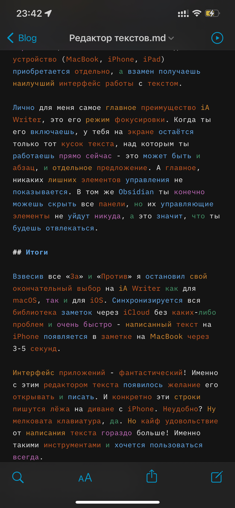

Привет, `%username%`! Какое-то время назад, я очень активно искал редактор текстов и хранилище заметок для себя. И занимался я этим довольно долго, но кажется пришло время основательно определиться и рассказать о моем выборе.

## А чего ты хочешь?

Определился я уже давно, а теперь попробую описать путь, который я прошел. Начну с определения требований, которые я предъявлял к редактору и их список постоянно менялся в процессе тестирования и выбора. Вот список требований, которые дожили до конца эксперимента:

- Написание текста в markdown;
- Экспорт в markdown/PDF;
- Тэги;
- Cross-linking;
- Синхронизация с мобилкой;
- Красиво и удобно;

Для меня очень важным моментом была поддержка markdown, потому что мне удобно писать в этом формате. Я уже к нему на столько привык, что для простых заметок где-то вне своего ноутбука использую [stackedit.io](https://stackedit.io/) – отличный онлайн-редактор для markdown. Экспорт в markdown и PDF нужен по простым причинам: в markdown хранить удобнее, а в PDF иногда надо для отправки документа кому-то из клиентов.

С тэгами все очевидно и понятно кмк, потому что тэгами я размечаю посты в телеге и блоге (и этими же тегами размечаю заметки). Просто и удобно искать статьи по конкретной тематике.

Cross-linking, позволяет делать перекрестные ссылки между разными заметками, но это не прям киллер-фича. Я как-то больше привык к тегам, но для некоторых категорий заметок cross-linking бывает полезен. А для тех, кто хочет практиковать [Zettelkästen](https://vas3k.club/post/3040/) эта фича прямо must-have! А я еще не дошел до такого уровня просветления.

## Огласите весь список

Список редакторов, которые я тестировал достаточно большой. Я действительно перепробовал довольно много всякого разного софта для “написания текстов”. Среди кандидатов были следующие имена:

- Evernote;
- Apple Notes;
- Obsidian;
- iA Writer;
- Simplenote;
- Typora;
- MacDown;

Про всякие вариации а-ля VIM/VS Code/Atom/Sublime/etc + Git/GDrive/DropBox/iCloud/etc даже вспоминать не хочу, потому что я хочу получать удовольствие от написания текста, а не мучиться с настройкой. С таким подходом довольно легко уйти в сторону “откажусь от гугла и поставлю NextCloud, перейду на ведроид, включу тонну плагинов и буду сам себе”. Счастье будет, но не долго (был опыт подобных экспериментов и если интересно, то маякни в [чате](https://ttttt.me/jtprogru_chat) об этом).

Я не хочу делать “обзор” для каждого упомянутого мною редактора, потому что их довольно много и не все из них я использовал дольше одного дня. Остановлюсь лишь на тех, что использовал дольше двух месяцев (ну или пытался использовать).

## Немного историй

За не малое время у меня уже сформировалась некоторая база заметок, которая довольно часто пополняется. Дополнительно к моей личной базе заметок я веду этот самый бложик, где ты читаешь эту статью. А еще веду [канал в телеге](https://ttttt.me/jtprogru_channel) – заглядывай и подписывайся. И вот везде в этих кейсах мне нужно писать текст. Не код на каком-либо ЯПе, а именно полноценный текст.

Примерно в 2015-2016 году я стал активнее пользоваться Markdown и мне стало нравиться. В тот период этот блог жил на Wordpress. И уже в 2019 с очередным обновлением Wordpress мне стало просто невыносимо в нем работать. Да и сама идея “сразу писать в браузере” мне категорически не нравилась (как и сейчас). Потому было принято решение перейти на [Hugo](https://jtprog.ru/gohugo/) и в процессе переезда я смог выгрузить все статьи в формате Markdown. И вот когда очередной десяток файликов со статьями был отформатирован, я понял – markdown = ванлав!

## Редактор редактору редактор

Срок “более двух месяце” для тестирования выбран не просто так. Поскольку я пока еще не каждый день пишу текст ([личный дневник](https://twtr.jtprog.ru/tqmoxxYXKVl) не считается), а стремлюсь именно к этому (просто хочу – это аргумент), мне важен [качественный инструмент](https://twtr.jtprog.ru/BL6cTtxS7). Именно по этой причине я перестал делать заметки просто в VIM’e, а ведь я их делал так довольно долго. В моей вселенной VIM не предназначен для написания текстов статей, но если верстать нормальную публикацию (научную статью с кучей формул), то VIM более чем идеален – публикацию придется писать в LaTeX’e (читай программировать).

Тестирование и сравнение я делал самым простым и доступным для меня способом. Большинство редакторов имеют возможность импорта заметок из markdown, либо позволяют закинуть “директорию с md-файлами”. Именно так я и делал в большинстве случаев. Просто брал все имеющиеся у меня файлики с markdown и скидывал в ту директорию, которую использует редактор как основную.

Далее смотрел на то, как получившуюся библиотеку реорганизует редактор. Например правильно ли соберёт тэги, как отработает cross-links. Важно было и то, насколько удобно переключаться между разными заметками. Например, бывает пишешь какую-то длинную заметку и понимаешь, что на первый взгляд не большая тема превращается в целую статью. В таких ситуациях просто вытаскиваешь этот кусок в отдельную заметку, на которую ссылаешься в дальнейшем.

Из примечательного, к примеру, в том же Obsidian было любопытно пользоваться отображением в виде графа - все перекрёстные ссылки отображались ветвями в графе. Я бы и дальше использовал этот вид, если бы мне понравился сам редактор. Но, спойлер, не понравился.

## "Выборы! Выборы! Кандидаты - редакторы!"

По итогу всех страданий и стараний, я дольше всего раздумывал над двумя кандидатами:

- [iA Writer](https://ia.net/writer)
- [Obsidian](https://obsidian.md)

Последний, бесплатный и относительно удобный. Неоспоримое преимущество - отображение графа связей и различные плагины. У него довольно неплохое комьюнити и им можно смело пользоваться.

Первый же, полностью платный и каждое устройство (MacBook, iPhone, iPad) приобретается отдельно, а взамен получаешь наилучший интерфейс работы с текстом.

Лично для меня самое главное преимущество iA Writer, это его режим фокусировки. Когда ты его включаешь, у тебя на экране остаётся только тот кусок текста, над которым ты работаешь прямо сейчас - это может быть и абзац, и отдельное предложение. А главное, никаких лишних элементов управления не показывается. В том же Obsidian ты конечно можешь скрыть все панели, но их управляющие элементы не уйдут никуда, а это значит, что ты будешь отвлекаться.

## Итоги

Взвесив все «За» и «Против» я остановил свой окончательный выбор на iA Writer как для macOS, так и для iOS. Синхронизируется вся библиотека заметок через iCloud без каких-либо проблем и очень быстро - написанный текст на iPhone появляется в заметке на MacBook через 3-5 секунд.

Интерфейс приложений - фантастический! Именно с этим редактором текста появилось желание его открывать и писать. И конкретно эти строки пишутся лёжа на диване с iPhone.

Неудобно? Ну мелковата клавиатура, да. Но кайф удовольствие от написания текста гораздо больше! Именно такими инструментами и хочется пользоваться всегда.

---
Если у тебя есть вопросы, комментарии и/или замечания – заходи в [чат](https://ttttt.me/jtprogru_chat), а так же подписывайся на [канал](https://ttttt.me/jtprogru_channel).
