Доброго времени суток тебе, открывший сюда. Эта инструкция настройки web-сервисов для 1Сv8.3 и IIS 8.5. была рождена в попытке исправить косяки одной компании, обслуживающей нас по сопровождению продуктов 1С. Проблема так же будет рассмотрена.

Воизбежание вопросов следующие вводные: Windows Server 2012 R2 Standard, IIS 8.5, 1С:Предприятие 8.3 (8.3.4.465). Машина - виртуалка на гипервизоре ESXi 5.5. Выделено 2 ядра и 32 гига оперативки. На этом все. Поехали.

1) Установка IIS выполняется стандартными средствами. Набор достаточных компонент приведен на скриншоте.

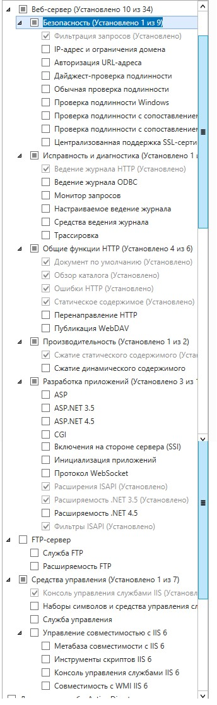

1) Создаем папку на web сервере. В моем случае 1С.

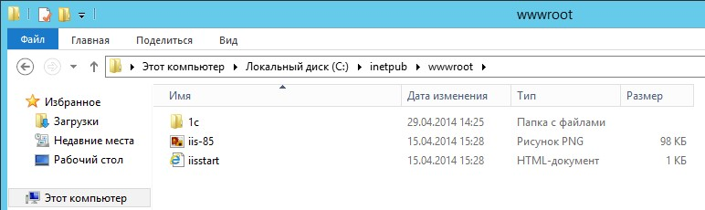

3) Публикуем сервис из 1С. 

Администрирование -> 1С -> Конфигуратор -> Администрирование -> Публикация на Web-сервере.

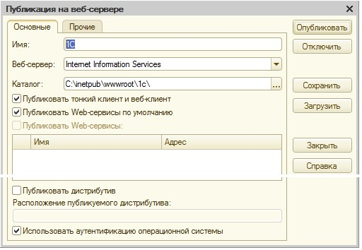

Содержимое.

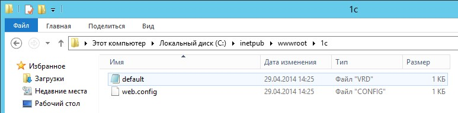

4) Зададим права для обработчика web-сервисов 1С.

Права на запуск (Выполнение) модулей добавляются для группы `IIS_IUSRS` на папку  
`C:\Program Files (x86)\1cv8\8.3.4.465\bin`.

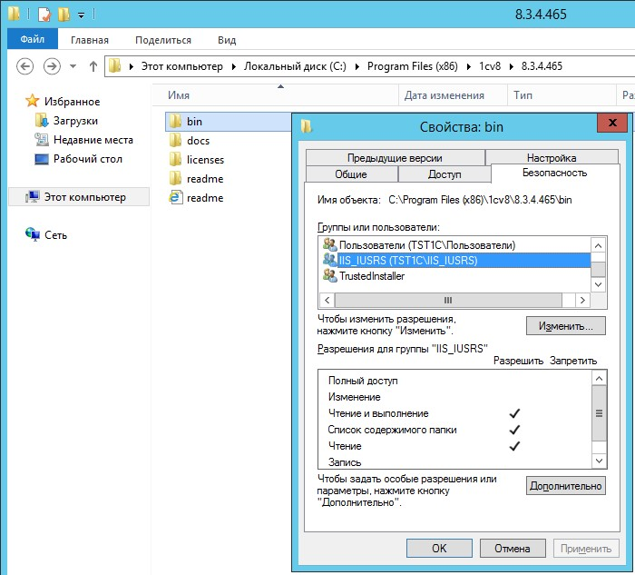

5) Если база файловая, нужно добавить права на изменение (`Изменение`) на папку и подпапки базы для той же группы.

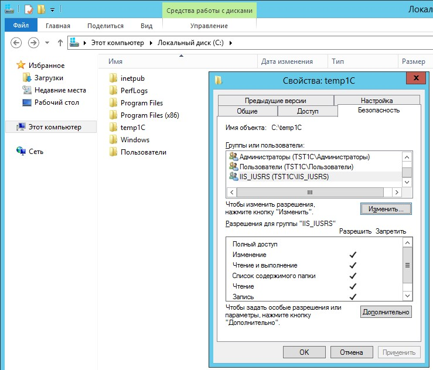

6) В консоли IIS. 

Кликаем правой кнопкой мыши на строку с созданной нами папкой.  Преобразовываем её в приложение.

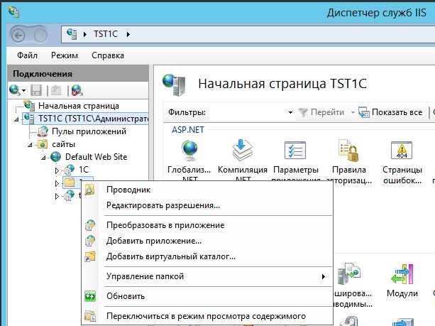

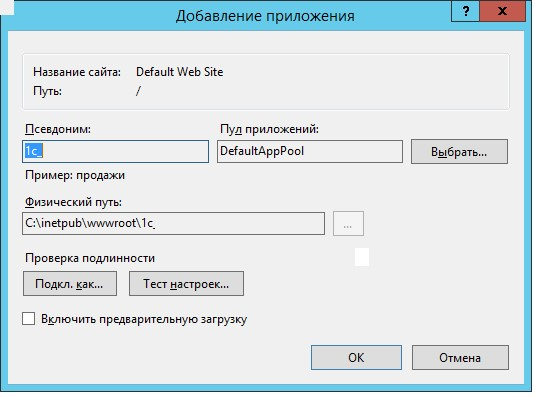

7) Добавляем `MIME` типы `1С`.

Делать это можно для сервера или для сайта, или для папки. Наследование присутствует.

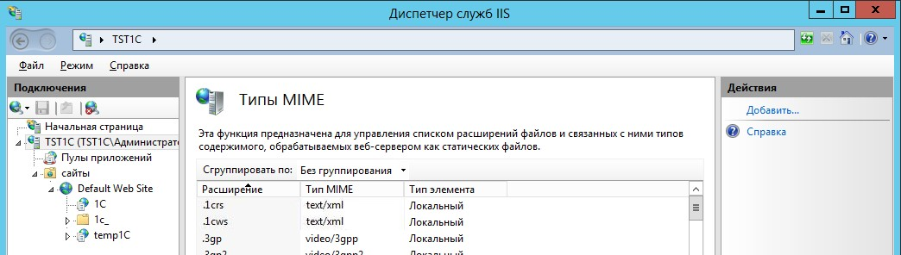

8) Добавляем настройки для обработки файлов 1С.

На вкладке `Сопоставление обработчиков` добавляем скрипты (не скрипты со звездочкой) для каждого расширения - `*.1cws` и `*.1crs`.

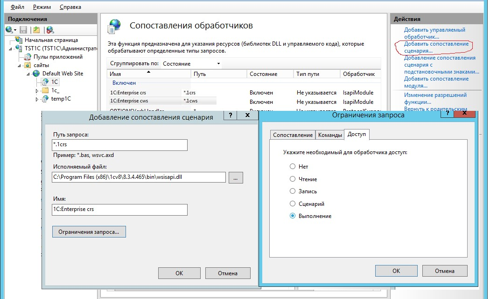

Имена любые. Главное - для каждого расширение отдельное правило! Ограничения запроса -> Доступ -> Сценарий или Выполнение.

9) Для обработчиков нужно задать дополнительные параметры (Edit Feature Permission). Установить флаги запуска скриптов и приложений.

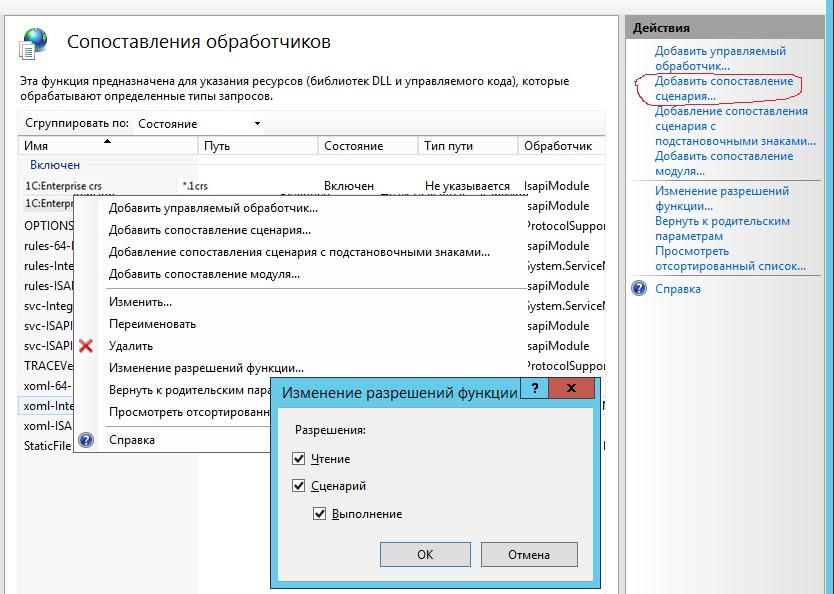

10) Можно проверить наличие обработчика web-сервисов 1С на вкладке `ISAPI and CGI Restrictions` для сервера.

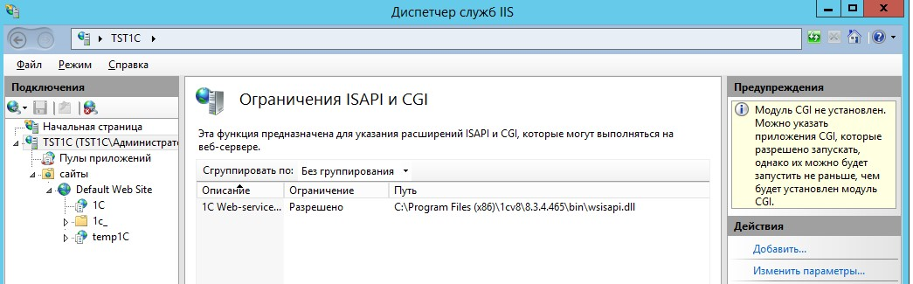

Так как установка идет в 64 разрядном окружении, то для обработчика нужно включить режим Пулы приложений -> DefaultAppPool -> Дополнительные параметры -> Разрешены 32-разрядные приложения -> True.

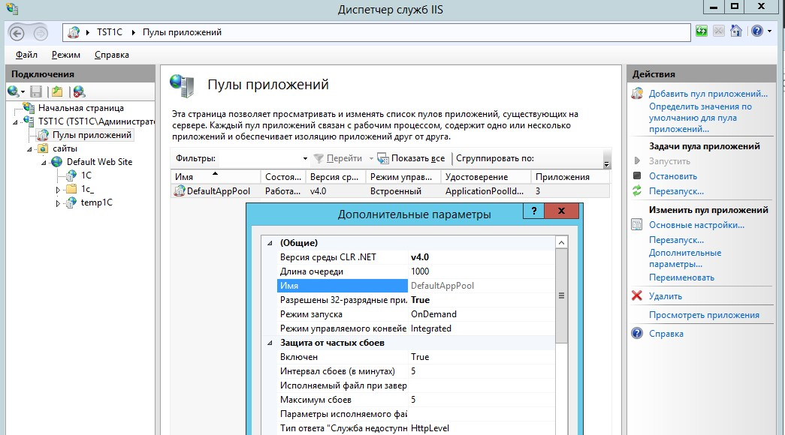

11) Обращаемся по адресу `http://localhost/1C/`.

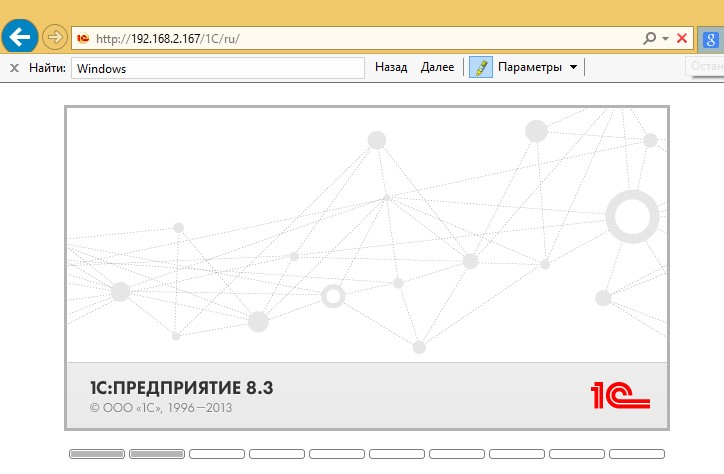

12) Об анонимной аутентификации на IIS и доступе к базе. Настроить доступ с использованием автоматически создаваемого пользователя IUSR у меня получилось. Важно проверить, что Анонимная проверка подлинности включена как в корне сервера, ТАК И НА САЙТЕ. Иначе не работает!!!!

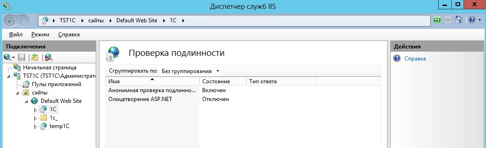

Собственно на этом все! Теперь все работает!

А теперь сам косяк - после некоторых обновлений, которые проводил "специалист" обслуживающей компании.

Спустя пару дней мы обнаружили, что у нас не работает веб-доступ к одной из конфигураций. Поковырявшись пару минут выяснилось, что при попытке публикации веб-приложения не создается файл конфигурации для веб-сервера - web.config

"Мастера", которых мы вызывали исправлять ситуевину, предлагали абсолютно всё - от переустановки самого сервера 1С, до попытки перенести сервер 1С на железо, за что собственно и были посланы ~~нахер~~ лесом.

А собственно проблема создания конфига web.config решалась просто - запускать все надо именно от имени Администратора, ДАЖЕ если вы сидите под ЛОКАЛЬНЫМ АДМИНИСТРАТОРОМ. После этого все прекрасно публиковалось, создавалось, работалось.

---
Если у тебя есть вопросы, комментарии и/или замечания – заходи в [чат](https://ttttt.me/jtprogru_chat), а так же подписывайся на [канал](https://ttttt.me/jtprogru_channel).
